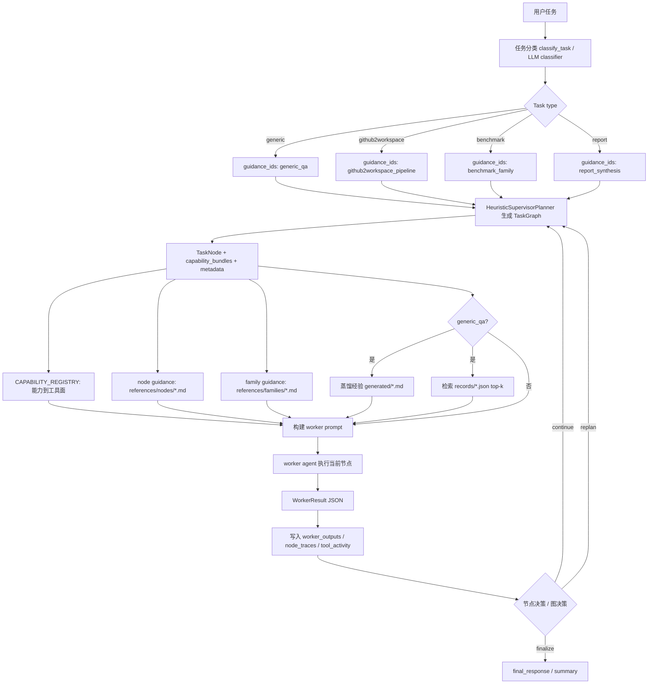
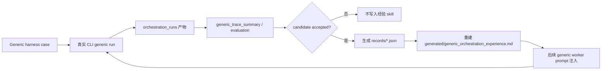

# Agent Skills Design

本文说明当前仓库中智能体 `skills` 的设计方式，重点覆盖
`.code2workspace/skills/` 下的项目级 skill、Supervisor Graph 对 skill 的加载方式，
以及 generic harness 如何把已接受的经验写回 skill。

## 一句话总结

当前设计不是把 skill 做成“每个任务都手动调用的插件集合”，而是分成两条线：

- **能力型 skills**：面向具体外部能力或本地数据能力，给 agent 提供可执行脚本、触发规则和证据边界。
- **编排型 skills**：面向 Supervisor Graph runtime，作为版本化 prompt/guidance 资产，被运行时自动读取并注入 worker prompt。

代码保留稳定的执行边界、能力到工具的映射和图执行逻辑；可迭代的任务经验、节点策略和报告写作策略尽量落在 skill 资产里。

## 目录布局

```text
.code2workspace/skills/
├── capabilities/
│   ├── academic-search/
│   ├── data-governance-ops/
│   ├── epietl-api/
│   ├── respiratory-disease-data-fetcher/
│   ├── respiratory-disease-wide-monitor/
│   └── virus-variation-query/
├── orchestration/
│   ├── supervisor-guidance/
│   │   ├── SKILL.md
│   │   └── references/
│   │       ├── families/
│   │       └── nodes/
│   └── generic-experience/
│       ├── SKILL.md
│       ├── records/
│       └── generated/
└── _shared-superagent-helpers/
    └── scripts/
```

## Skill 分类

### 1. Capability Skills

`capabilities/` 下的 skill 更接近传统意义上的项目能力包。每个 skill 通常包含：

- `SKILL.md`：自然语言触发规则、使用边界、命令示例、输出要求。
- `scripts/`：可直接运行的本地 helper。
- `references/` 或本地数据文件：API 字段说明、数据源表、查询示例等。
- `agents/openai.yaml`：对 OpenAI/agent 侧的默认提示补充。

当前能力型 skill 包括：

| Skill | 作用 | 典型入口 |
| --- | --- | --- |
| `academic-search` | PubMed、Springer Nature、bioRxiv 等论文/预印本检索 | `scripts/search_tools.py` |
| `data-governance-ops` | 数据源治理、快照刷新、快照对比、质量检查 | `scripts/governance_ops.py` |
| `epietl-api` | EpiETL 疫情情报 API、source catalog、risk events | `scripts/epietl_api.py` |
| `respiratory-disease-data-fetcher` | 少量固定官方疫情源快速抓取 | `scripts/fetch_data.py` |
| `respiratory-disease-wide-monitor` | 50+ 呼吸道病原官方来源表筛选与抓取 | `scripts/fetch_sources.py` |
| `virus-variation-query` | 本地 `virus_variation` / `covid_data` 变异数据库查询 | shell / SQL helper |

这些 skill 的重点是“怎么做某类事实工作”，例如查论文、查本地变异库、拉取官方监测数据。它们可能依赖外部 API、数据库凭据、MySQL、网络或本地数据根目录，因此不是严格自包含的纯代码资产。

### 2. Orchestration Skills

`orchestration/` 下的 skill 不主要给用户手动调用，而是给 Supervisor Graph runtime 自动读取。

#### `supervisor-guidance`

这是稳定的编排策略资产。它把以前容易写进 Python 的任务经验拆成 Markdown：

```text
references/families/
├── benchmark_family.md
├── generic_qa.md
├── github2workspace_pipeline.md
└── report_synthesis.md

references/nodes/
├── benchmark_case.md
├── compose_generic.md
├── compose_report.md
├── computed_data_lane.md
├── existing_data_lane.md
├── init_generic.md
├── init_report.md
├── inspect.md
├── local_data_lane.md        # legacy compatibility guidance
├── monitoring_lane.md
├── register.md
├── worker_context.md
├── worker_solution.md
└── ...
```

设计规则是：

- family guidance 说明某类任务的整体策略，例如 `github2workspace`、`benchmark`、`report`、`generic_qa`。
- node guidance 说明某个节点如何停止、如何验证、优先使用哪些证据、哪些行为不能算完成。
- Python runtime 只负责把对应 guidance 找出来并注入 prompt，不在代码里持续堆积领域策略。

#### `generic-experience`

这是 harness 写回的经验记忆 skill。它分两层：

- `records/*.json`：每条 accepted generic case 的结构化经验。
- `generated/generic_orchestration_experience.md`：由 records 自动蒸馏出的可复用 planning hints。

经验记录保留：

- 问题分类：意图、证据模式、复杂度、作用域。
- 问题抽象：摘要、约束、标签。
- 轨迹：图形状、节点、轮数、工具节奏、停止规则、答案风格。
- 效果：case score、traceability/evidence/efficiency score、完成状态。
- 适用性：什么情况下用，什么情况下避免。
- 置信度。

运行时使用这些经验时，只把它们当作“如何编排”的提示，不把历史答案硬编码到新任务里。

## Runtime 装配路径

### 任务分类与 guidance id

核心分类逻辑在 `libs/code2workspace/code2workspace/orchestration_runtime.py`。

运行时会先把用户任务分成四类：

- `generic`
- `github2workspace`
- `benchmark`
- `report`

每类任务会附带 `guidance_ids`：

| 任务类型 | guidance id |
| --- | --- |
| `generic` | `generic_qa` |
| `github2workspace` | `github2workspace_pipeline` |
| `benchmark` | `benchmark_family` |
| `report` | `report_synthesis` |

分类先有规则兜底，也可以调用 LLM classifier。LLM 输出置信度不足或格式不合法时，会回退到规则分类。

### 图规划

`HeuristicSupervisorPlanner` 根据任务类型生成 Supervisor Graph：

- `github2workspace`：通常是 `inspect -> build -> wdl -> summarize`，失败后从失败阶段窄重试。
- `benchmark`：先 `register`，再按工具/案例 fan-out 到 `benchmark_case` worker，最后汇总。
- `report`：先 `init_report` 生成报告契约和下一轮动态图，再按需要选择
  `monitoring_lane`、`existing_data_lane`、`computed_data_lane`、`literature_lane`
  的组合，最后进入 `compose_report -> summarize/final_response`。
- `generic`：先 `init_generic` 让 worker 规划下一轮动态图，再执行 worker 节点并合成答案。

每个 `TaskNode` 都会带上：

- `capability_bundles`
- `metadata.task_type`
- `metadata.guidance_ids`
- 原始任务、run 目录、前序 worker output 等运行上下文。

### 能力到工具的映射

能力映射在 `libs/cli/code2workspace_cli/supervisor_capabilities.py` 的
`CAPABILITY_REGISTRY` 中。

示例：

| Capability bundle | 实现类型 | 首选工具面 |
| --- | --- | --- |
| `repo_fetch` | `hybrid` | `execute`, `read_file`, `ls`, `glob` |
| `docker_build_run` | `hybrid` | `execute`, `read_file`, `write_file`, `edit_file`, `ls` |
| `wdl_run` | `hybrid` | `execute`, `read_file`, `write_file`, `edit_file`, `ls` |
| `web_search` | `tool` | `web_search` |
| `web_fetch` | `tool` | `fetch_url` |
| `summarize` | `guidance` | `read_file`, `write_file` |
| `plan` | `guidance` | `read_file`, `write_file` |

这里的设计重点是把“能用哪些工具”留在代码中，保证执行面稳定；把“这类节点该怎么做、什么时候停止、什么证据才算完成”放到 skill Markdown 中。

### Worker Prompt 注入

worker prompt 构建在 `libs/cli/code2workspace_cli/supervisor_runtime.py` 的
`_build_worker_prompt()`。

注入顺序大致是：

1. 读取节点 capability bundles。
2. 通过 `describe_capabilities()` 生成能力说明、实现类型、首选工具面。
3. 通过 `node_guidance_lines(node.node_id)` 读取节点级 guidance。
4. 通过 `family_guidance_lines(guidance_ids)` 读取 family 级 guidance。
5. 如果是 `generic_qa`，额外读取：
   - `generic-experience/generated/generic_orchestration_experience.md`
   - 当前任务 top-k 匹配的 `generic-experience/records/*.json`
6. 如果是 report lane 或 local computation 节点，注入本地数据/算子/数据集/历史记录上下文。
7. 拼成 worker prompt，要求 worker 只执行当前节点，并返回结构化 JSON。

## 总体流程图



## Generic Experience 学习闭环

generic skill 的进化路径来自 harness，而不是手工无限修改一个 prompt 文件。



这个闭环使系统能够保留 case-level 可审计经验，同时把高分轨迹蒸馏成更短的可复用策略。

## 为什么这样分层

### 1. 减少 Python 中的策略膨胀

如果所有任务策略都写在 runtime 里，`orchestration_runtime.py` 和
`supervisor_runtime.py` 很快会变成充满特例的调度器。现在代码主要负责：

- 任务分类。
- 图结构生成。
- worker runner 边界。
- artifact 写入。
- capability-to-tool 映射。
- 节点决策和最终汇总。

任务经验则通过 Markdown skill 迭代。

### 2. 保持策略可版本化、可测试、可被 harness 优化

`supervisor-guidance` 和 `generic-experience` 都是项目文件，可以被 diff、review、
测试和 harness 候选修改。generic harness 已经把优化 surface 放在 guidance 资产上，
再把 accepted case 写成经验记录。

### 3. 支持不同粒度的复用

- capability skill 复用“具体工具能力”。
- family guidance 复用“任务族策略”。
- node guidance 复用“节点级停止/验证规则”。
- generic experience 复用“历史成功轨迹”。
- operator/dataset/history store 复用“本地计算和证据资产”。

## 与本地 store 的关系

skill 不是唯一的知识来源。Supervisor worker prompt 还会注入本地 store：

- `operator_store`：可执行工具或 workflow。
- `dataset_store`：数据集和 input bundle。
- `benchmark_comparison_history_store`：历史 benchmark 结果。

在 report `existing_data_lane` / `computed_data_lane` 和 generic computation 节点中，
prompt 明确区分：

- `existing_data`：已经存在的本地数据库、registry、API、缓存 artifact、dataset 记录、历史记录。
- `computed_data`：需要选择 operator + dataset/input bundle 并实际运行后产生的新证据。

报告链路现在把两者拆成一条“只查已有证据”的 lane 和一条“确有缺口才运行本地算子”的 lane；
generic 链路仍在本地计算上下文里使用同一套边界。

## 设计约束

1. **skill guidance 不能替代 runtime 边界**
   worker 仍必须返回结构化 `WorkerResult`，节点仍受 graph/runner 管理。

2. **skill 只能指导编排和证据策略，不能硬编码答案**
   尤其是 `generic-experience`，历史经验只能作为 planning hints。

3. **能力映射留在代码里**
   `CAPABILITY_REGISTRY` 负责工具面，避免 Markdown 改动绕开工具约束。

4. **外部依赖要显式承认**
   capability skills 可能依赖网络、API key、本地数据库或外部数据根。它们是项目级能力资产，但不代表整个项目完全可离线复制运行。

5. **报告和 judgment 类任务要保留证据边界**
   report/generic guidance 强调 source category、direct/inferred/proxy evidence、freshness/date 和不确定性。

## 关键代码入口

| 文件 | 作用 |
| --- | --- |
| `libs/code2workspace/code2workspace/orchestration_runtime.py` | 任务分类、guidance id 注册、Supervisor 图规划、worker result 类型 |
| `libs/cli/code2workspace_cli/supervisor_capabilities.py` | capability registry、guidance asset 读取、generic experience 注入入口 |
| `libs/cli/code2workspace_cli/supervisor_runtime.py` | CLI-facing supervisor runtime、worker prompt 构建、artifact 写入、local store context |
| `libs/cli/code2workspace_cli/generic_experience_store.py` | generic experience record schema、写入、蒸馏、检索 |
| `libs/cli/tests/unit_tests/test_supervisor_runtime.py` | prompt 注入、guidance、local computation、benchmark/report/generic 行为回归测试 |

## 当前状态与后续方向

当前 skill 设计已经形成三层能力：

- 项目能力包：解决“查什么、跑什么脚本、连什么本地库”。
- 稳定编排策略：解决“这个任务族或节点怎么执行才算靠谱”。
- 经验演化记忆：解决“过去哪些 generic 编排轨迹有效，什么时候复用”。

后续可以继续增强：

- 给 generic experience 检索增加 embedding / SQLite 索引。
- 区分 accepted 正例和 rejected 负例。
- 周期性把高置信经验归纳回稳定 `supervisor-guidance`。
- 给 capability skill 增加更统一的输出 manifest，方便 Supervisor 自动引用证据。
