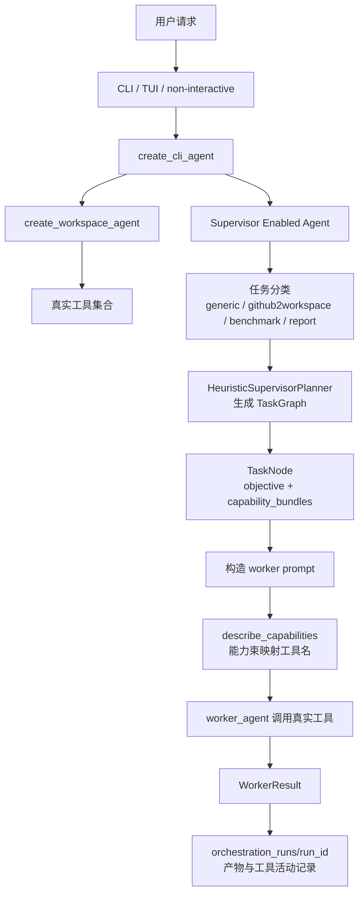
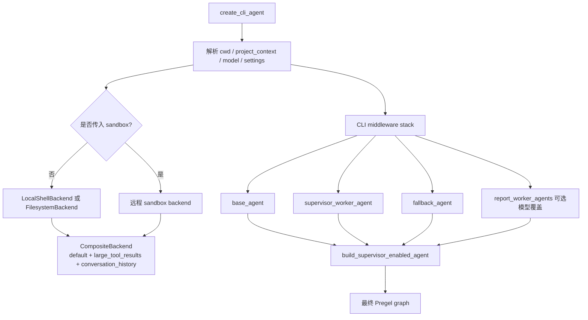
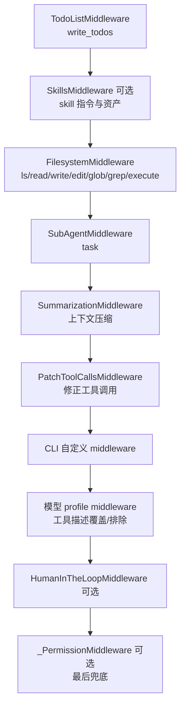
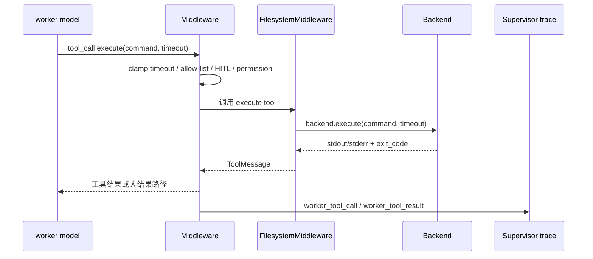
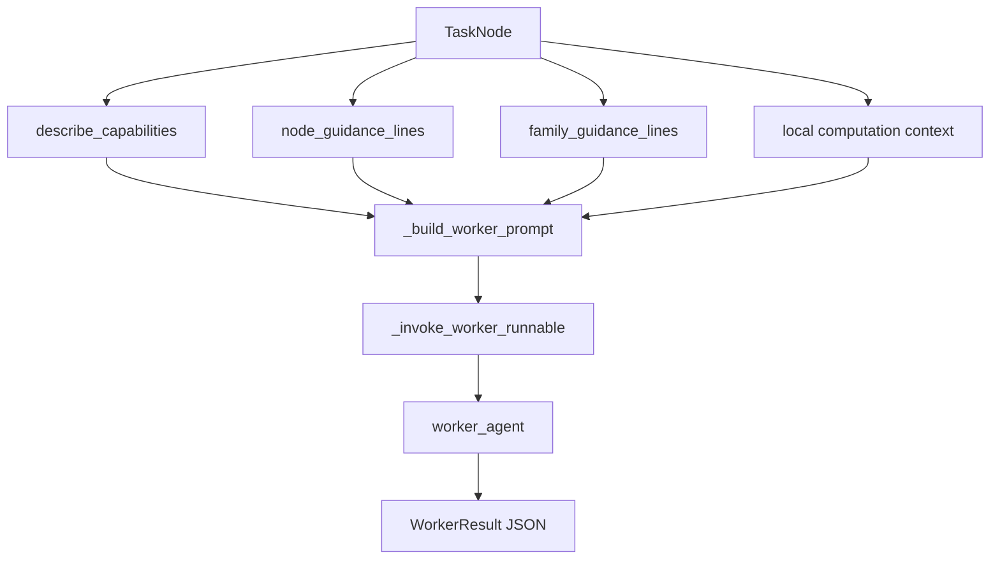
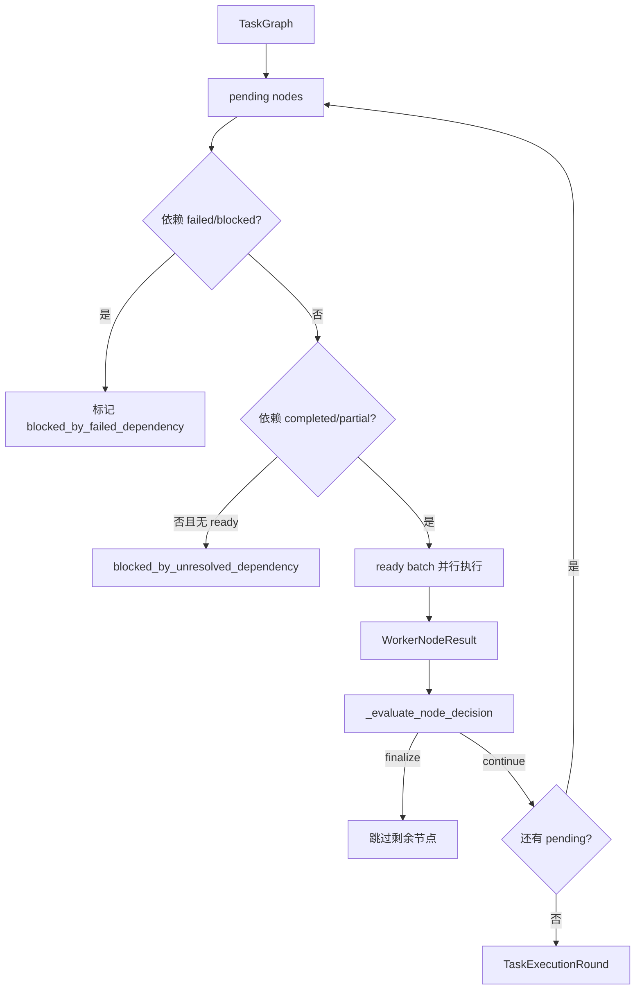
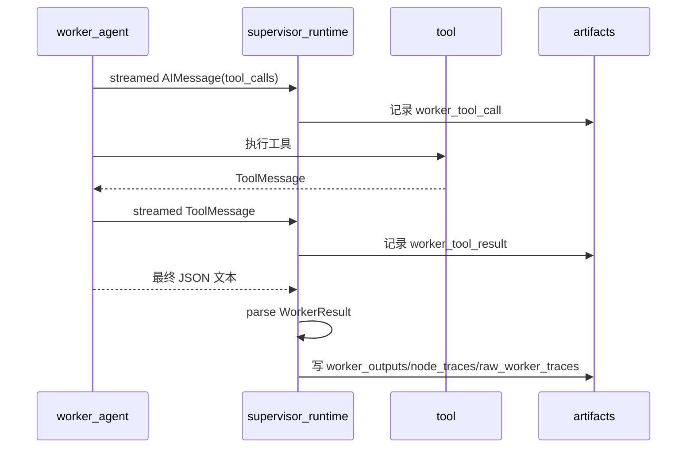
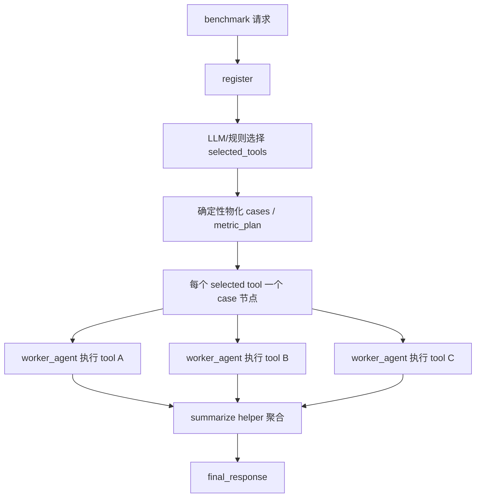

# 当前智能体工具设计说明

本文说明当前目录下 `code2workspace` 智能体的工具体系设计，重点回答三个问题：

- 工具从哪里来；
- Supervisor Graph 如何把任务能力映射到工具；
- 一次工具调用如何被执行、拦截、记录，并最终进入可审计产物。

相关入口文件：

| 主题 | 主要文件 |
| --- | --- |
| CLI 智能体组装 | `libs/cli/code2workspace_cli/agent.py` |
| Workspace Agent 基础工具装配 | `libs/code2workspace/code2workspace/graph.py` |
| 文件与 shell 工具 | `libs/code2workspace/code2workspace/middleware/filesystem.py` |
| 子智能体 `task` 工具 | `libs/code2workspace/code2workspace/middleware/subagents.py` |
| Supervisor Graph 运行时 | `libs/cli/code2workspace_cli/supervisor_runtime.py` |
| 任务图与调度原语 | `libs/code2workspace/code2workspace/orchestration_runtime.py` |
| 能力束到工具面的映射 | `libs/cli/code2workspace_cli/supervisor_capabilities.py` |

## 总体分层

当前系统不是把所有工具直接塞给一个模型后让模型自由行动，而是采用三层结构：

1. 底层 `Workspace Agent` 提供真实可调用工具，例如文件、shell、web、ask_user、subagent。
2. 中层 `Middleware` 负责注入工具、注入提示、权限控制、人工确认、结果压缩和调用修正。
3. 上层 `Supervisor Graph` 先把用户任务拆成节点，再用 `capability_bundles` 给每个 worker 节点声明“推荐工具面”和执行约束。



这意味着 `capability_bundles` 本身不是 LangChain tool，它更像 Supervisor 层的“工具使用合同”。真正执行仍发生在 worker agent 可见的 LangChain 工具里。

## 工具来源

当前 agent 的工具来源主要有四类。

| 来源 | 典型工具 | 生成方式 | 说明 |
| --- | --- | --- | --- |
| SDK middleware | `write_todos`、`ls`、`read_file`、`write_file`、`edit_file`、`glob`、`grep`、`execute`、`task` | `create_workspace_agent()` 自动装配 | 所有 Workspace Agent 的基础能力 |
| CLI middleware | `ask_user` 等 | `create_cli_agent()` 按交互模式追加 | 交互式 TUI 才适合启用，非交互路径通常关闭 |
| CLI 外部工具 | `web_search`、`fetch_url`、MCP 工具 | 通过 `tools=` 参数传入 | server graph 会把 web/MCP 工具传给 `create_cli_agent()` |
| Skill / subagent | skill 指令、`task` 可调用的子智能体 | `SkillsMiddleware`、`SubAgentMiddleware` | skill 更偏提示与流程资产，subagent 是可调用执行单元 |

底层 `create_workspace_agent()` 的默认工具面包括：

- `write_todos`：来自 LangChain `TodoListMiddleware`，用于任务清单管理；
- `ls`、`read_file`、`write_file`、`edit_file`、`glob`、`grep`：来自 `FilesystemMiddleware`；
- `execute`：当 backend 支持 `SandboxBackendProtocol` 时提供，用于 shell 命令；
- `task`：来自 `SubAgentMiddleware`，用于启动短生命周期子智能体；
- 调用者通过 `tools=` 传入的额外工具，例如 `web_search`、`fetch_url`、MCP 工具。

## Workspace Agent 装配流程

`create_cli_agent()` 是 CLI 使用的总入口。它先根据运行模式准备 backend、memory、skills、subagents、审批策略，然后多次调用 `_build_workspace_agent()` 构造不同用途的 agent。



几类 agent 的区别：

| agent | 用途 |
| --- | --- |
| `base_agent` | 原始 workspace agent，保留完整工具能力 |
| `supervisor_worker_agent` | Supervisor 普通节点的默认 worker |
| `fallback_agent` | 当 route 进入普通聊天 fallback 时使用，避免强行进入编排 |
| `report_worker_agents` | 给 report 的不同节点单独指定模型 |
| `classifier_model` | 只做任务分类，不直接执行工具 |

## Middleware 如何注入工具

`create_workspace_agent()` 通过 middleware 建立工具面。核心顺序是：



这里采用 middleware，而不是单纯的函数列表，主要是因为工具系统需要动态行为：

- 有些工具需要按 backend 能力动态启用，例如没有 shell backend 时 `execute` 不能真正执行；
- 有些工具需要向系统提示注入使用说明，例如 memory、skills、subagent；
- 有些工具调用前后要被拦截，例如人工确认、权限检查、shell allow-list、超时限制；
- 大输出需要被写入 `/large_tool_results/` 后只给模型返回预览，防止上下文爆炸。

## 文件与 shell 工具

`FilesystemMiddleware` 是最重要的工具注入点。它提供统一的文件和执行接口，实际 I/O 委托给 backend。

| 工具 | 输入 | 作用 | 关键约束 |
| --- | --- | --- | --- |
| `ls` | `path` | 列目录 | 路径必须是绝对路径 |
| `read_file` | `file_path`、`offset`、`limit` | 分页读文件，也支持图片/音视频/PDF 多模态块 | 默认分页，长行和大内容会截断 |
| `write_file` | `file_path`、`content` | 新建或覆盖写文件 | 更推荐编辑已有文件 |
| `edit_file` | `file_path`、`old_string`、`new_string`、`replace_all` | 精确字符串替换 | 要先读文件，`old_string` 默认必须唯一 |
| `glob` | `pattern`、`path` | 文件名模式搜索 | 内置超时，鼓励缩小范围 |
| `grep` | `pattern`、`path`、`glob`、`output_mode` | 文本搜索 | 按字面量搜索，不按正则 |
| `execute` | `command`、`timeout` | 执行 shell 命令 | 只有支持执行的 backend 可用，超时有上限 |

`execute` 的设计比较谨慎：

- 本地模式下，`create_cli_agent()` 会创建 `LocalShellBackend`，所以 `execute` 可以运行命令；
- remote sandbox 模式下，`execute` 由 sandbox backend 提供；
- `ExecuteTimeoutClampMiddleware` 会把超过工具上限的 `timeout` 压到 3600 秒以内；
- 非 `auto_approve` 模式下，`HumanInTheLoopMiddleware` 会对 `execute`、写文件、编辑文件、web 搜索、fetch URL 等工具触发人工确认；
- `interrupt_shell_only` 模式下，`ShellAllowListMiddleware` 会以内联错误的方式拒绝不在 allow-list 里的 shell 命令，避免非交互运行被中断拆成多段 trace。



## Web、MCP 与 ask_user 工具

`web_search` 和 `fetch_url` 不在 SDK 基础 middleware 中硬编码，而是由 CLI/server 作为额外工具传给 `create_cli_agent(tools=...)`。Supervisor 能力注册表会把：

- `web_search` 能力束映射到 `web_search` 工具；
- `web_fetch` 能力束映射到 `fetch_url` 工具；
- `api_call` 能力束映射到 `fetch_url` 和 `execute`。

`ask_user` 来自 `AskUserMiddleware`。交互式 CLI/TUI 可启用它，让智能体在缺少关键输入时弹出结构化问题。非交互 runner 会关闭它，避免后台任务卡在等待用户输入。

MCP 工具同样走 `tools=` 注入路径。也就是说，对 Workspace Agent 来说，MCP 工具和普通 `BaseTool` 一样出现在最终工具列表中；区别主要在 CLI/server 负责解析 MCP server、创建 session manager，并把工具对象传进来。

## 子智能体工具 task

`SubAgentMiddleware` 会构造一个名为 `task` 的结构化工具。主 agent 或 worker agent 调用 `task(description, subagent_type)` 后，会启动指定子智能体，并把子智能体最后一条消息作为工具结果返回。

```mermaid
flowchart TD
    MAIN[worker_agent] --> CALL[调用 task 工具]
    CALL --> CHECK{subagent_type 存在?}
    CHECK -->|否| ERR[返回允许的 subagent 类型]
    CHECK -->|是| LIMIT[检查 nested delegation 深度和预算]
    LIMIT --> SUB[构造子智能体 state<br/>HumanMessage(description)]
    SUB --> RUN[子智能体运行自己的工具循环]
    RUN --> MSG[取最后一条消息]
    MSG --> TM[包装为 ToolMessage]
    TM --> MAIN
```

当前系统还支持嵌套子智能体限制：

- `allow_nested_task` 控制某个子智能体是否还能再调用 `task`；
- `nested_task_budget` 控制嵌套调用次数；
- `max_delegation_depth` 控制最大委托深度；
- `nested_scope_guard` 用于限制嵌套委托的适用范围。

这使得长任务可以分治，但不会无限递归。

## Supervisor 能力束设计

Supervisor 层用 `CapabilityBundle` 描述节点需要的能力，而不是直接让 planner 写具体工具调用。当前能力束包括：

| 能力束 | 实现类型 | 推荐工具面 | 含义 |
| --- | --- | --- | --- |
| `repo_fetch` | hybrid | `execute`、`read_file`、`ls`、`glob` | 克隆/定位仓库，检查源码树 |
| `docker_build_run` | hybrid | `execute`、`read_file`、`write_file`、`edit_file`、`ls` | 构建镜像、运行容器、检查日志 |
| `wdl_run` | hybrid | `execute`、`read_file`、`write_file`、`edit_file`、`ls` | 编写、运行、验证 WDL |
| `data_filter` | hybrid | `execute`、`read_file`、`write_file` | 数据筛选、转换、抽取 |
| `operator_filter` | guidance | `read_file`、`execute` | 从算子库选择工具或 workflow |
| `metric_compute` | hybrid | `execute`、`read_file`、`write_file` | 指标计算、结果表生成 |
| `summarize` | guidance | `read_file`、`write_file` | 汇总、综合、写最终说明 |
| `validate` | guidance | `read_file`、`ls`、`execute` | 校验产物、日志、前置条件 |
| `plan` | guidance | `read_file`、`write_file` | 规划和拆解 |
| `task_manage` | guidance | `read_file`、`write_file`、`ls` | run 目录和状态管理 |
| `web_search` | tool | `web_search` | 外部检索 |
| `web_fetch` | tool | `fetch_url` | 抓取已知 URL |
| `db_access` | hybrid | `execute`、`read_file` | 本地数据库、结构化数据访问 |
| `api_call` | hybrid | `fetch_url`、`execute` | 外部或本地 API 调用 |

`implementation_kind` 的含义：

- `tool`：基本就是某个具体工具；
- `guidance`：主要通过 prompt 约束 worker 如何行动，不一定新增独立工具；
- `hybrid`：既依赖具体工具，也依赖节点提示和产物约束。

## 能力束如何进入 worker prompt

每个 `TaskNode` 包含：

- `node_id`：节点身份，例如 `inspect`、`build`、`wdl`、`register`、`monitoring_lane`；
- `objective`：该节点的目标；
- `capability_bundles`：该节点推荐使用的能力束；
- `metadata`：原始任务、run_dir、先前 worker 输出、任务类型、指导 id 等。

执行 worker 前，`_build_worker_prompt()` 会做几件事：

1. 调用 `describe_capabilities()` 把能力束变成能力说明、推荐工具名、实现类型；
2. 根据 `node_id` 注入节点级 guidance，例如 `inspect`、`wdl`、`benchmark_case`、`final_response`；
3. 根据 `guidance_ids` 注入任务族 guidance，例如 `generic_qa`；
4. 对 report/local-data 或 generic compute 节点注入 `operator_store`、`dataset_store`、`benchmark_comparison_history_store` 候选；
5. 要求 worker 只返回结构化 JSON：`status`、`summary`、`artifacts`、`evidence`、`next_action_hint`、`failure_reason`、`spawned_subgraph`。



这里的 `Preferred tool surface` 是提示层约束，不是强制工具白名单。真正的强制约束由权限 middleware、HITL、shell allow-list、backend 能力、模型 profile 的 excluded tools 等机制完成。

## Supervisor 节点执行流程

`execute_graph_round()` 负责按 `TaskGraph.edges` 做依赖调度：

- 依赖完成或 partial 的节点，其后继可以执行；
- 依赖 failed 或 blocked 的节点会被标记为 blocked；
- 同一批 ready 节点用 `asyncio.gather()` 并行；
- 节点运行后会执行 decision check，必要时提前 finalize。



`SupervisorWorkerRunner.run()` 的实际执行优先级是：

1. `_maybe_prepare_worker_inputs()`：代码预处理仓库或输入；
2. `_maybe_run_agentic_benchmark_register()`：benchmark register 的 agentic 选择；
3. benchmark case 节点：直接调用 worker agent；
4. `_maybe_run_agentic_benchmark_case_repair()`：兼容旧的 case repair；
5. `_maybe_run_deterministic_worker()`：确定性 helper 或本地代码；
6. `_invoke_worker_runnable()`：普通 worker agent。

这种顺序把“确定、可复现”的工作留给代码，把“需要语义判断、修复和探索”的工作交给模型。

## 一次工具调用如何被记录

worker agent 执行时，Supervisor 会通过 stream 读取模型消息和工具消息，并记录两类事件：

- `worker_tool_call`：工具名、tool_call_id、参数预览；
- `worker_tool_result`：工具结果摘要。

这些事件会进入：

- supervisor event stream；
- `orchestration_runs/<run_id>/tool_activity.jsonl`；
- `orchestration_runs/<run_id>/raw_worker_traces/<node_id>.jsonl`；
- 节点级 `worker_outputs/<node_id>.json` 和 `node_traces/<node_id>.json`。



这套记录让最终回答可以被追溯到节点、工具调用、输出文件和证据路径。

## 四类任务中的工具使用方式

### generic

`generic` 是默认路径。第一轮通常由 `init_generic` 规划子图；之后根据任务需要生成 `worker_context`、`worker_solution`、`compose_generic`、`final_response` 等节点。

工具特点：

- 简单问题可能只用 `read_file`、`web_fetch`、`summarize`；
- 代码/仓库问题会用 `glob`、`grep`、`read_file`、`edit_file`、`execute`；
- 预测、模拟、评分或指标任务会优先注入本地 `operator_store` 和 `dataset_store` 候选，再决定是否运行本地算子。

### github2workspace

`github2workspace` 面向“把 GitHub 仓库转成可运行工作空间”的任务。典型节点包括 inspect、build、wdl、summarize、final_response。

工具特点：

- `repo_fetch` 用 `execute` 克隆或定位仓库，用 `ls`/`glob`/`read_file` 检查结构；
- `docker_build_run` 用 `execute` 构建镜像、运行 smoke test，用文件工具保存 Dockerfile、日志、报告；
- `wdl_run` 用文件工具编写或修复 WDL，用 `execute` 跑 `miniwdl check/run`；
- evaluator 会在最终产物中判断完成度，避免只有 smoke 或语法检查就宣称完成。

### benchmark

`benchmark` 面向多工具/多 workflow 对比。它的工具设计最强调“agent 语义选择 + deterministic artifact contract”。

典型流程：



工具特点：

- register 可读 benchmark root、operator_store、history store；
- 每个 case worker 优先执行已注册的 Docker/WDL/entrypoint 路径；
- worker 可用 `execute` 做 bounded repair，但必须产出日志、状态、分析 artifact；
- summarize 节点聚合每个 case 的 manifest、metrics、analysis。

### report

`report` 面向资料检索、监测、文献、本地数据和最终报告组合。`init_report`
会先生成报告契约和下一轮动态图，只选择当前任务真正需要的 evidence lane：

- `monitoring_lane`：官方监测与实时资料，常用 `web_search`、`fetch_url`；
- `literature_lane`：论文、预印本、技术资料，常用 web 工具；
- `existing_data_lane`：只查询已有本地结构化数据、历史 benchmark、dataset/operator 记录，常用 `read_file`、本地 store 检索和轻量查询；
- `computed_data_lane`：只有在明确缺少某个报告值时，才选择 operator + dataset/input bundle 并运行本地计算，常用 `execute`、文件工具和本地 store；
- `compose_report`：从已有 lane evidence 组合报告；
- `final_response`：保留结构化 Markdown 报告，不暴露内部节点。

report worker 节点有默认 20 分钟超时，超时会作为 `partial` 记录，避免某个 lane 无限阻塞整个报告。

## 权限、确认与失败边界

工具安全边界不是单点实现，而是多层叠加：

| 层 | 机制 | 作用 |
| --- | --- | --- |
| backend 能力 | `SandboxBackendProtocol` 检查 | 没有执行能力时 `execute` 不可真正执行 |
| HITL | `HumanInTheLoopMiddleware` | 对 shell、写文件、编辑、web 等工具人工确认 |
| shell allow-list | `ShellAllowListMiddleware` | 非交互限制命令前缀 |
| timeout clamp | `ExecuteTimeoutClampMiddleware` | 防止模型请求超过工具支持上限的执行时间 |
| permissions | `_PermissionMiddleware` | 最后拦截不允许的文件操作 |
| profile exclusion | `_ToolExclusionMiddleware` | 根据模型/平台能力移除不兼容工具 |
| node decision check | `_evaluate_node_decision` | 阻止缺失关键产物但状态看似完成的节点继续下游 |
| evaluator | `write_evaluation_for_run` | 对 github2workspace/benchmark 最终完成度做产物后处理 |

## 设计取舍

当前工具设计有几个重要取舍：

- 不把 Supervisor capability 做成真实 tool。这样 planner 输出稳定，真实工具面仍由 Workspace Agent 统一维护。
- 不为每类任务写一套完全不同的 agent。worker agent 复用同一套基础工具，差异通过节点 prompt、guidance、metadata 和确定性 adapter 表达。
- benchmark register 和 summarize 保留确定性代码，case 执行交给 agent。这样既能比较稳定地落地产物结构，又能让模型处理真实工具运行中的修复和判断。
- `task` 是内部短生命周期委托工具，不等同于 Supervisor 的节点调度。Supervisor 是外层图调度，`task` 是 worker 内部在必要时再分治。
- 工具调用记录和 worker 输出都写入 run 目录，最终回答必须从已记录证据中来，减少“执行没完成但回答过度宣称”的假阳性。

## 快速阅读路线

如果只想从代码上验证这套设计，可以按下面顺序读：

1. `libs/cli/code2workspace_cli/agent.py::create_cli_agent`
2. `libs/code2workspace/code2workspace/graph.py::create_workspace_agent`
3. `libs/code2workspace/code2workspace/middleware/filesystem.py::FilesystemMiddleware`
4. `libs/code2workspace/code2workspace/middleware/subagents.py::SubAgentMiddleware`
5. `libs/cli/code2workspace_cli/supervisor_capabilities.py::CAPABILITY_REGISTRY`
6. `libs/cli/code2workspace_cli/supervisor_runtime.py::_build_worker_prompt`
7. `libs/cli/code2workspace_cli/supervisor_runtime.py::SupervisorWorkerRunner`
8. `libs/code2workspace/code2workspace/orchestration_runtime.py::execute_graph_round`
