# Supervisor Agent 功能流程图说明

本文面向毕业设计说明，解释 `code2workspace` 目录下当前智能体的主要功能、执行流程、技术分工、产物设计、算子库与 benchmark 比对历史库设计，以及不同任务的评估指标。除功能关键词和代码名保持英文外，其余尽量用中文说明。

## 目录

1. [总体架构](#总体架构)
2. [Agent 与 Worker 设计](#agent-与-worker-设计)
3. [任务分类与路由](#任务分类与路由)
4. [通用任务 generic](#通用任务-generic)
5. [仓库转工作空间 github2workspace](#仓库转工作空间-github2workspace)
6. [基准测试 benchmark](#基准测试-benchmark)
7. [报告生成 report](#报告生成-report)
8. [节点执行机制](#节点执行机制)
9. [能力束与 Skill guidance](#能力束与-skill-guidance)
10. [产物与 Benchmark 比对历史库](#产物与-benchmark-比对历史库)
11. [算子库 operator_store](#算子库-operator_store)
12. [Benchmark 比对历史库 benchmark_comparison_history_store](#benchmark-比对历史库-benchmark_comparison_history_store)
13. [评估指标与完成度判断](#评估指标与完成度判断)
14. [Prompt 注入与假阳拦截总表](#prompt-注入与假阳拦截总表)
15. [入口文件速查](#入口文件速查)

## 总体架构

当前默认 CLI 智能体不是直接把用户问题交给单个 chat agent，而是先进入 `Supervisor Graph Runtime`。它先判断任务类型，再生成一轮或多轮 `TaskGraph`，每个节点由确定性代码、helper 脚本、worker agent 或最终 LLM 汇总器执行。

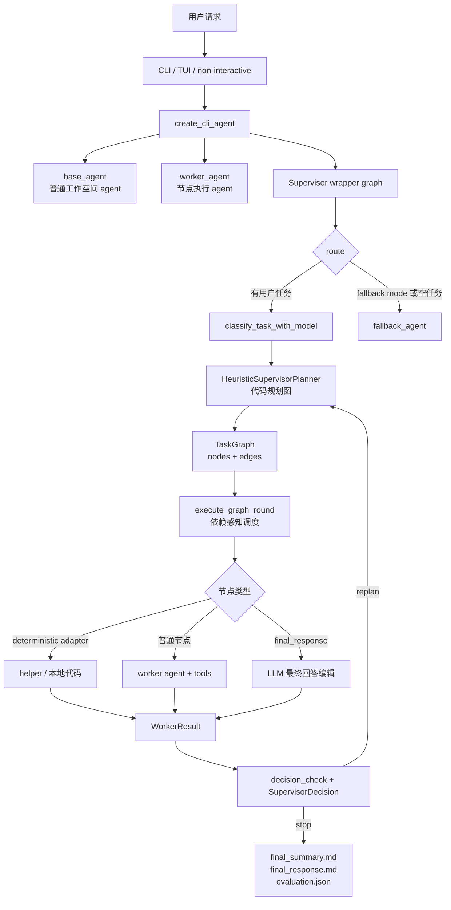

核心分工：

| 层次 | 由谁执行 | 主要作用 |
| --- | --- | --- |
| `route` | LangGraph 代码节点 | 决定进入 `supervise` 还是 `fallback` |
| `classify_task_with_model` | LLM + 规则兜底 | 识别 `generic`、`github2workspace`、`benchmark`、`report` |
| `HeuristicSupervisorPlanner` | Python 代码 | 生成每轮 `TaskGraph` |
| `execute_graph_round` | Python 代码 | 按 `edges` 做依赖调度，可并行执行 ready 节点 |
| `SupervisorWorkerRunner` | Python 代码 | 先尝试确定性 adapter，再调用 worker agent |
| worker 节点 | agent + tools | 执行仓库检查、构建、写文件、搜索、总结等 |
| helper | Python 脚本 | 对 `benchmark` 的注册、准备、执行做可复现处理 |
| `final_response` | LLM | 从已有证据中写最终给用户看的回答，不新增事实 |

## Agent 与 Worker 设计

当前系统里有几类容易混淆的 agent。它们都由 `create_cli_agent()` 组装，但职责不同。

```mermaid
flowchart TD
    C[create_cli_agent] --> M[解析 model / project_context / cwd]
    M --> MW[组装 CLI middleware stack]
    MW --> BA[base_agent<br/>正常 workspace agent]
    MW --> WK[supervisor_worker_agent<br/>Supervisor 节点默认 worker]
    MW --> FB[fallback_agent<br/>普通聊天/ fallback]
    MW --> RW[report_worker_agents<br/>按 report 节点模型覆盖]

    C --> CM[classifier_model<br/>resolve_model(model)]
    BA --> SG[build_supervisor_enabled_agent]
    WK --> SG
    FB --> SG
    RW --> SG
    CM --> SG

    SG --> OUT[最终 CLI agent graph]
```

### agent 类型

| 名称 | 由谁创建 | 作用 | 是否直接面向用户 |
| --- | --- | --- | --- |
| `base_agent` | `_build_workspace_agent()` | 原始工作空间 agent，也是某些兜底执行路径的基础能力 | 否，包在 supervisor 后面 |
| `supervisor_worker_agent` | `_build_workspace_agent()` 的第二个实例 | supervisor 普通节点默认执行器，即文档里的 `worker_agent` | 否，只执行节点 |
| `fallback_agent` | 去掉 orchestration skill 后的 `_build_workspace_agent()` | 当 route 进入 fallback 时做普通聊天 | 是，fallback 时直接输出 |
| `report_worker_agents` | `_build_workspace_agent(model_override=...)` | 给 report 的特定节点换模型，例如 `monitoring_lane`、`compose_report` | 否，只执行 report 节点 |
| `classifier_model` | `resolve_model(model)` | 只做任务族分类，输出 JSON | 否 |

这里的 `worker_agent` 不是单独手写的一套 agent，而是“同样工具能力 + 同样系统提示 + 同样 middleware”的 workspace agent 副本。这样设计的原因是：supervisor 外层负责拆图和调度，worker 内层仍然可以使用文件、shell、skills、subagents、summary 等完整工具能力。

### workspace agent 的 middleware 栈

`create_cli_agent()` 先准备 CLI 层 middleware，然后调用 `create_workspace_agent()`。最终 worker 可见的核心能力来自下面两层。

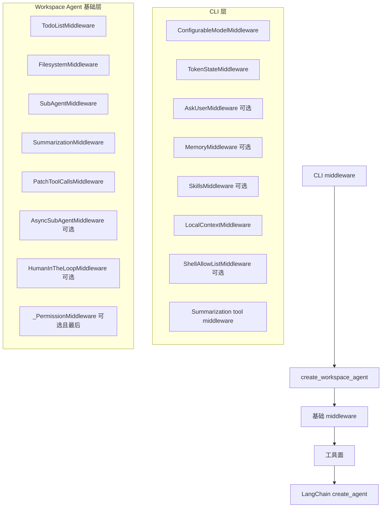

关键能力：

| middleware | 作用 |
| --- | --- |
| `ConfigurableModelMiddleware` | 支持运行时模型配置 |
| `TokenStateMiddleware` | 记录 token 状态，便于 checkpoint |
| `AskUserMiddleware` | 交互模式下可向用户提问 |
| `MemoryMiddleware` | 读取用户/项目 `AGENTS.md` 记忆 |
| `SkillsMiddleware` | 加载 built-in、用户、项目 skill |
| `LocalContextMiddleware` | 注入本地 git、目录、MCP 等上下文 |
| `FilesystemMiddleware` | 提供 `ls`、`read_file`、`write_file`、`edit_file`、`glob`、`grep`、`execute` |
| `SubAgentMiddleware` | 提供 `task` 工具，允许 worker 再委托短生命周期 subagent |
| `SummarizationMiddleware` | 处理长上下文和总结 |
| `PatchToolCallsMiddleware` | 修正工具调用形态 |
| `HumanInTheLoopMiddleware` | 根据配置暂停危险工具调用 |
| `_PermissionMiddleware` | 最后检查文件权限 |

### worker_agent 节点执行选择

`SupervisorWorkerRunner` 不会所有节点都交给 LLM。它按顺序尝试多种执行器。

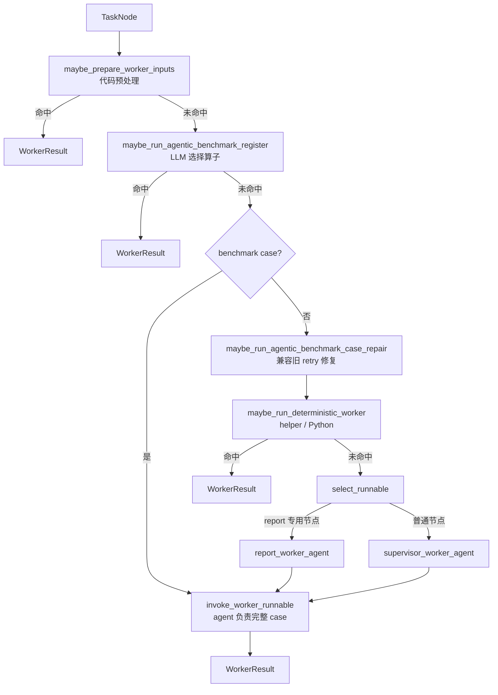

执行优先级：

1. `github2workspace inspect` 的仓库 materialization 由代码先做。
2. `github2workspace wdl` 可复用已有 smoke 证据，但只能返回 `partial`，不能假装主 workflow 完成。
3. `benchmark register` 可以先让 LLM 在候选算子中选工具，再交给确定性 helper 落地。
4. `benchmark case` 默认直接进入 per-tool `worker_agent`，由 agent 负责执行、修复、验证和分析；helper 只是 agent 可调用的工具命令。
5. `benchmark summarize` 仍优先走确定性 helper，负责聚合各 agent case 产物。
6. 其他节点才进入 `worker_agent`。

### report 专用 worker 模型

`report` 任务可以给不同节点配不同模型。默认模型是 `openai_paid:gpt-5.4`，不可用时尝试兼容 fallback `openai:gpt-5.4`。

| report 节点 | 环境变量 |
| --- | --- |
| 全局 report worker | `CODE2WORKSPACE_SUPERVISOR_REPORT_MODEL` |
| `init_report` | `CODE2WORKSPACE_SUPERVISOR_REPORT_INIT_MODEL` |
| `monitoring_lane` | `CODE2WORKSPACE_SUPERVISOR_REPORT_MONITORING_MODEL` |
| `local_data_lane` | `CODE2WORKSPACE_SUPERVISOR_REPORT_LOCAL_DATA_MODEL` |
| `literature_lane` | `CODE2WORKSPACE_SUPERVISOR_REPORT_LITERATURE_MODEL` |
| `compose_report` | `CODE2WORKSPACE_SUPERVISOR_REPORT_COMPOSE_MODEL` |
| `summarize` | `CODE2WORKSPACE_SUPERVISOR_REPORT_SUMMARIZE_MODEL` |
| `final_response` | `CODE2WORKSPACE_SUPERVISOR_REPORT_FINAL_RESPONSE_MODEL` |

`SupervisorWorkerSubagent` 只是一个轻量映射：

- `name`：例如 `report:compose_report`。
- `runnable`：对应模型构建出的 workspace agent。
- `node_ids`：这个 runnable 负责的节点集合，例如 `compose_report` 和 `retry_compose_report`。

`SupervisorWorkerRunner._select_runnable()` 会先看节点是否匹配 report 专用 worker；匹配则用专用 runnable，否则用默认 `supervisor_worker_agent`。

### worker prompt 设计

每个 `TaskNode` 进入 `worker_agent` 前，会被 `_build_worker_prompt()` 包装成严格的节点执行提示。这个 prompt 的核心目标是让 worker 只完成当前节点，而不是重新规划整个任务。

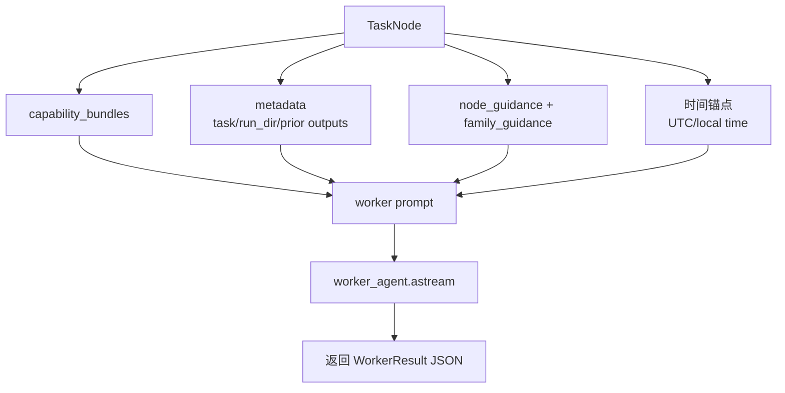

prompt 中会注入：

- `Workspace root`
- 当前 UTC 时间和本地时间，用于 latest/recent 任务。
- `Node ID`、`Objective`、原始用户任务。
- `Run directory`。
- 之前节点的 `worker_outputs`、`node_traces` 和简化 payload。
- `capability_bundles` 的说明、实现类型和偏好工具。
- 节点级 guidance，例如 `register`、`wdl`、`compose_report`。
- family guidance，例如 `benchmark_family`、`github2workspace_pipeline`。
- 对 `final_response` 节点，额外注入 final summary 和决策信息。
- 对 `report local_data_lane` 和 generic 计算节点，额外注入 `operator_store` 候选算子、候选输入数据，以及 `benchmark_comparison_history_store` 候选历史记录。

worker 必须返回 JSON：

```json
{
  "status": "completed",
  "summary": "节点完成内容",
  "artifacts": ["文件路径"],
  "evidence": ["证据说明或路径"],
  "next_action_hint": null,
  "failure_reason": null,
  "spawned_subgraph": null
}
```

如果 worker 没有返回 JSON，解析器会把文本包装成 `completed`，但这类结果在关键节点会被 `decision_check` 拦住。例如 `init_generic` 没有 `spawned_subgraph.nodes`，就不能进入下一轮执行。

### prompt 注入位置

系统里有三类 prompt 注入，作用不同：

| 注入位置 | 注入对象 | 注入内容 | 目的 |
| --- | --- | --- | --- |
| `get_system_prompt()` | `base_agent`、`worker_agent`、`fallback_agent` | CLI/工作空间通用 system prompt、本地运行规则、交互/非交互差异 | 给所有 workspace agent 统一人格和工具使用边界 |
| `MemoryMiddleware` / `SkillsMiddleware` | `base_agent`、`worker_agent` | 用户/项目 `AGENTS.md`、`.code2workspace/skills`、`.agents/skills` | 注入项目规则、技能说明、orchestration guidance |
| `_build_worker_prompt()` | 每个 supervisor 节点 | 节点目标、run_dir、历史 worker 输出、capability、family/node guidance、本地计算上下文 | 把“一个大任务”压缩成“当前节点只做什么” |

`worker_agent` 的节点 prompt 不是 system prompt，而是作为当前 HumanMessage 交给 agent。这样它仍然继承 workspace agent 的工具、skills、memory 和 subagent 能力，同时又被节点级指令约束。

### worker prompt 的信息拼装流程

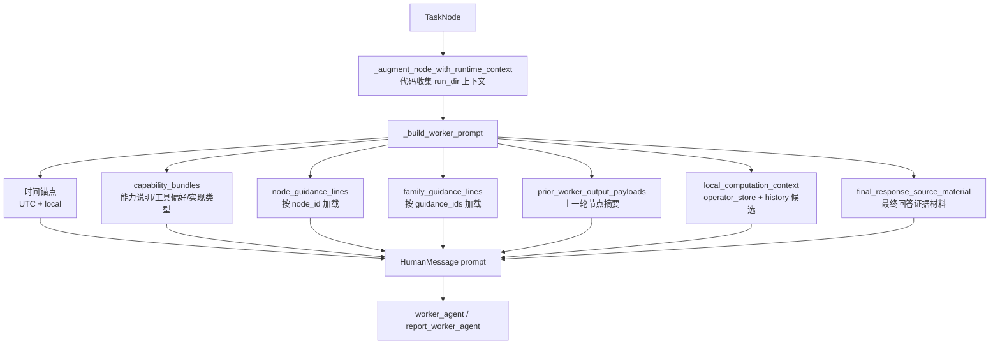

其中 `local_computation_context` 只在需要本地数据或计算的节点注入，例如 `report local_data_lane`、`generic worker_context`、`worker_solution`，以及带 `db_access`、`operator_filter`、`metric_compute`、`data_filter` 能力束的节点。

### subagent 机制

worker agent 自己还可以通过 `task` 工具调用 subagent。subagent 定义来自：

```txt
.code2workspace/agents/<agent_name>/AGENTS.md
~/.code2workspace/<assistant_id>/agents/<agent_name>/AGENTS.md
```

每个 subagent 文件使用 YAML frontmatter：

```md
---
name: researcher
description: Research topics on the web before writing content
model: openai:gpt-5.4
allow_nested_task: true
nested_task_budget: 1
max_delegation_depth: 3
---

这里写 subagent 的 system_prompt。
```

`SubAgentMiddleware` 会把它们暴露成一个 `task(description, subagent_type)` 工具。调用时：

1. 父 agent 给出详细 `description` 和 `subagent_type`。
2. middleware 创建只包含这次任务的新 state，避免把父 agent 全部上下文泄漏给子 agent。
3. 子 agent 独立运行，最后只把最后一条消息作为 `ToolMessage` 返回。
4. 对 report lane，可以允许有限 nested subagent，但受 `nested_task_budget`、`max_delegation_depth`、`nested_scope_guard` 限制。

这意味着系统里有两种“worker”：

- supervisor 层的 `worker_agent`：执行 `TaskGraph` 节点。
- workspace agent 内部的 subagent：由 worker 通过 `task` 工具临时调用，用于隔离复杂子任务。

## 任务分类与路由

任务分类有两层：先用规则识别明显信号，再尝试用 LLM 分类；当 LLM 输出无效、低置信度或不可用时回退到规则结果。

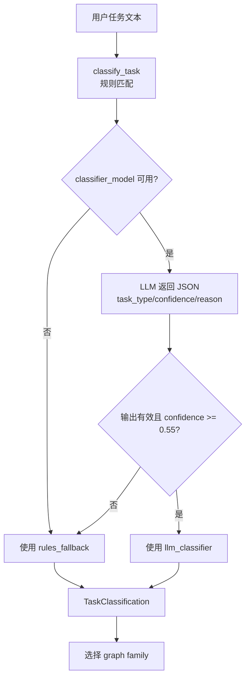

分类结果：

| `task_type` | 触发场景 | 后续图 |
| --- | --- | --- |
| `generic` | 普通问答、代码修复、数据分析、判断类问题 | 动态规划或通用执行图 |
| `github2workspace` | 把 GitHub 仓库转成可运行 workspace、Docker、WDL 验证 | `inspect -> build -> wdl -> summarize` |
| `benchmark` | 多工具或多 workflow 在共享数据集上比较指标 | `register -> parallel tool cases -> summarize` |
| `report` | 正式报告、风险评估、监测简报、证据综述 | `init_report -> evidence lanes -> compose_report -> summarize` |

特别规则：如果用户说“先给我口头判断”“不要正式写作”“直接回答”，即使内容像报告，也优先走 `generic`，避免误生成正式报告。

## 通用任务 generic

`generic` 是默认能力，用来处理普通问答、代码修复、仓库分析、方案比较、判断类任务。它的第一轮通常由 `init_generic` 让 worker agent 设计下一轮子图。

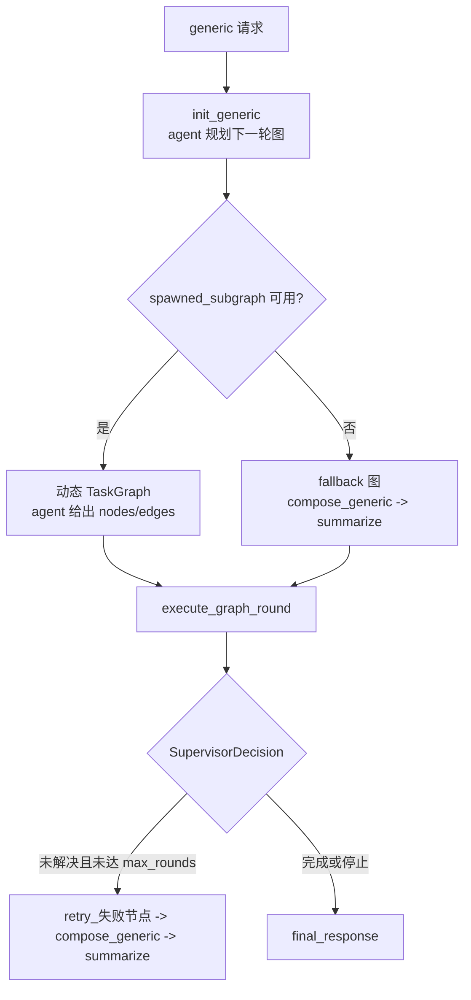

`init_generic` 的关键技术点：

- 由 worker agent 执行，不直接给最终答案。
- 要返回 JSON，其中 `spawned_subgraph.nodes` 是下一轮节点列表。
- 每个节点需要 `node_id`、`title`、`objective`、`capability_bundles`。
- 代码会清洗节点名、能力束和边，防止非法节点进入调度。
- 如果没有可用子图，会退化为 `compose_generic -> summarize`。

典型节点设计：

| 节点 | 谁执行 | 作用 |
| --- | --- | --- |
| `init_generic` | worker agent | 分析任务并规划下一轮子图 |
| `worker_context` | worker agent | 查约束、证据、仓库事实或上下文 |
| `worker_solution` | worker agent | 做实现、修复、方案或结论 |
| `compose_generic` | worker agent / LLM | 合并 worker 输出为正常用户答案 |
| `summarize` | worker agent / LLM | 记录结果、阻塞点、下一步建议 |
| `final_response` | LLM | 编辑成最终聊天回答 |

## 仓库转工作空间 github2workspace

`github2workspace` 面向“把 GitHub 仓库变成可运行工作空间”的任务，重点验证 Docker 与 WDL，而不是只写说明。

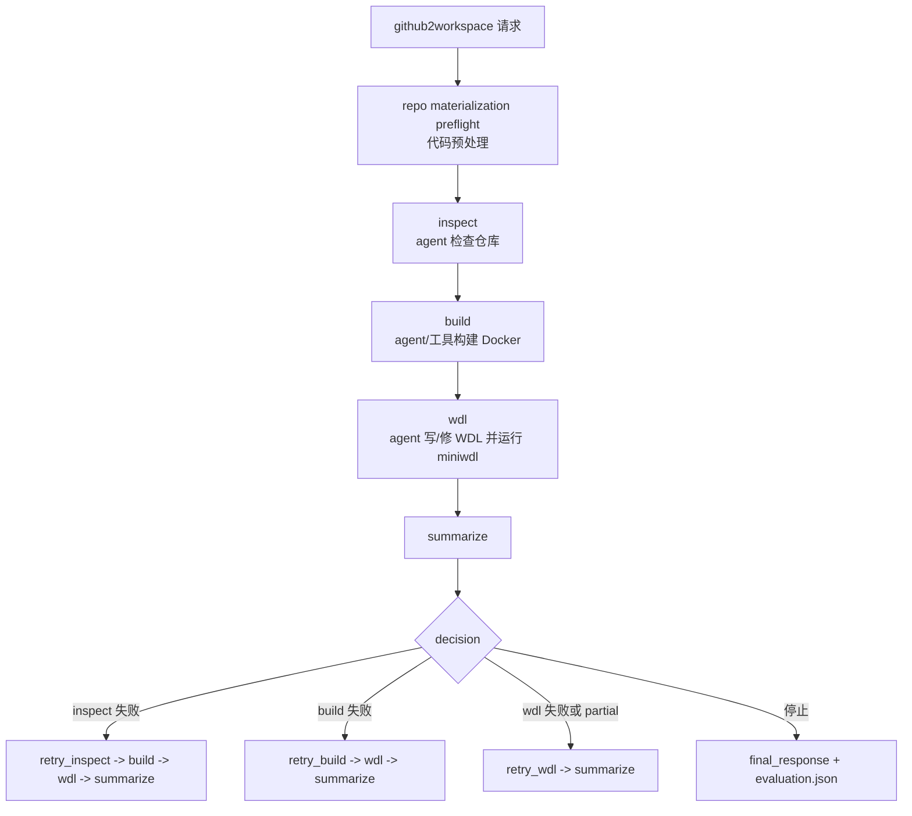

`repo materialization preflight` 由代码执行，顺序为：

1. 如果 workspace 已有目标 git 仓库，直接复用。
2. 查找本地 `code_repository` 缓存并复制。
3. 执行普通 `git clone`。
4. 执行 `git clone --depth 1`。
5. 查找本地同名仓库并 `git clone --local`。
6. 都失败则返回 `repo_materialization_failed`，这会作为实验结果记录，而不是让批处理崩溃。

节点完成标准更严格：

| 阶段 | 关键证据 | 说明 |
| --- | --- | --- |
| `inspect` | 仓库结构、入口脚本、依赖、数据需求 | 给 `build` 和 `wdl` 提供下游前提 |
| `build` | Dockerfile、镜像构建日志、最小容器验证 | 优先官方镜像，其次薄包装镜像，最后从零构建 |
| `wdl` | 主功能 WDL、`outputs.json`、`workflow.log` | 只通过 `miniwdl check` 不算完成 |
| `summarize` | 已验证状态和阻塞点 | 不能把 smoke 成功夸大成主 workflow 成功 |

`decision_check` 会阻止虚假完成：如果 `wdl` 声称 `completed`，但没有主功能 `miniwdl` 成功运行证据，代码会生成 `check_wdl` 并要求停止或重试。

### github2workspace 的假阳拦截

这里的“假阳”主要指最终回答说已经跑通，但产物证据不足。

| 拦截位置 | 类型 | 触发条件 | 处理 |
| --- | --- | --- | --- |
| `wdl` 节点 guidance | prompt 约束 | worker 可能只做 `miniwdl check` | 明确说明 `miniwdl check` 不等于完成 |
| `decision_check` | 代码判断 | `wdl` 返回 `completed`，但没有主 workflow 成功 `outputs.json` / `workflow.log` | 生成 `check_wdl`，停止下游或要求重试 |
| `evaluation.json` | artifact 后处理 | final response 声称 Docker/WDL/可复现成功，但证据等级不足 | 标记 `false_positive=true` 和 `unsupported_claims` |
| `operator_store` 写入 | 产品库记录 | github2workspace 产物被登记为算子 | 把 `false_positive`、`completion_level`、缺失证据写入算子记录和 tag |

## 基准测试 benchmark

`benchmark` 用于多个算子或工具在共享输入上比较指标。这里的关键不是让 LLM 自由发挥，而是把注册、准备、执行、汇总拆成可追溯阶段。

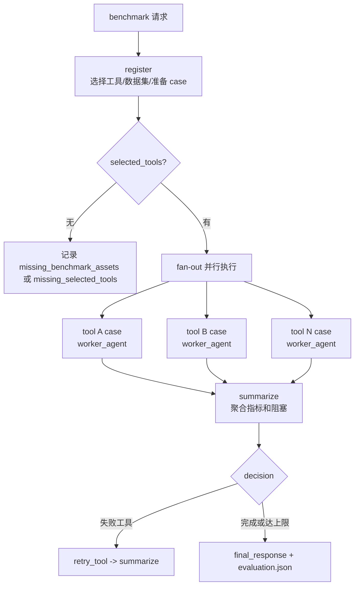

`register` 的实现分三层：

| 层 | 谁执行 | 作用 |
| --- | --- | --- |
| `operator_store` 检索 | 代码 + SQLite | 根据任务、输入输出类型、tag、全文或 embedding 召回候选算子 |
| LLM 选择 | worker agent | 在候选集中选择最合适的工具子集，输出 JSON |
| deterministic helper | Python 脚本 | 初始化 benchmark 目录、解析数据集、准备 case、生成执行契约 |

`register` 最少要产出：

- `operator_selection.json`：选择策略、候选和最终工具。
- `benchmark_plan.json/md`：本次基准测试计划。
- `dataset_resolution.json/md`：共享数据集和输入解析结果。
- `metric_plan.json/md`：要计算的指标。
- `cases/<tool>/manifest.json`：每个工具的 case 描述。
- `cases/<tool>/execution_ready.json`：是否具备 runtime image、WDL、inputs。
- `spawned_subgraph.selected_tools`：下一轮并行节点的机器可读工具列表。

执行节点现在由并行的 per-tool `worker_agent` 负责完整 case 执行。agent 会读取 `manifest.json`、`execution_ready.json` 和执行契约，自行选择 repo-native helper、WDL 路径或必要的受限修复；`.code2workspace/skills/orchestration/benchmark-workflow-orchestrator/scripts/benchmark_workflow.py` 仍可作为 agent 调用的工具命令，但不再由 supervisor 直接短路执行整个 case。

### benchmark case 执行与修复

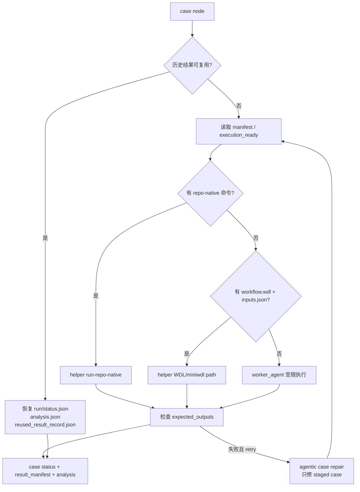

修复节点不是让 agent 重新设计 benchmark，而是把错误日志、staged WDL、case manifest、输入路径注入给 worker，让它做最小修复。修复输出必须能落到 `repair_report.json` 或具体被改文件，否则忽略无效修复。

## 报告生成 report

`report` 面向正式报告、风险评估、监测简报等证据型交付。它把证据分成多条 lane，最后由 `compose_report` 合成。

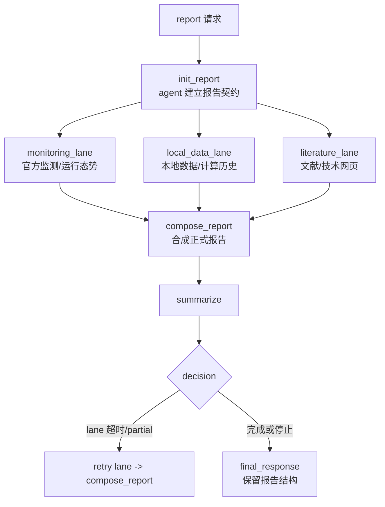

报告链路的技术约束：

- `init_report` 只做报告契约和目录脚手架，不做大规模研究。
- 三条 evidence lane 可并行执行。
- report 节点有默认超时 `20min`，超时记录为 `partial + worker_timeout`，后续仍可基于已有证据合成。
- `local_data_lane` 会注入 `benchmark_comparison_history_store` 候选历史记录，把本地 benchmark 比对计算历史当作结构化证据。
- `local_data_lane` 和 generic 计算节点都会注入 `operator_store` 候选，把算子库作为 `computed_data` 的首选来源。
- `compose_report` 必须区分直接证据、推断证据和不确定性。
- `final_response` 对 report 不压缩成短摘要，而是尽量保留正式 Markdown 报告结构。

默认报告结构包括：标题、执行摘要、范围与时间窗口、关键发现、证据分析、不确定性与局限、建议或下一步、来源与证据附录。

### report 的 evidence lane 设计

| lane | 主要来源 | 由谁执行 | 输出要求 |
| --- | --- | --- | --- |
| `monitoring_lane` | 官方监测、主数据源、可信域名搜索 | `report_worker_agent` | 2-4 条 source-backed findings、source priority、freshness、uncertainty |
| `local_data_lane` | 本地数据库、API、`operator_store`、`benchmark_comparison_history_store` | `report_worker_agent` + 本地工具 | `existing_data`、`computed_data`、历史记录摘录或无结果说明 |
| `literature_lane` | 文献、preprint、技术网页、一次来源 | `report_worker_agent` | 2-4 条文献/技术证据、direct-vs-proxy、局限 |
| `compose_report` | 三条 lane 的产物 | `report_worker_agent` / LLM | 正式 Markdown 报告，不新增未证实事实 |
| `final_response` | compose 结果、final summary、decision | LLM | 保留报告结构，补充证据边界 |

`monitoring_lane` 的证据深度默认是 D2：定向可信源搜索并读取支撑具体结论的页面、PDF、CSV、JSON 或报告。需要趋势/变化时升到 D3；高风险、争议、强不确定或用户要求全面研究时才升到 D4。

## 节点执行机制

每轮图执行由 `execute_graph_round` 完成，它按边关系找 ready 节点，并用 `asyncio.gather` 并行执行。

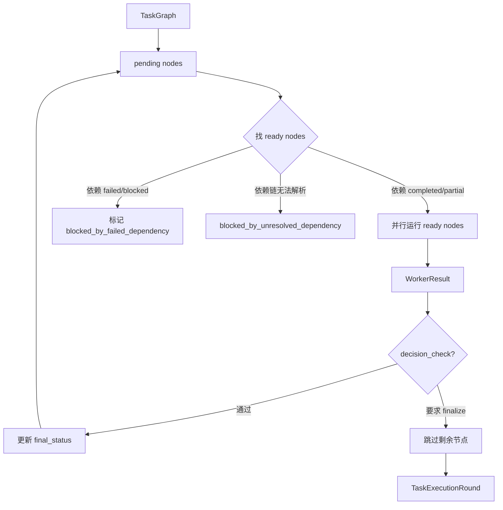

`WorkerResult` 是所有节点统一返回格式：

```json
{
  "status": "completed | blocked | failed | partial",
  "summary": "节点摘要",
  "artifacts": ["产物路径"],
  "evidence": ["证据路径或证据说明"],
  "next_action_hint": "下一步提示",
  "failure_reason": "失败原因",
  "spawned_subgraph": {}
}
```

节点执行包装 `_run_worker_and_capture` 会额外做：

- 写 `node_started`、`node_heartbeat`、`node_finished` 到 `tool_activity.jsonl`。
- 把 worker 真实工具调用暴露为 `worker_tool_call` / `worker_tool_result`。
- 对 report 节点设置超时。
- 把结果写入 `worker_outputs/<node>.json` 和 `node_traces/<node>.json`。
- 把原始 worker 消息、raw output、解析后的 `WorkerResult`、source URLs、耗时写入 `raw_worker_traces/<node>.jsonl`。
- 向 TUI / stream 发送 supervisor event，便于界面显示长任务进度。

### node decision check

部分关键节点在 `metadata.decision_check=true` 时会被代码复核。复核不是 LLM 评审，而是根据 `WorkerResult` 和已落盘证据判断“能不能让下游继续”。

| 节点 | 复核规则 | 失败处理 |
| --- | --- | --- |
| 任意关键节点 | `status=failed/blocked` | `finalize`，下游标记 `blocked_by_node_decision_check` |
| `init_generic` | 没有 `spawned_subgraph.nodes` | 允许继续，由 generic fallback 图兜底 |
| `register` / `retry_register` | 没有结构化 `selected_tools` 或 `blocked_tools` | `finalize`，防止无工具列表时 fan-out |
| `init_report` | `partial` 或没有 contract/artifact/evidence 信号 | `finalize`，防止证据 lane 在不可靠报告契约上运行 |
| `github2workspace wdl` | `completed` 但无主功能 miniwdl 成功证据，或只有 smoke-level 证据 | `finalize`，防止把静态检查当成跑通 |

被 `finalize` 的节点会生成一个虚拟 `check_<node_id>` 结果，记录原因；剩余节点不会继续消耗时间，但仍会写 final summary、final response 和 evaluation。

## 能力束与 Skill guidance

每个 `TaskNode` 不是只写自然语言目标，还带 `capability_bundles`。能力束告诉 worker 这一节点允许或偏好的工具面。

| `capability_bundle` | 实现类型 | 典型工具 | 用途 |
| --- | --- | --- | --- |
| `repo_fetch` | hybrid | `execute`, `read_file`, `ls`, `glob` | 拉取和检查仓库 |
| `docker_build_run` | hybrid | `execute`, `write_file`, `edit_file` | Docker 构建与运行 |
| `wdl_run` | hybrid | `execute`, `write_file`, `edit_file` | WDL/Cromwell/miniwdl |
| `operator_filter` | guidance | `read_file`, `execute` | 算子筛选 |
| `metric_compute` | hybrid | `execute`, `read_file`, `write_file` | 指标计算 |
| `summarize` | guidance | `read_file`, `write_file` | 汇总和最终表达 |
| `web_search` | tool | `web_search` | 搜索证据 |
| `web_fetch` | tool | `fetch_url` | 抓取网页 |
| `db_access` | hybrid | `execute`, `read_file` | 访问本地数据库 |
| `api_call` | hybrid | `fetch_url`, `execute` | 调 API |

`Skill guidance` 存放在 `.code2workspace/skills/orchestration/supervisor-guidance/`。代码会按 family 和 node 加载提示片段，例如：

- `families/github2workspace_pipeline.md`
- `families/benchmark_family.md`
- `families/report_synthesis.md`
- `nodes/register.md`
- `nodes/benchmark_case.md`
- `nodes/inspect.md`
- `nodes/compose_report.md`

部分节点没有独立 Markdown 文件时，会使用 `supervisor_capabilities.py` 里的默认 guidance。例如 `wdl` 完成判断、`compose_generic`、`benchmark_case` 等都有代码侧默认提示或与现有 node guidance 叠加。

这样做的好处是：稳定的调度逻辑留在 Python，经验型执行策略放到 Skill 文档，便于迭代和论文追踪。

## 产物与 Benchmark 比对历史库

每次 supervisor 运行都会写入：

```txt
<workspace>/orchestration_runs/<run_id>/
├── request.json
├── task_classification.json
├── retrieved_cases.json
├── graph_round_1.json
├── graph_round_2.json
├── node_traces/
├── worker_outputs/
├── tool_activity.jsonl
├── final_summary.md
├── final_response.md
├── final_decision.json
└── evaluation.json
```

这些文件是 canonical evidence，也就是最可靠的可追溯来源。SQLite 索引只是可重建缓存。

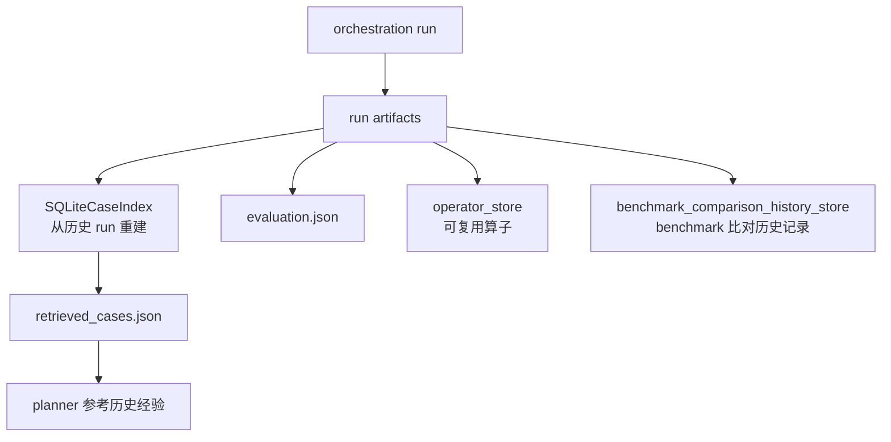

`SQLiteCaseIndex` 会从历史 `orchestration_runs` 中读取 `request.json`、`final_decision.json`、`final_summary.md`，把类似任务摘要索引起来。新任务规划前会检索最多 3 条相似历史案例。

### run artifact 的作用分层

| artifact | 谁写入 | 用途 |
| --- | --- | --- |
| `request.json` | supervisor wrapper 代码 | 原始请求、时间和入口信息 |
| `task_classification.json` | classifier / 规则 | 记录任务族、置信度、来源 |
| `retrieved_cases.json` | `SQLiteCaseIndex` | 给 planner 的相似历史案例 |
| `graph_round_*.json` | planner 代码 | 记录每轮图结构，便于复现调度 |
| `worker_outputs/*.json` | `_run_worker_and_capture` | 节点结构化结果，供后续节点和评估读取 |
| `node_traces/*.json` | `_run_worker_and_capture` | 节点输入输出快照 |
| `raw_worker_traces/*.jsonl` | worker wrapper | 原始消息、工具调用、模型输出和 source URLs |
| `tool_activity.jsonl` | worker wrapper / stream | TUI 进度、工具调用、heartbeat |
| `final_decision.json` | supervisor decision | 是否完成、是否重试、失败节点 |
| `final_summary.md` | summary 节点 / supervisor | 运行摘要 |
| `final_response.md` | final response 节点 | 最终给用户看的回答 |
| `evaluation.json` | deterministic evaluator | 完成度、缺失证据、假阳判断 |

## 算子库 operator_store

`operator_store` 用于管理可复用算子。当前设计是 manifest-first：文件是主记录，SQLite 是查询层。

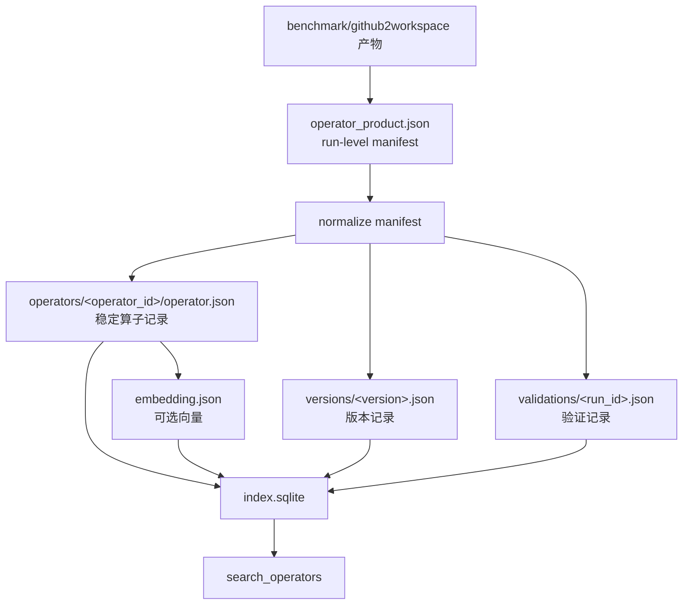

目录结构：

```txt
operator_store/
├── objects/
│   └── <family>/<name>/<version>/operator_product.json
├── operators/
│   └── <operator_id>/
│       ├── operator.json
│       ├── embedding.json
│       ├── versions/<version>.json
│       └── validations/<run_id>.json
└── index.sqlite
```

`operator.json` 记录“这个算子是什么”，包括：

- `operator_id`
- `family`
- `name`
- `version`
- `summary`
- `description`
- `source_repo`
- `inputs`
- `outputs`
- `runtime`
- `metrics`
- `tags`
- `canonical_text`

`validations/<run_id>.json` 记录“这次跑得怎么样”，包括：

- `validation_id`
- `operator_id`
- `run_id`
- `status`
- `dataset_id`
- `run_dir`
- `summary`
- `product_manifest_path`

检索接口 `search_operators` 支持：

- 结构化过滤：`family`、`input_media_type`、`output_media_type`、`metric_name`、`status`、`tags`。
- SQLite `FTS5` 全文检索。
- 可选 embedding 检索，支持 `sqlite_vec` 时走向量表，否则用 Python cosine similarity。
- 混合排序：语义结果和文本结果合并，按相关性与限制数量返回。

在 `benchmark register` 中，算子库的作用是把历史可运行产物变成候选工具，而不是让 LLM 从零猜测可运行命令。

## Benchmark 比对历史库 benchmark_comparison_history_store

`benchmark_comparison_history_store` 保存历史 benchmark 比对计算记录，主要服务两个场景：复用已有成功结果，以及给 `report local_data_lane` 提供本地比对计算证据。

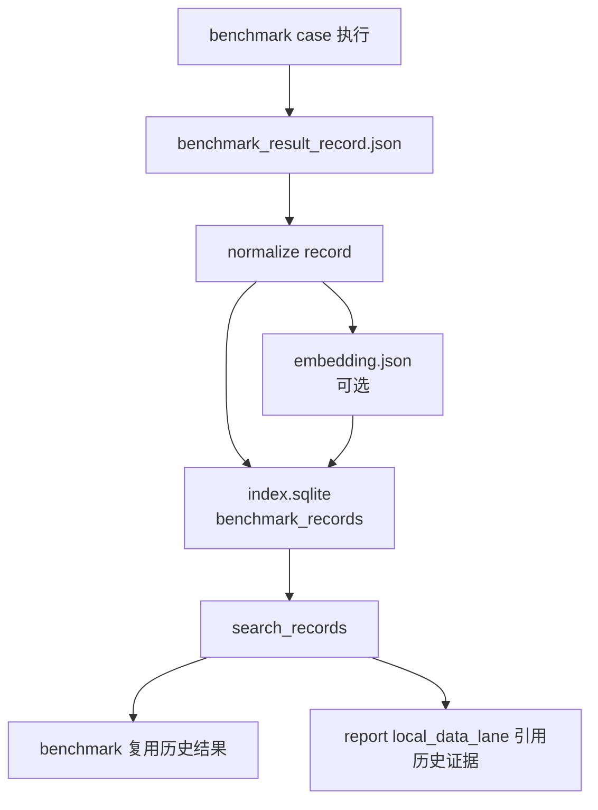

目录结构：

```txt
benchmark_comparison_history_store/
├── records/
│   └── <repo>/<run_id>/
│       ├── benchmark_result_record.json
│       └── embedding.json
└── index.sqlite
```

核心字段：

| 字段 | 作用 |
| --- | --- |
| `record_id` | 历史记录唯一标识 |
| `repo` | 工具或仓库名 |
| `operator_id` | 对应算子 |
| `dataset_key` | 数据集标识 |
| `workflow_signature` | workflow 摘要 |
| `input_signature` | 输入摘要 |
| `success` / `returncode` | 执行结果 |
| `workflow_path` / `inputs_json_path` | 可复现输入 |
| `result_manifest_path` | 输出检查结果 |
| `analysis_path` | 指标分析文件 |
| `canonical_text` | 用于检索的文本 |

检索 `search_records` 先做结构化过滤，再用 query token 和可选 embedding 对候选重排。默认 `success_only=True`，需要报告失败经验时可设为 `False`。

## 评估指标与完成度判断

评估器是 artifact post-processor，不是 agent。它读取 run 目录产物，写 `evaluation.json`。当前支持 `github2workspace`、`benchmark` 和 `generic`。其中 `github2workspace` 与 `benchmark` 更强调阶段完成度和假阳检测，`generic` 更强调路由、图结构、证据边界和 trace 可审计性。

### github2workspace 评估等级

| 等级 | 名称 | 判断依据 |
| --- | --- | --- |
| `G0` | `repo_not_materialized` | 仓库未成功落地 |
| `G1` | `repo_materialized` | 有成功 materialization 记录 |
| `G2` | `repo_inspected` | `inspect` 至少 partial/completed |
| `G3` | `environment_created` | 找到 Dockerfile 等环境产物 |
| `G4` | `environment_built` | 有 Docker build 成功证据 |
| `G5` | `workflow_created` | 有 WDL 产物 |
| `G6` | `workflow_validated` | `wdl` 节点至少 partial/completed |
| `G7` | `smoke_run_succeeded` | `outputs.json` + 成功 `workflow.log` |
| `G8` | `workspace_reproducible` | 关键请求、决策和成功输出都存在 |

同时检查 false positive：

- 没有 build 证据却声称 Docker 成功。
- 没有 smoke 成功证据却声称端到端跑通。
- 没有可复现证据却声称完全可复现。

### benchmark 评估等级

| 等级 | 名称 | 判断依据 |
| --- | --- | --- |
| `B0` | `benchmark_not_registered` | 未注册 |
| `B1` | `task_registered` | 有 `operator_selection.json` 或 register 输出 |
| `B2` | `operators_selected` | 选出了工具 |
| `B3` | `inputs_resolved` | 输入或数据集已解析 |
| `B4` | `cases_materialized` | case manifest 和 WDL/input 已落地 |
| `B5` | `execution_started` | run/status 或 wdl/status 出现 |
| `B6` | `single_operator_completed` | 至少一个工具成功 |
| `B7` | `multi_operator_completed` | 至少两个工具成功 |
| `B8` | `metrics_extracted` | 有指标 |
| `B9` | `comparison_valid` | 可比较数据集上形成有效比较 |
| `B10` | `result_reusable` | 有可复用历史记录或复用证据 |

额外指标：

- `selected_operators`
- `completed_operators`
- `failed_operators`
- `dataset_consistency`
- `comparison_valid`
- `history_reuse`
- `required_evidence_missing`
- `unsupported_claims`

这套评估避免只看最终回答文字，而是把“真实完成到哪一步”落到文件证据上。

### generic 评估等级

| 等级 | 名称 | 判断依据 |
| --- | --- | --- |
| `D0` | `no_generic_artifacts` | 没有可用 generic 产物 |
| `D1` | `classified_generic` | `task_classification.json` 或 `final_decision.json` 标记为 `generic` |
| `D2` | `graph_planned` | 有 `graph_round_*.json` 且包含节点 |
| `D3` | `nodes_executed` | 有 `worker_outputs/*.json` |
| `D4` | `worker_trace_available` | 有 `raw_worker_traces/*.jsonl` 或 `tool_activity.jsonl` |
| `D5` | `final_answer_written` | 有非空 `final_response.md` |
| `D6` | `evidence_boundary_preserved` | 最终回答包含证据边界、不确定性、局限、直接/推断等信号 |

generic 还会写 `generic_trace_summary.json`，用于 harness 对比。它不是判断“答案一定正确”，而是判断这次通用任务运行是否可审计、可比较、边界清楚。

| 指标 | 含义 |
| --- | --- |
| `routing_score` | 是否正确留在 `generic` |
| `graph_fit_score` | 图结构是否适合任务，避免过度拆分或缺节点 |
| `traceability_score` | worker 输出、raw trace、耗时和工具事件是否完整 |
| `evidence_score` | 是否有 source URL、搜索后读取、证据边界 |
| `answer_score` | 是否写出最终回答，是否有可审计摘要和证据边界 |
| `efficiency_score` | 节点数、工具事件数和耗时是否过高 |

generic 的常见 findings 包括：没有规划节点、部分节点缺 raw trace、工具事件名称未归一化、运行成本过高、收集了 source 但 final answer 没保留证据边界等。

## Prompt 注入与假阳拦截总表

### prompt 注入总表

| 功能 | 注入位置 | 主要注入内容 | 为什么注入 |
| --- | --- | --- | --- |
| 任务分类 | classifier prompt | task、候选 task_type、JSON 输出约束 | 让分类结果机器可读 |
| `generic init` | `_build_worker_prompt` + `nodes/init_generic.md` | 动态子图格式、能力束白名单、本地计算要求 | 让 worker 规划下一轮而不是直接答完 |
| `generic evidence/solution` | `worker_context.md` / `worker_solution.md` | D2-D4 证据深度、本地 operator 计算、停止条件 | 让普通任务也保留证据边界 |
| `github2workspace inspect/build/wdl` | family guidance + node guidance | 仓库落地、Docker、WDL、miniwdl 真实运行要求 | 防止只写说明不验证 |
| `benchmark register` | `nodes/register.md` + operator candidates | 候选算子、共享数据集、helper 命令、`selected_tools` 输出 | 让下游 fan-out 有机器可读输入 |
| `benchmark case` | `nodes/benchmark_case.md` + case artifacts | manifest、execution contract、helper 路径、期望输出 | 让每个算子由并行 agent 完整执行 case |
| `report init` | `nodes/init_report.md` | 报告契约、lane 期望、目录脚手架 | 让证据 lane 有统一口径 |
| `report lanes` | lane guidance + local computation context | source priority、D2/D3/D4、operator/history 候选 | 控制证据质量和本地计算复用 |
| `compose_report` | `nodes/compose_report.md` | 默认报告模板、引用规则、证据/推断/局限 | 产出正式结构化报告 |
| `final_response` | `_build_worker_prompt` 特殊分支 | final summary、decision、已收集证据、禁止发明事实 | 把内部产物编辑成用户回答 |

### 假阳拦截总表

| 功能 | 假阳风险 | 拦截点 | 判断依据 |
| --- | --- | --- | --- |
| `generic` | 有 source 但回答抹掉不确定性 | `generic` evaluator | `has_evidence_boundary`、`has_audit_summary`、source URL 与 final answer 对照 |
| `github2workspace build` | 声称 Docker 成功但无构建证据 | evaluator | `worker_outputs/build.json` 中的 Dockerfile 和 build success marker |
| `github2workspace wdl` | `miniwdl check` 被当成真实运行 | node decision + evaluator | `wdl_smoke_run/*/outputs.json` 和成功 `workflow.log` |
| `github2workspace reproducible` | 声称完全可复现但缺请求/决策/输出 | evaluator | `request.json`、`final_decision.json`、smoke outputs/log |
| `benchmark register` | 没有工具列表却继续 fan-out | node decision | `spawned_subgraph.selected_tools` 或 `blocked_tools` |
| `benchmark comparison` | 一个工具成功却说多工具比较有效 | evaluator | `completed_operators>=2`、`dataset_consistency`、summary comparison |
| `benchmark history reuse` | 历史结果被错误复用 | history reuse 规则 | workflow/input signature 优先，dataset_key 兜底 |
| `report` | 证据 lane 不全却写成确定结论 | report guidance + final prompt | 必须保留 missing lane、uncertainty、source appendix |

### 代码与 LLM 的边界

| 环节 | 代码负责 | LLM / agent 负责 |
| --- | --- | --- |
| 路由 | 规则兜底、置信度阈值、无效 JSON 回退 | 根据任务语义输出分类 JSON |
| 图规划 | 已知任务族默认图、重试图、依赖调度 | `init_generic` 可生成动态子图 |
| 节点执行 | register/summarize helper、历史复用、产物落盘、超时、heartbeat | per-tool case 执行、命令选择、修复、证据提炼、报告写作 |
| 算子检索 | SQLite/FTS/embedding 召回候选 | 从候选中解释选择理由或做小范围决策 |
| 完成判断 | `decision_check`、`evaluation.json`、false positive 标记 | `final_response` 用已有证据写清楚边界 |

## 入口文件速查

| 文件 | 作用 |
| --- | --- |
| `libs/code2workspace/code2workspace/orchestration_runtime.py` | `TaskGraph` 数据结构、分类、规划、依赖调度、决策检查 |
| `libs/cli/code2workspace_cli/supervisor_runtime.py` | CLI supervisor wrapper、运行目录、worker 执行、产物落盘、helper adapter |
| `libs/cli/code2workspace_cli/supervisor_capabilities.py` | `capability_bundles` 到工具和 guidance 的映射 |
| `libs/cli/code2workspace_cli/supervisor_evaluation.py` | `evaluation.json` 阶段化评估 |
| `libs/cli/code2workspace_cli/operator_store.py` | 算子库、结构化/全文/向量检索 |
| `libs/cli/code2workspace_cli/benchmark_result_store.py` | benchmark 比对历史库实现；模块名保留旧称以兼容代码 |
| `.code2workspace/skills/orchestration/supervisor-guidance/` | family 和 node 执行经验 |
| `.code2workspace/skills/orchestration/benchmark-workflow-orchestrator/scripts/benchmark_workflow.py` | benchmark 确定性 helper |
