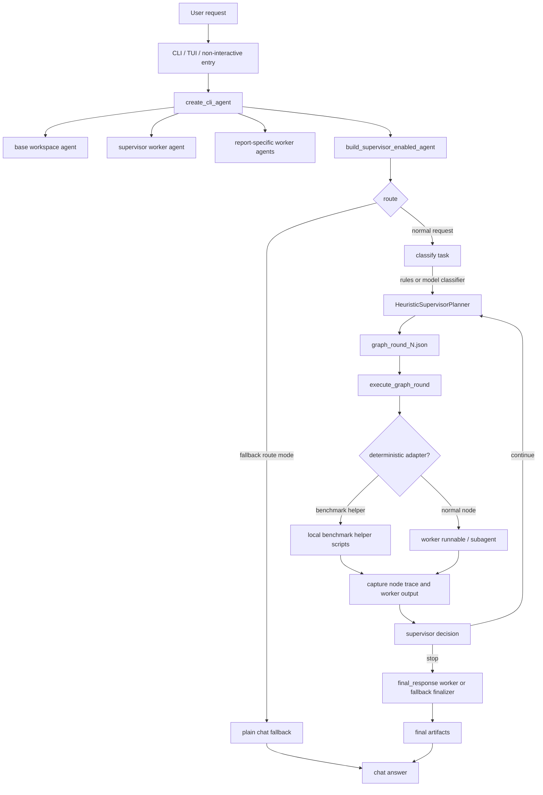
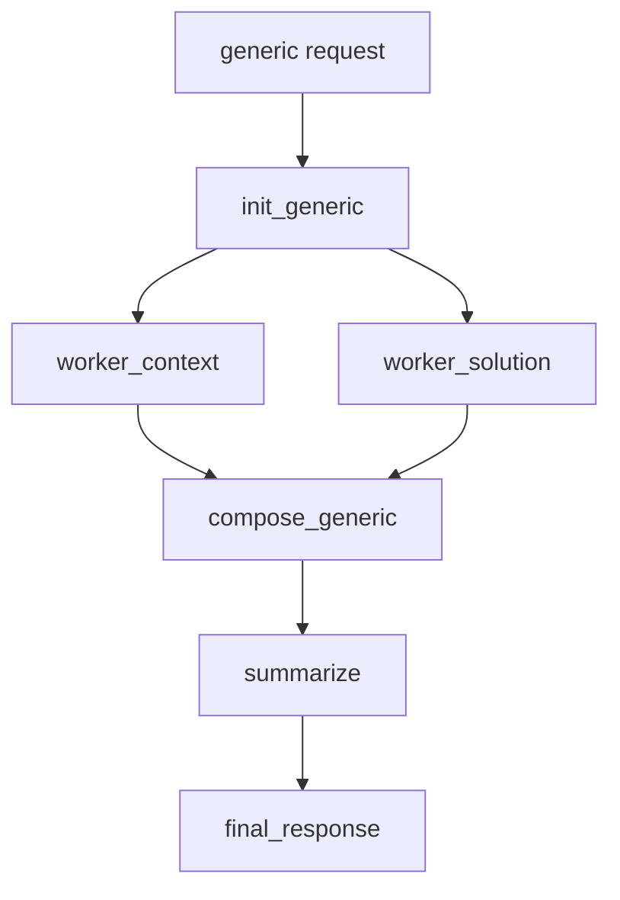
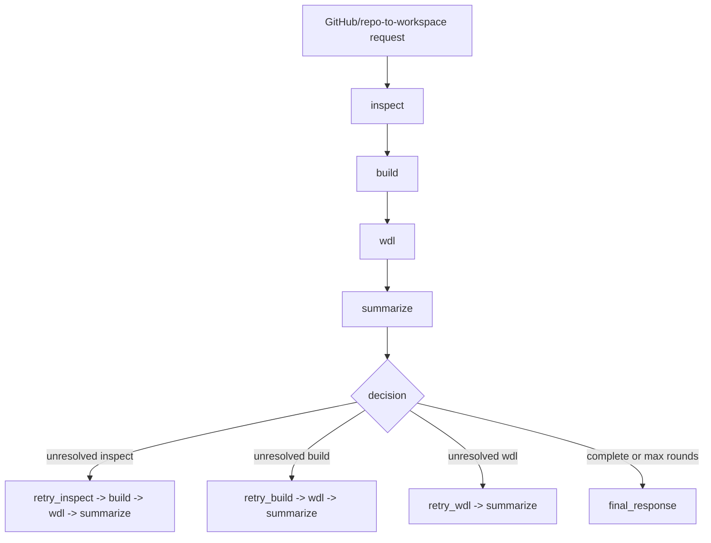
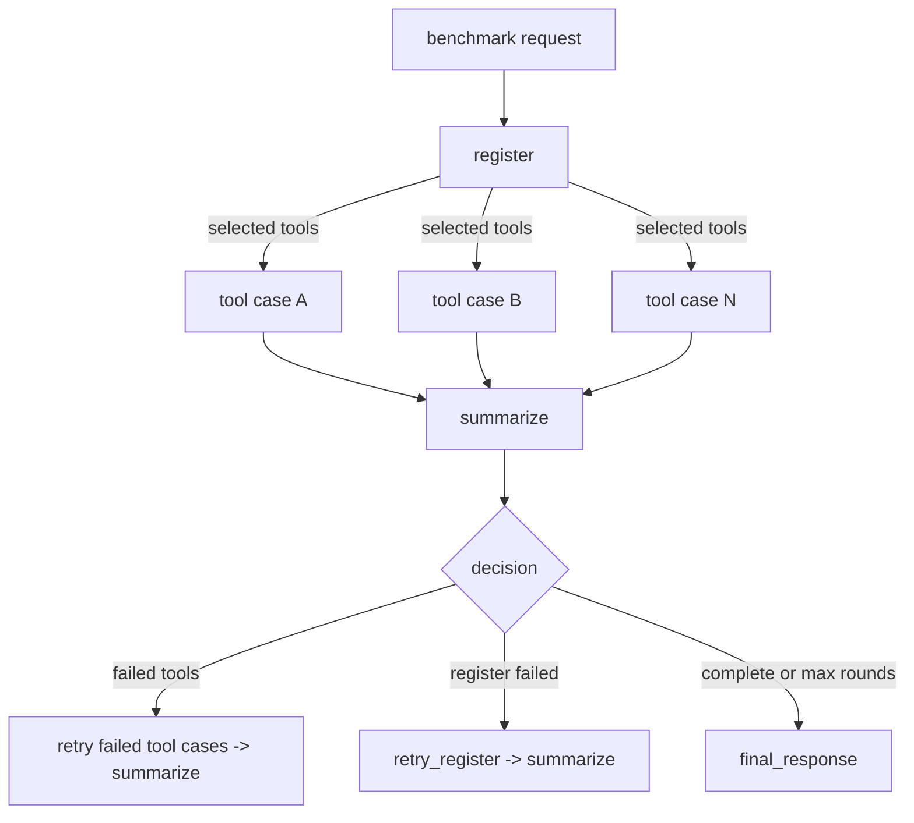
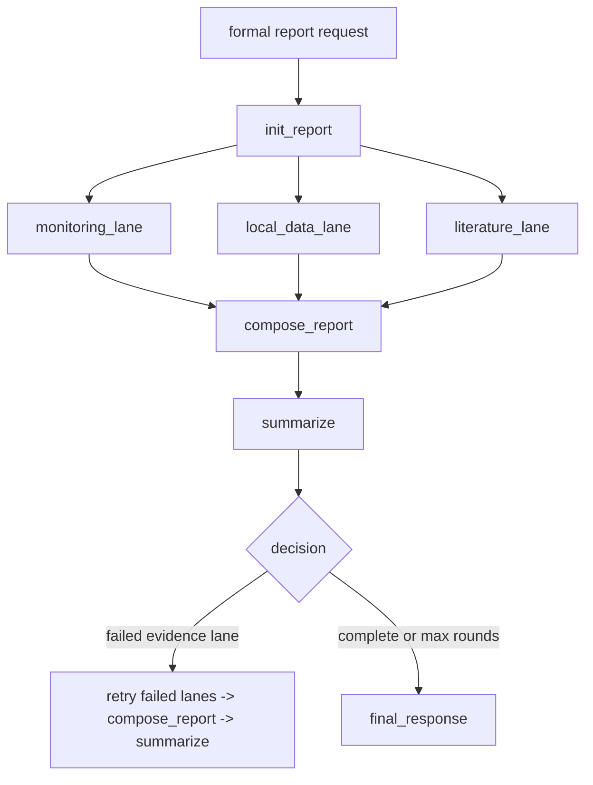

# Supervisor Graph Flow And Experiment Status

Last updated: 2026-05-13 08:11 CST.

This note summarizes the current intelligent-agent flow in this worktree, recent
experiment outcomes, and whether the current runtime satisfies the portability
and single-configuration requirements.

## Scope

The current CLI path wraps the normal workspace agent with Supervisor Graph
orchestration. The relevant implementation surfaces are:

- `libs/code2workspace/code2workspace/orchestration_runtime.py`
- `libs/cli/code2workspace_cli/supervisor_runtime.py`
- `libs/cli/code2workspace_cli/agent.py`
- `.code2workspace/skills/capabilities/`
- `.code2workspace/skills/orchestration/`
- `backend/config/agent_models.json`

## Overall Flow

Canonical supervised-run artifacts are written under
`orchestration_runs/<run_id>/`:

- `request.json`
- `task_classification.json`
- `retrieved_cases.json`
- `graph_round_*.json`
- `node_traces/*.json`
- `worker_outputs/*.json`
- `tool_activity.jsonl`
- `final_summary.md`
- `final_response.md`
- `final_decision.json`

For benchmark-family runs, reusable operator products are additionally written
under `<workspace>/operator_store/`: per-operator manifests live at
`objects/benchmark/<tool>/<run_id>/operator_product.json`, and `index.sqlite`
is a rebuildable lookup cache rather than the canonical store.

## Task Family Flows

### generic

Generic is the default family for ordinary analysis, code repair, repository
inspection, and question-answering tasks that are not explicitly workflow
benchmarks, repo-to-workspace conversions, or formal reports.

Important behavior:

- First round asks `init_generic` to produce or confirm a bounded execution
  graph.
- The fallback execution skeleton is
  `init_generic -> worker_context + worker_solution -> compose_generic ->
  summarize`.
- Generic guidance is loaded through `generic_qa` and node guidance assets.
- If a node is failed, partial, or blocked, the next round creates a targeted
  `retry_<node>` path before composing again.

### github2workspace

`github2workspace` is used when the user asks to turn a repository into a
runnable workspace, usually involving repository inspection, Docker, WDL, or
Cromwell validation.

Important behavior:

- The graph is sequential because later phases depend on earlier concrete
  artifacts.
- Retrying begins from the first unresolved phase.
- Repository-preparation failures are treated as experiment outcomes rather than
  batch-killing crashes.

### benchmark

`benchmark` is used when the task asks to compare multiple workflows or tools on
shared local benchmark inputs and summarize metrics or outcomes.

Important behavior:

- `register` scans benchmark assets and selects compatible cases/tools.
- Ready case nodes fan out in parallel after registration.
- Deterministic helpers in
  `.code2workspace/skills/orchestration/benchmark-workflow-orchestrator/` run
  register, per-case execution, and summarization before falling back to an LLM
  worker.
- Catalog files are optional hints; local case directories with WDL/input JSON
  are the stronger source of truth.

### report

`report` is used for formal reports, risk assessments, monitoring briefs, and
evidence-backed synthesis deliverables.

Important behavior:

- The three evidence lanes can run in parallel after `init_report`.
- Report composition guidance asks for source-category notes, freshness/date
  notes where relevant, and direct-vs-inferred evidence separation.
- Report worker nodes currently support model overrides through environment
  variables, which is useful operationally but conflicts with the single-entry
  configuration requirement below.

## 实验结果整理

### 总体结论

近期实验主要验证了三件事：任务能否正确进入 Supervisor Graph、节点执行提示是否具备可操作约束、以及真实 CLI 运行能否产出可用回答。整体来看，`generic` 通用任务链路已经比较稳定，`benchmark` 链路已经具备注册后并行 fan-out 的证据，`report` 链路有完整架构但限时完成能力仍弱。当前最明显的问题不是图结构，而是输出质量和可移植配置：quiet 模式会泄漏分类 JSON，部分最终回答不完整，复制项目后仍需要外部模型密钥才能真实运行。

| 实验类别 | 实验目录/记录 | 样例数 | 主要结果 | 结论 |
| --- | --- | ---: | --- | --- |
| 路由与图结构 | `supervisor-routing-trigger-eval/20260507T143455346391Z` | 5 | 5/5 正确进入 `generic`，图结构均为 `init_generic -> worker_context -> worker_solution -> compose_generic -> summarize` | 证明规则兜底下的 generic 边界识别稳定；不代表模型分类器已被 live 验证 |
| generic 能力提示 | `generic-capability-prompt-eval/20260510T174323Z` | 5 | 5/5 保持 `generic` 图，均加载 `generic_qa`，能力契约字段齐全 | 证明 worker prompt 已具备较清晰的执行约束；属于静态提示检查 |
| generic live QA | `generic-qa-live-replay/20260510T175920Z` | 5 | 5/5 因项目本地配置缺少可用 API key 而未执行 | 直接暴露可移植性问题：拷贝代码后不能无配置运行 live 模型任务 |
| generic 真实问题 | `supervisor-generic-real-cases-15min-parallel3/20260507T154111585584Z` | 3 | 3/3 在 15 分钟限制内返回，图结构符合预期 | 证明 generic 真实任务可跑通，但事实正确性仍需人工或外部校验 |
| report 限时回放 | `supervisor-report-cases-bounded/20260507T131756580675Z` | 3 | 3/3 在 5 分钟限制下超时，证据 lane 已启动但未形成完整报告 | 证明 report 图已启动，但限时完成和最终成文能力仍不足 |
| COVID 变异株并发 CLI | `cli_covid_variant_parallel_20260513.md` | 11 | 11/11 进程级完成，10/11 有实质回答，1/11 输出严重不完整 | 证明非交互 CLI 可批量运行，但 quiet 输出和最终答案质量仍需修复 |

### 1. 路由与图结构实验

实验目标是确认普通问题、代码分析、最新态势判断、普通编码任务和科研判断问题不会误入 `benchmark`、`github2workspace` 或 `report`，而是走默认 `generic` 图。

结果如下：

| 指标 | 结果 |
| --- | --- |
| 总样例数 | 5 |
| 正确路由数 | 5 |
| 正确率 | 100% |
| 实际任务族 | 全部为 `generic` |
| 实际图结构 | 全部为 `init_generic -> worker_context -> worker_solution -> compose_generic -> summarize` |
| 分类来源 | `rules_fallback_model_unavailable` |

需要注意的是，本次评估尝试使用 `openai_paid:gpt-5.4`，但当时缺少可用凭据，最终走的是规则兜底。因此，这组实验可以证明规则层面的边界处理有效，但不能证明模型分类器在 live 环境下同样稳定。

### 2. Generic 能力提示实验

实验目标是检查通用任务的 worker prompt 是否已经从“只有图结构”进化到“具备可执行契约”。5 个样例覆盖代码修复、数据分析、故障排查、方案比较和迁移计划。

结果如下：

| 检查项 | 结果 |
| --- | --- |
| 样例数 | 5 |
| 是否保持 `generic` 图 | 5/5 是 |
| 是否加载 `generic_qa` family guidance | 5/5 是 |
| 是否包含节点级 hint | 5/5 是 |
| 是否包含 `execution_focus` | 5/5 是 |
| 是否包含 `preferred_inputs` | 5/5 是 |
| 是否包含 `expected_outputs` | 5/5 是 |
| 是否包含 `stop_when` | 5/5 是 |
| 是否包含 `avoid` | 5/5 是 |

这说明当前 generic worker 已经有比较清楚的执行边界：知道要看什么输入、产出什么结果、什么时候停止，以及避免做哪些无关扩展。不过这组实验是静态 prompt 检查，不等同于端到端任务成功率。

### 3. Generic Live QA 回放

实验目标是用项目本地模型配置执行 5 个 generic QA 样例，验证拷贝后的 QA-only 或 generic runtime 是否能直接运行。

实际结果是 5 个样例全部被阻塞，原因是 `backend/config/agent_models.json` 中没有可用 API key。实验没有进入真实模型调用，也没有生成 orchestration run。

这组结果对功能成功率没有正向证明，但对可移植性很重要：它说明当前仓库即使有项目本地配置文件，也仍然依赖外部密钥注入。其他用户拷贝代码后，如果不额外配置模型密钥，无法直接完成 live 智能体任务。

### 4. Generic 真实问题实验

实验目标是把真实 COVID/呼吸道问题交给 Supervisor Graph generic 路径，验证实际运行是否能在限定时间内完成。

结果如下：

| 样例 | 是否超时 | 返回码 | 图结构 |
| --- | --- | ---: | --- |
| `spring-travel-covid-spread` | 否 | 0 | `init_generic -> worker_context -> worker_solution -> compose_generic -> summarize` |
| `next-covid-flu-peak` | 否 | 0 | `init_generic -> worker_context -> worker_solution -> compose_generic -> summarize` |
| `ba32-xfg-severity-and-wastewater` | 否 | 0 | `init_generic -> worker_context -> worker_solution -> compose_generic -> summarize` |

这组实验说明 generic 路径不仅能生成正确图结构，也能完成真实运行并返回结果。限制是：实验记录主要证明“运行完成”和“图结构正确”，没有对回答中的事实、引用和最新性做独立人工复核。

### 5. Report 限时实验

实验目标是验证 formal report / risk assessment 这类任务是否能按 `init_report -> 三条证据 lane -> compose_report -> summarize` 的结构完成。

结果如下：

| 样例数 | 超时数 | 已观察到的进展 | 未完成部分 |
| ---: | ---: | --- | --- |
| 3 | 3 | `init_report` 已启动，部分样例进入 monitoring/local/literature evidence lanes | 5 分钟限制内没有形成完整报告正文和最终总结 |

结论是：report 任务族目前“图结构和证据 lane 设计”已经存在，但限时完成能力不足。它比 generic 更重，容易卡在证据收集或成文前，因此还不能作为当前最稳定的展示路径。

### 6. COVID 变异株并发 CLI 实验

实验目标是用非交互 quiet CLI 并发运行一组真实 COVID 变异株问题，观察端到端回答能力、耗时和输出问题。

总体结果如下：

| 指标 | 结果 |
| --- | --- |
| 总问题数 | 11 |
| 进程级完成 | 11/11 |
| 有实质最终回答 | 10/11 |
| 严重不完整回答 | 1/11 |
| 最短耗时 | 167.63 秒 |
| 最长耗时 | 514.25 秒 |
| 主要问题 | quiet stdout 泄漏分类 JSON；第 2 题最终回答不完整；部分回答时间窗口和地区假设需要更明确 |

各题结果如下：

| 序号 | 问题简称 | 耗时 real(s) | 状态 |
| --- | --- | ---: | --- |
| 1 | 中国大陆 5 月主要流行新冠毒株 | 167.63 | 完成 |
| 2 | 近两周增长最快亚型与序列规模 | 514.25 | 输出异常，不完整 |
| 3 | BA.3.2 与 XFG.1.1 RBD 趋同进化 | 280.44 | 完成 |
| 4 | 中国 JN.1 占比与趋势 | 229.80 | 完成 |
| 5 | PQ.2 RBD 氨基酸突变 | 253.57 | 完成 |
| 6 | BA.3.2/XFG 子代突破 KP.2 疫苗免疫屏障 | 420.61 | 完成 |
| 7 | BA.3.2 疫苗临床试验 | 215.20 | 完成 |
| 8 | 最新新冠疫苗公司与靶株 | 196.31 | 完成 |
| 9 | 临床阳性率与污水监测趋势 | 443.29 | 完成 |
| 10 | BA.3.2/XFG 子代免疫逃逸与 BD55-1205 | 345.81 | 完成 |
| 11 | 下一波新冠和流感阳性率高峰 | 235.80 | 完成 |

主要问题记录：

- quiet 模式下 stdout 前缀泄漏了任务分类 JSON，例如 `{"task_type":"generic",...}`。这会污染 `-q` 管道输出，应优先修复。
- 第 2 题只输出了“纯模型增长率第一”，没有回答时间窗口、增长判据、序列规模和地区范围，属于明显失败样例。
- 第 11 题在 2026-05-13 运行时仍把 `2026年4-6月` 表述为“下一波”新冠高峰警惕窗口。这个窗口已经部分发生，最终回答需要改成更准确的时间锚定表达。
- 第 9 题在用户未指定地区时选择美国 CDC 全国口径，这个假设可以接受，但应在答案开头明确，避免被误解为中国或全球口径。
- 多个答案引用动态事实和具体日期，本记录只保存 CLI 输出，没有做人工事实复核。

## 当前任务完成情况

| 模块/能力 | 当前状态 | 可信度 |
| --- | --- | --- |
| Supervisor-first CLI 入口 | 已实现。普通请求默认先进 Supervisor Graph，除非显式走 fallback/plain chat。 | 高 |
| `generic` 通用任务 | 已实现，并有静态 prompt 检查、真实问题运行和并发 CLI 证据。 | 较高 |
| `github2workspace` 仓库转工作空间 | 图结构和重试逻辑已实现，符合 Docker/WDL 路线；历史重型仓库实验已有正向样例。 | 中 |
| `benchmark` 工作流评测 | 已实现注册、工具选择、并行 fan-out 和 deterministic helper adapter；已有并行执行证据。 | 较高 |
| `report` 报告生成 | 图结构和 evidence lane 已实现，但近期 5 分钟限时实验全部超时。 | 中低 |
| 运行产物记录 | 已实现 request、classification、graph、node trace、worker output、tool activity、final summary/response 等产物。 | 高 |
| quiet 非交互输出 | 尚不合格，`-q` 仍可能泄漏分类 JSON。 | 低 |
| 拷贝后可运行性 | 尚不合格，live 模型任务仍依赖外部密钥和部分环境变量。 | 低 |

## Requirement Audit

### Requirement 1: all dependencies are inside the project

Current status: **partially satisfied, not strictly satisfied**.

What is satisfied:

- Python package dependencies are declared in `libs/cli/pyproject.toml` and
  `libs/code2workspace/pyproject.toml`.
- Local SDK dependency is project-local through
  `libs/cli/pyproject.toml` `tool.uv.sources`:
  `code2workspace = { path = "../code2workspace", editable = true }`.
- Lockfiles exist under `libs/cli/uv.lock` and `libs/code2workspace/uv.lock`.
- Active project skills are checked into `.code2workspace/skills/`.

What is not strictly satisfied:

- Third-party packages are resolved by `uv` from external package indexes unless
  already cached; they are not vendored into the repository.
- Runtime tools such as Docker, shell utilities, browser/network access,
  Cromwell/WDL execution support, and LLM provider access are external
  prerequisites.
- Some capability skills depend on external services or local external data
  roots, for example EpiETL credentials and the data-governance agent root.

### Requirement 2: no dependency on files, directories, or environment variables outside the project

Current status: **not satisfied**.

Known violations or risks:

- `libs/cli/code2workspace_cli/config.py` still loads the nearest project
  `.env` and reads many environment variables.
- `backend/config/agent_models.json` stores `api_key_env` and `base_url_env`
  names rather than complete self-contained provider settings.
- `libs/cli/code2workspace_cli/model_config.py` resolves credentials via
  environment variables, including `CODE2WORKSPACE_CLI_`-prefixed overrides.
- `libs/cli/code2workspace_cli/agent.py` reads
  `CODE2WORKSPACE_SUPERVISOR_REPORT_MODEL` and per-report-node model override
  variables.
- `.env.example` documents external variables such as `OPENAI_API_KEY`,
  `OPENAI_BASE_URL`, `ANTHROPIC_API_KEY`, `TAVILY_API_KEY`, and LangSmith
  variables.
- Some checked-in skills mention or require external environment/config roots,
  such as `EPIETL_API_KEY` and `DATA_GOVERNANCE_AGENT_ROOT`.

### Requirement 3: portability after copying the code

Current status: **partially satisfied, not yet good enough**.

What works in favor of portability:

- The main model config file is project-local:
  `backend/config/agent_models.json`.
- The codebase has project-local skills and local benchmark assets.
- `uv run --project libs/cli ...` gives a repeatable launch path.

What still blocks easy portability:

- Live model use requires user-provided API credentials.
- The config currently expects credentials through environment variables unless
  inline keys are added to `backend/config/agent_models.json`.
- Some optional skills require external service credentials or local datasets.
- Docker/WDL/benchmark tasks require system-level tools and can fail or stall on
  first-build dependency setup.
- The live QA replay on 2026-05-10 was blocked specifically by missing API key,
  which is a concrete portability failure.

### Requirement 4: only one configuration entrypoint

Current status: **partially satisfied, but not cleanly satisfied**.

What is close:

- `backend/config/agent_models.json` is the intended project-local model
  configuration entry.
- `.code2workspace/config.toml` now points readers to
  `backend/config/agent_models.json` rather than carrying active model settings.

What remains split:

- Base URL and API key are still configured through environment-variable names
  in `backend/config/agent_models.json`, not through one self-contained value
  source.
- `.env` loading is still active in the normal CLI path.
- Report worker model selection is configured through separate
  `CODE2WORKSPACE_SUPERVISOR_REPORT_*` environment variables.
- CLI settings, LangSmith tracing, shell allow-list, extra skill dirs, and some
  tool credentials still use environment variables.
- Older TOML paths remain supported for tests/migration helpers, so the code is
  not a hard single-entry implementation.

## Recommended Next Fixes

1. Move report-worker model routing into `backend/config/agent_models.json`
   under a `supervisor.report_workers` section and remove the report-specific
   environment-variable path from normal runtime.
2. Decide whether secrets are allowed inline in the project-local config. If not,
   define one explicit secrets file under `backend/config/` and make the
   application fail fast with a clear message when it is absent.
3. Disable automatic `.env` loading for the main runtime path, or limit it to a
   single documented project-local file that is treated as part of the one
   configuration entry.
4. Add a portability check command that reports missing model credentials,
   external service credentials, Docker availability, WDL/Cromwell availability,
   and optional skill external-data roots.
5. Fix quiet-mode stdout leakage so `-q` emits only the final answer.
6. Rerun the incomplete "近两周增长最快亚型" prompt after the quiet-output fix,
   with verbose artifacts enabled for diagnosis.
