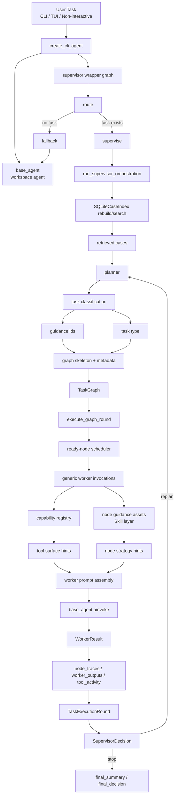

# Supervisor System Architecture

This document captures the current supervisor-first architecture after the
runtime was generalized so every task enters the supervisor layer and node
experience is increasingly stored as Skill assets rather than embedded directly
in Python prompt branches.

## Overview

## Layer Split

- `libs/code2workspace/code2workspace/orchestration_runtime.py`
  graph data model, task classification, family guidance ids, graph skeleton
  planning, and dependency-aware execution
- `libs/cli/code2workspace_cli/supervisor_runtime.py`
  CLI wrapper graph, artifact persistence, case retrieval, worker invocation,
  and worker prompt assembly
- `libs/cli/code2workspace_cli/supervisor_capabilities.py`
  capability-to-tool registry plus node-guidance asset loading
- `.code2workspace/skills/supervisor-guidance/`
  node execution strategy and experience fragments used by the worker prompt

## Current Execution Model

- Every task now enters supervisor first.
- Unknown tasks use a generic graph:
  - `init_generic`
  - `worker_context`
  - `worker_solution`
  - `compose_generic`
  - `summarize`
- Thesis-facing known task families currently add guidance/template skeletons:
  - `benchmark`
  - `github2workspace`
- Capability bundles remain code-level execution contracts.
- Node experience and strategy are moving into Skill assets.

## Artifact Contract

Canonical supervised runs write under:

- `<thread_workspace>/orchestration_runs/<run_id>/`

Expected artifacts:

- `request.json`
- `retrieved_cases.json`
- `graph_round_*.json`
- `node_traces/*.json`
- `worker_outputs/*.json`
- `tool_activity.jsonl`
- `final_summary.md`
- `final_decision.json`

The SQLite case index remains rebuildable cache only; the run directories are
the canonical source of truth.
