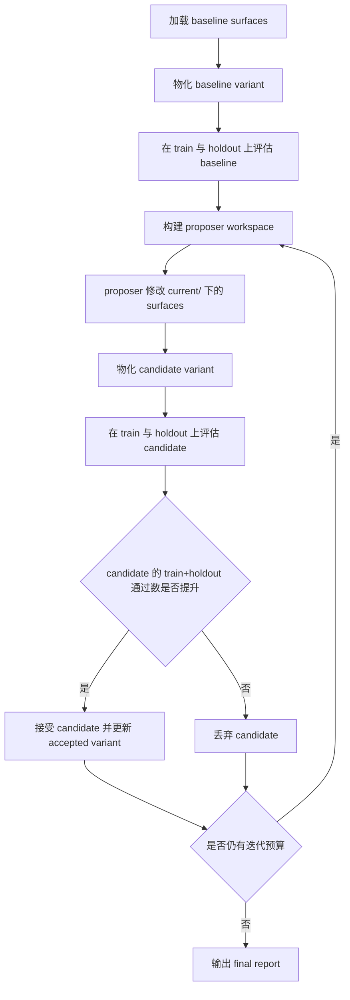

# Harness 章节中文稿

本文档用于直接支撑毕业论文中与 `code2workspace` 相关的“方法设计”“系统实现”和“实验分析”章节写作。相较于 [THESIS_METHOD.md](/mnt/data1/zhangpf/code2workspace/experiments/harness/THESIS_METHOD.md)，本稿采用更接近中文本科论文正文的表达方式，并补入当前仓库内已经具备的图表、案例与结果摘要。整篇论文的总目录建议见 [THESIS_OUTLINE_ZH.md](/mnt/data1/zhangpf/code2workspace/experiments/harness/THESIS_OUTLINE_ZH.md)，实验设计与待补实验清单见 [THESIS_EXPERIMENT_DESIGN_ZH.md](/mnt/data1/zhangpf/code2workspace/experiments/harness/THESIS_EXPERIMENT_DESIGN_ZH.md)，完整论文总稿见 [THESIS_FULL_DRAFT_ZH.md](/mnt/data1/zhangpf/code2workspace/experiments/harness/THESIS_FULL_DRAFT_ZH.md)，图表资产清单见 [THESIS_ASSET_MATRIX_ZH.md](/mnt/data1/zhangpf/code2workspace/experiments/harness/THESIS_ASSET_MATRIX_ZH.md)。

## 1. 研究背景与问题定义

本课题面向的并非短小、静态、单轮即可完成的代码生成任务，而是一类长时程、强状态依赖的 repository-to-workspace 任务。给定一个真实软件仓库，智能体需要依次完成仓库理解、依赖确认、Docker 镜像构建、基于真实数据的容器验证、WDL 接口编写以及基于 Cromwell 的工作流执行。

与常见编程 benchmark 相比，这类任务至少具有以下三点特征。

- 任务链条长。仓库阅读、环境准备、构建、测试和工作流执行前后相互依赖，任一环节的偏差都可能导致最终失败。
- 任务成本高。目标仓库多为生物信息学软件，构建与运行成本远高于常规软件工程样例，不适合依赖大规模试错。
- 结果对 harness 敏感。提示词、完成判定标准、shell 能力暴露方式等外围配置，会直接影响智能体能否尽早进入真实执行路径，并影响成功标签是否可信。

因此，本文关注的核心问题不是“某一次 one-shot 运行能否碰巧成功”，而是：

如何将智能体 harness 的调参与迭代过程，从非结构化的经验操作，转化为可复现、可审计、可比较的实验过程？

## 2. 基线方法及其局限

### 2.1 直接 one-shot 运行

最直接的方式是：给定仓库 URL，构造一条任务 prompt，运行一次智能体，然后根据最终输出或人工检查判断是否成功。

这种方式实现简单，但存在明显缺陷。

- prompt 改动往往是隐式的，难以追踪
- 不同运行之间缺少统一比较单位
- `completed` 标签容易退化为字符串匹配
- 仓库准备失败、harness 缺陷和智能体推理失误混在一起

因此，直接 one-shot 更适合快速试验，不适合作为论文中的方法学主线。

### 2.2 人工 prompt 迭代

另一种更强但仍然常见的方式，是研究者在观察失败后手工修改 prompt 或执行策略，再重复运行。

这种方式虽然比单次运行更接近“优化”，但仍然存在以下问题。

- 改动对象不明确，难以回答“到底改了 harness 的哪一部分”
- 缺少 `train/holdout` 分离，容易对少量可见样本过拟合
- 过程决策很少被结构化持久化
- 最终配置通常只能从聊天记录或人工记忆中恢复

换言之，人工 prompt 迭代能够产出经验，但难以形成受控实验。

## 3. 本文方法：基于 Surface 的 Harness 优化框架

### 3.1 基本思想

本文将 harness 优化重新表述为一个外环搜索问题。优化对象不再是“某一次聊天过程”，而是一组显式命名、可持久化、可替换的 harness surfaces。当前已经在系统中暴露为 live surface 的部分包括：

- `one_shot_prompt`
- `completion_rubric`

未来还可以继续扩展至：

- planner 指令
- shell 使用策略
- 结果打包策略
- 任务分解策略

在这种建模下，每次评估的对象不再是“agent 这次表现如何”，而是“某个具体 harness variant 在一组 case 上表现如何”。

### 3.2 系统架构

当前实现可以概括为六层结构。

#### 3.2.1 内层执行器

内层执行器位于 `experiments/oneshot/`，负责单次仓库任务执行，其职责包括：

- clone 或复用目标仓库
- 根据仓库 URL 生成标准任务 prompt
- 调用 `code2workspace`
- 持久化 prompt、日志、summary 与 manifest

在论文表述中，这一层是“被优化对象”，不是“优化器本身”。

#### 3.2.2 Surface 层

surface 层用于将 harness 中可编辑、可加载、可比较的组成部分显式化。该设计有两个直接收益。

- 它明确了优化对象，使研究者能够准确说明修改的是哪一个 harness surface。
- 它约束了搜索空间，使外层优化不会无约束地修改整个系统。

#### 3.2.3 Variant 物化层

每个 variant 都包含：

- 变体标签
- 相对 baseline 发生变化的 surfaces
- 所有 surface 的具体取值

在评估期间，surface 会被临时 patch 到目标工作区中，运行结束后再恢复。这样能够保证 baseline 与 candidate 可并列比较，并保证每次实验都对应一个可序列化、可回放的 harness 状态。

#### 3.2.4 证据化完成判定层

相较于初始基线，最关键的方法学改进之一，是将完成判定从关键词匹配升级为 evidence-backed completion judgment。

当前系统中的 `experiments/oneshot/completion.py` 已经将完成标签建立在多源证据上，主要检查以下项目：

- Dockerfile 是否在本轮新建或被修改
- 目标镜像是否被真实构建且镜像名与仓库对应
- `results/docker_test` 是否产生了本轮新的非日志工件
- WDL 文件是否被新写入且 runtime 指向目标镜像
- 是否真实执行了 `java -jar /mnt/data2/bin/cromwell.jar run`
- Cromwell 日志或 metadata 中是否存在 `Succeeded`
- `results/wdl_result` 与 `results/wdl_file` 是否写入了新的工件
- 最终回答是否明确声明 `COMPLETED`

这意味着，成功标签不再来自单一字符串，而来自多个独立证据通道的一致性判断。

#### 3.2.5 外层 proposer workspace 层

为了支持外环优化，系统在每轮迭代中创建 proposer workspace。该工作区包含：

- 当前允许编辑的 surface 文件
- surface manifest
- 可见 train 失败样本
- 复制出的 train 工件
- 历史 keep/discard 决策
- 任务说明

外层 proposer 现在支持两种模式：

- 本地 `[proposer].command`，用于 smoke test 和可控的契约验证
- 原生 `[better_agent]` DeepAgents 外环，用于真实的 outer-loop 优化

两种模式都只能修改 `current/` 中的 surface 文件，并在 `proposal.md` 中解释改动原因。这一设计实现了失败观察环境、harness 编辑环境和 candidate 重评估环境的分离。

更重要的是，这个设计并不臃肿。系统没有再造一套新的仓库执行栈，而是保留现有 one-shot runner 作为内层执行路径，只在其外增加一个面向显式 surfaces 的窄外环。

#### 3.2.6 决策与报告层

每个 candidate 会同时在 `train` 与 `holdout` 上评估。当前 keep/discard 规则为：

只有当 candidate 的 `train + holdout` 合计通过数严格高于当前已接受 variant 时，才接受该 candidate。

虽然该规则简单，但它已经具备原型论文所需要的三项性质：

- 不会因为单纯改善 train 表现就盲目接受新 variant
- 为 holdout 提供了最基本的泛化约束
- 易于序列化、复核和解释

## 4. 优化流程

图 1 展示了本文 harness 外环的核心流程。

图 1 对应的过程可以概括为以下步骤。

1. 读取实验配置并加载 baseline surfaces。
2. 物化 baseline variant。
3. 在 `train` 和 `holdout` 上运行 baseline。
4. 根据当前 accepted variant 与可见 `train` 失败构建 proposer workspace。
5. 运行 proposer，对允许的 surfaces 进行修改。
6. 将修改后的 surfaces 物化为 candidate variant。
7. 在 `train` 和 `holdout` 上评估 candidate。
8. 若 candidate 的 `train + holdout` 合计通过数提升，则接受；否则丢弃。
9. 直至预算耗尽或 proposer 不再产生新候选。
10. 输出 final report，对 baseline 与最终 accepted variant 进行汇总。

## 5. 实验设置

### 5.1 任务对象与数据来源

当前仓库中已经沉淀出一组面向真实生物信息学软件的仓库级任务，主要包括：

- `spades`
- `canu`
- `megahit`
- `Flye`
- `trinityrnaseq`
- `v-pipe`
- `covid-19-signal`
- `fieldbioinformatics`

这些仓库均来自 [docs/overview/roadmap.md](/mnt/data1/zhangpf/code2workspace/docs/overview/roadmap.md) 中定义的目标列表。实验产物主要保存在 `results/oneshot/` 与 `.workspaces/oneshot/` 下。

### 5.2 运行预算与产物形态

当前自动 one-shot 运行默认采用 30 分钟预算。每次运行至少会持久化以下信息：

- `prompt.txt`
- `agent.log`
- `summary.json`
- `manifest.json`

在成功或部分成功的情况下，还会保留：

- `results/docker_test/`
- `results/wdl_file/`
- `results/wdl_result/`

### 5.3 评估口径

本章采用两类互补口径。

- 工程过程口径：观察智能体是否真正进入 Docker 构建、容器运行和 WDL/Cromwell 执行。
- 结果完成口径：观察运行是否形成 end-to-end 的完成证据。

需要说明的是，当前仓库中的一部分早期 `summary.json` 形成于证据化完成判定完全稳定之前，因此本章在引用这些 run 时，会明确区分“自动完成结果”和“代码层已实现的完成判定逻辑”。

## 6. 实验结果

### 6.1 方法框架与基线方法对比

表 1 对比了直接 one-shot、人工 prompt 迭代与本文 harness 框架的差异。

| 维度 | 直接 one-shot | 人工 prompt 迭代 | 本文 harness 框架 |
| --- | --- | --- | --- |
| 优化对象 | 单次运行 | prompt 或少量策略文本 | 显式 harness surfaces |
| 改动单位 | 隐式 | 半显式 | variant 级显式物化 |
| 成功判定 | 人工检查或关键词 | 人工检查为主 | 证据化 completion judgment |
| 泛化控制 | 无 | 无 | `train/holdout` 分离 |
| 决策规则 | 无 | 研究者主观判断 | keep/discard 规则 |
| 过程可追溯性 | 弱 | 中等 | 强 |
| 失败归因能力 | 弱 | 中等 | 强 |
| 论文可复现性 | 低 | 中等 | 高 |

从表 1 可以看出，本文方法的核心价值不在于增加更多工程模块，而在于把原本不可控的 prompt 调参过程转化为可解释、可复现、可审计的实验流程。

用更直观的话说，研究目标从“某一次 run 碰巧成功了没有”转变为“某个 harness variant 是否在同一组 `train/holdout` 仓库上把通过数真正提高了”。

### 6.2 当前仓库级 one-shot 结果概览

表 2 汇总了当前仓库内已经形成代表性证据的一组 one-shot 运行。这里的 `spades` 采用的是首次进入真实构建的代表性 run，而不把后续手工延续算作自动 baseline 成功。

| 仓库 | 代表性运行 | 持续时间 | 状态 | 完成情况 | 结果解读 |
| --- | --- | --- | --- | --- | --- |
| `spades` | `20260416T123616Z` | 26m42s | `finished` | 未完成 | 首次跨越仓库理解阶段，进入真实 `docker build` |
| `canu` | `20260416T151417Z` | 30m00s | `timed_out` | 未完成 | 已进入真实镜像构建，但在 30 分钟预算内未完成 |
| `megahit` | `20260416T154420Z` | 30m00s | `timed_out` | 未完成 | 已进入真实镜像构建，并暴露外部 APT 镜像不稳定 |
| `Flye` | `20260417T003012Z` | 2m44s | `finished` | 未完成 | 已收敛到真实测试入口，但尚未形成有效执行闭环 |
| `trinityrnaseq` | `20260417T003257Z` | 30m44s | `timed_out` | 未完成 | 在预算内未形成完成证据，仍属长时程重仓库难例 |
| `v-pipe` | `20260417T010342Z` | 25m28s | `completed` | 完成 | 真实容器测试与 Cromwell workflow 均跑通 |
| `covid-19-signal` | `20260417T012910Z` | 11m40s | `completed` | 完成 | 真实 ENA 数据与官方脚本路径形成闭环 |
| `fieldbioinformatics` | `20260417T014050Z` | 16m16s | `completed` | 完成 | 形成端到端完成证据 |

从表 2 可以得到三个直接结论。

- 当前自动 one-shot 结果已经不是“全部停留在阅读阶段”，而是出现了真实构建、真实容器验证和真实 WDL 执行。
- 在当前代表性样本中，已有 3 个仓库形成自动完成闭环，说明任务并非本质不可做。
- 另有 `spades`、`canu` 与 `megahit` 这类重型仓库已经进入真实执行，但受策略或预算限制尚未稳定完成，说明瓶颈主要转移到执行可靠性而非能力缺失。

### 6.3 结果分层解读

从当前结果看，失败或未完成大致可以分为三层。

第一层是系统级阻塞。典型例子是早期 `spades` 运行中，非交互执行路径没有暴露 shell/execute 工具，导致智能体只能“谈论” Docker/WDL，而无法真实执行。

第二层是执行策略不足。即便 shell 能力恢复，智能体仍可能在仓库理解阶段停留过久，迟迟不开始第一次真实 `docker build`。这说明 prompt 与 planner 行为属于需要被优化的 harness surface，而不是无关外围。

第三层是具体任务接口问题。当系统真正进入构建、运行和 Cromwell 之后，暴露出来的错误已不再是抽象推理问题，而是可定位、可修复的工程问题，例如 Ubuntu 镜像同步不一致、命令参数组合错误或 workflow 输入路径不正确。

这种分层失败结构，恰恰说明 harness 工程在本课题中不是附属细节，而是影响成败的核心研究对象。

### 6.4 架构带来的实际作用

对本课题而言，这套架构最实际的作用有三点。

第一，它把成功率提升变成了可测目标。外环 proposer 是否有价值，不再靠主观感觉判断，而是看 combined `train + holdout` 通过数是否真的上升。

第二，它减少了无效优化成本。因为外环只改 prompt、completion rubric 等显式 surfaces，而不改内层执行路径，所以可以持续试错而不必每次都重写或重构整套 one-shot 系统。

第三，它让失败也变得有研究价值。即便某个 candidate 没有提高通过数，系统仍会保留下来它改了什么、为什么被拒绝、失败发生在哪一层，这些信息都能反过来指导后续迭代。

## 7. `spades` 个案分析

`spades` 是本文最重要的重型案例，因为它完整覆盖了 Docker 构建、真实数据测试与 WDL/Cromwell 执行三个关键阶段，并在仓库内留下了正反两类证据。

### 7.1 实验演化时间线

表 3 汇总了 `spades` 的关键实验节点。

| 运行标识 | 绝对时间 | 结果 | 主要发现 |
| --- | --- | --- | --- |
| `20260416T105820Z` | 2026-04-16 10:58:20 UTC | `interrupted` | 智能体停留在仓库理解阶段，未进入 Docker/WDL 执行 |
| `20260416T110635Z` | 2026-04-16 11:06:35 UTC | `interrupted` | 暴露出非交互运行缺失 shell/execute 工具的系统性阻塞 |
| `20260416T111040Z` | 2026-04-16 11:10:40 UTC | `interrupted` | `--shell-allow-list all` 后具备真实执行能力，但仍在首次构建前过度收敛 |
| `20260416T123133Z` | 2026-04-16 12:31:33 UTC | `finished` 但未完成 | 已写出部分发现日志和结果目录，但未真正开始 `docker build` |
| `20260416T123616Z` | 2026-04-16 12:36:16 UTC | 进入真实构建 | 首次跨越前置收敛瓶颈，进入真实 `docker build` |
| 手工延续工作区 | 2026-04-16 22:55:29 本地日志时间 | `Succeeded` | Cromwell workflow `8acdb90d-e0bd-4436-a371-3e39520e32ef` 成功 |

### 7.2 失败模式的逐步暴露

`spades` 个案最重要的价值，不只是最后得到了一个成功结果，而是它清晰暴露了失败模式的层次结构。

首先，最初失败并不是任务本身不可完成，而是运行环境没有暴露 shell/execute 能力。失败源头位于 harness，而不是仓库。

其次，即便恢复了 shell 能力，智能体仍可能在“确认构建细节”阶段停留过久，迟迟不进入真实 `docker build`。这说明问题从“能力缺失”转变成了“执行策略不够激进”。

再次，当系统终于开始真实构建后，暴露出的错误已不再是抽象的智能体推理问题，而是具体可修正的执行问题，例如 Ubuntu 包镜像同步异常，或 `spades.py --test` 与 `-o` 参数组合不兼容。

因此，`spades` 个案支持本文的核心判断：在重型科学仓库上，主要障碍不是任务本质不可做，而是 harness 能否稳定把智能体推入真实执行路径，并用可靠证据判断任务是否真正完成。

### 7.3 成功证据链

`spades` 最终成功的证据链包括以下事实。

- Docker 镜像真实构建成功，日志中出现 `naming to docker.io/library/spades done`
- 容器内真实测试完成，`results/docker_test/docker_run_test.log` 中出现 `TEST PASSED CORRECTLY`
- 工作区和 `results/wdl_file/` 中均存在 `spades.wdl` 与 `inputs.json`
- `results/wdl_result/cromwell_run_retry.log` 记录了真实的 Cromwell 调度过程
- `metadata_retry.json` 中 `status` 明确为 `"Succeeded"`
- `results/wdl_result/` 下存在 `contigs.fasta`、`scaffolds.fasta`、`assembly_graph.fastg` 等真实输出文件

这一证据链恰好对应本文提出的 evidence-backed completion judgment，也说明为何完成判定必须建立在多源证据上，而不能建立在最终口头声明之上。

## 8. 方法学意义与局限性

### 8.1 方法学意义

从研究方法角度看，本文框架至少具有三点意义。

第一，它将优化对象从“单次运行”提升为“harness 配置”。研究对象不再是偶然的某次成功，而是可持久化、可比较的 variant。

第二，它将成功标签从“文本判断”提升为“证据判断”。Docker、WDL、Cromwell 与输出工件共同构成完成标签的证据基础，从而增强了评估标签的内部有效性。

第三，它将调参过程从“经验操作”提升为“受控实验”。surface、variant、split、keep/discard 与 final report 共同构成了一个可审计的实验轨迹。

### 8.2 当前局限

尽管当前原型已具备论文方法章节的基本完整性，但仍有以下局限需要如实说明。

- 外层 proposer 现在同时支持本地 `[proposer].command` 与原生 `[better_agent]` DeepAgents 外环，但 DeepAgents 路径仍需要在更大仓库 split 上积累更多真实优化结果，才能支撑更强的成功率提升结论
- 当前 case 数量有限，更能说明方法可行性与实验结构合理性，尚不足以支持大规模统计泛化结论
- 目标仓库计算成本高，导致外环优化不能依赖高预算穷举搜索
- 当前仓库中的部分早期结果形成于完成判定逻辑演化过程中，因此在写论文时应明确区分“历史 run 结果”与“当前代码中的最终判定机制”

## 9. 本章小结

本文将智能体 prompt 调优过程形式化为一个基于显式 surfaces 的 harness 优化问题，并通过 variant 物化、`train/holdout` 分离评估、keep/discard 决策与 evidence-backed completion judgment，将原本分散于聊天记录或人工经验中的调参活动，转化为面向长时程仓库任务的可复现、可审计实验框架。

当前仓库中的 `spades`、`canu`、`megahit`、`v-pipe`、`covid-19-signal` 与 `fieldbioinformatics` 等案例进一步表明：重型科学仓库并非本质不可完成，真正决定成功率上限的关键，在于 harness 是否能稳定驱动智能体进入真实执行，并以充分证据确认结果。
