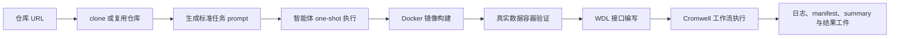
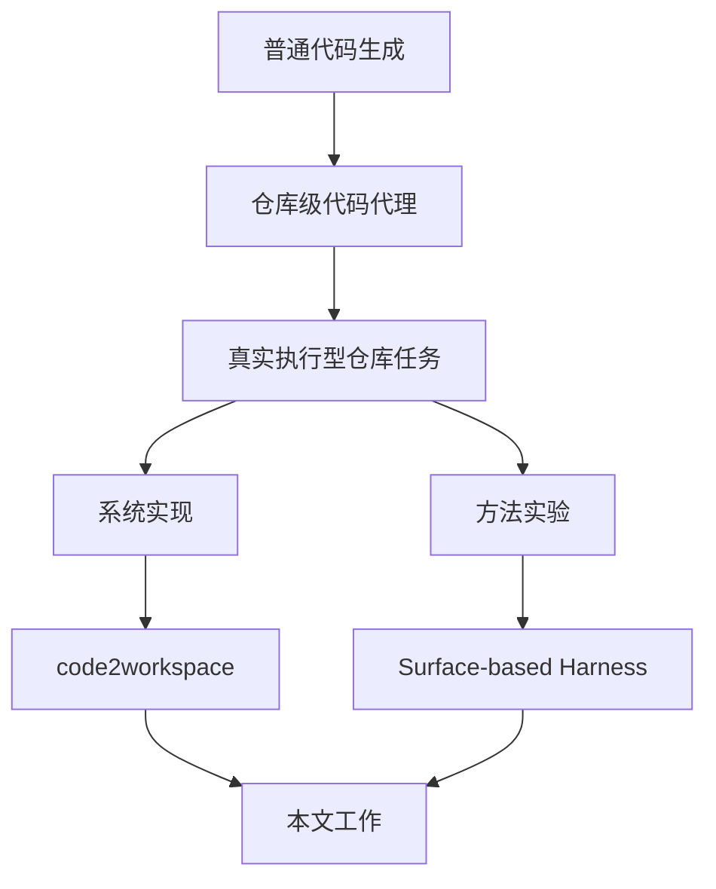
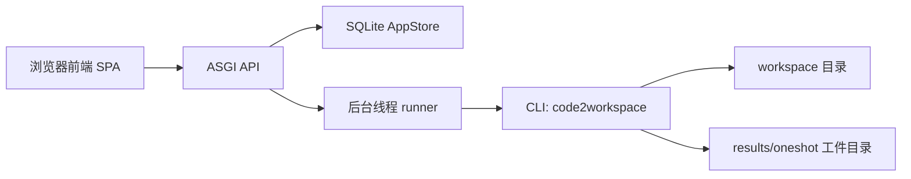
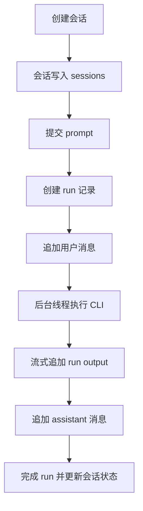
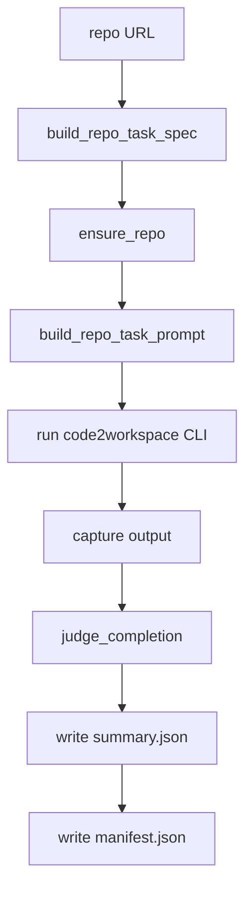
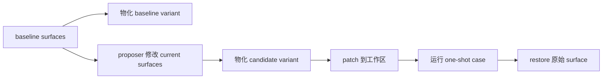
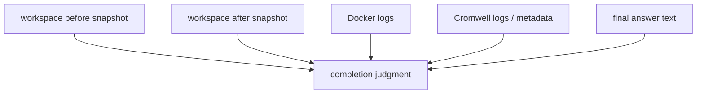
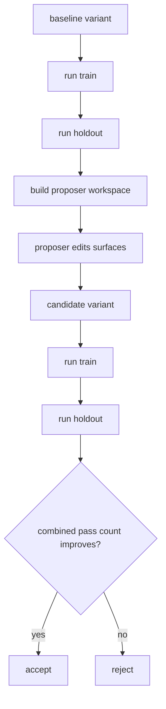

# 本科毕业设计（论文）草稿

## 封面信息

- 论文题目：面向真实软件仓库任务的智能体工作空间系统设计与实现
- 备选题目：面向长时程仓库任务的智能体 Harness 优化方法研究与实现
- 学院：`[待填写]`
- 专业：`[待填写]`
- 学生姓名：`[待填写]`
- 学号：`[待填写]`
- 指导教师：`[待填写]`
- 提交日期：`[待填写]`

> 说明：本稿按本科毕业论文正文结构组织，内容优先服务于正式写作与后续补实验，不作为最终排版稿。

---

## 学位论文原创性声明

本人郑重声明：所呈交的论文是本人在导师指导下独立进行研究所取得的成果。除文中已经明确标注引用的内容外，本论文不包含任何其他个人或集体已经发表或撰写过的研究成果。对本文研究做出重要贡献的个人和集体，均已在文中以明确方式标明。本人完全意识到本声明的法律后果由本人承担。

作者签名：`[待填写]`  
日期：`[待填写]`

## 学位论文版权使用授权书

本人完全了解学校关于保留、使用学位论文的有关规定，同意学校保留并向有关部门或机构送交论文的复印件和电子版，允许论文被查阅和借阅；同意学校可以公布论文的全部或部分内容，并采用影印、缩印或其他复制手段保存和汇编本论文。

作者签名：`[待填写]`  
指导教师签名：`[待填写]`  
日期：`[待填写]`

---

## 摘要

随着大语言模型和代码智能体的发展，基于自然语言驱动软件仓库理解、环境构建和工作流执行的自动化系统逐渐成为软件工程智能化的重要方向。然而，现有大量代码生成或代理 benchmark 主要集中于短上下文、低成本、单轮即可验证的任务，难以覆盖真实软件仓库中的长时程、强状态依赖执行问题。针对这一不足，本文围绕 repository-to-workspace 场景，设计并实现了一个面向真实软件仓库任务的智能体工作空间系统 `code2workspace`，并进一步提出基于显式 surfaces 的 harness 优化方法，以提升任务执行过程的可复现性、可审计性和结果判定可靠性。

在系统实现方面，本文构建了一个轻量 Web 控制面与 Python ASGI 后端，支持会话管理、one-shot 任务提交、运行轮询与 SQLite 持久化；设计并实现了标准化的 one-shot repository runner，能够完成仓库 URL 到任务 prompt、实际执行、日志落盘、manifest 记录和 summary 输出的完整链路；同时构建了面向 Docker 构建、真实数据验证、WDL 编写与 Cromwell 执行的统一任务工件布局。在方法方面，本文将原本分散于人工 prompt 调整中的经验过程形式化为 surface-based harness optimization，通过显式 surface、variant 物化、`train/holdout` 分离评估、keep/discard 决策以及 evidence-backed completion judgment，将 prompt 调参与结果评估转化为可比较、可回放、可复核的实验过程。

实验部分采用双层验证思路：一层是待补测的 `SWE-bench Lite` 子集，用于验证 agent 在通用软件工程仓库修复场景中的能力；另一层是多个真实生物信息学软件仓库，用于验证系统在 Docker、真实数据验证、WDL 与 Cromwell 任务链条上的落地能力。当前结果表明，系统已经在 `v-pipe`、`covid-19-signal` 和 `fieldbioinformatics` 三个仓库上形成自动完成闭环，并在 `spades`、`canu`、`megahit` 等重型仓库上进入真实 Docker 构建和后续执行阶段。`spades` 个案进一步说明，系统的主要障碍并非任务本质不可完成，而是 shell 能力暴露、执行策略收敛速度、完成判定规则等 harness 因素是否能稳定驱动智能体进入真实执行路径。本文所提出的 evidence-backed completion judgment 能够有效减少仅凭关键词判定带来的伪阳性，而 harness 外环则为后续成功率优化提供了结构化实验基础。

本文完成了一个兼具系统实现与方法实验价值的毕业设计原型。研究表明，针对真实仓库任务，单纯依赖一次性运行或人工 prompt 调试难以形成稳定结论，而基于显式 surfaces 的 harness 优化更适合支撑长时程、高成本任务上的可靠实验。后续工作将进一步补全 DeepAgents proposer 外环、大规模 split 上的泛化实验以及更完整的图表化结果分析。

关键词：智能体系统；软件仓库任务；工作空间构建；Harness 优化；工作流执行

## Abstract

With the rapid progress of large language models and coding agents, repository-level automation driven by natural language has become an important direction for intelligent software engineering. However, many existing code-generation or agent benchmarks still focus on short-context, low-cost, single-turn tasks, and therefore fail to capture the long-horizon, stateful execution challenges that appear in real software repositories. To address this gap, this thesis designs and implements `code2workspace`, an agent workspace system for repository-to-workspace tasks, and further introduces a surface-based harness optimization framework to improve reproducibility, auditability, and reliability of execution outcomes.

On the system side, this work builds a lightweight Web control plane with a Python ASGI backend, supporting session management, one-shot task submission, run polling, and SQLite-based persistence. A standardized one-shot repository runner is implemented to connect repository URLs, task prompts, real execution, log persistence, machine-readable manifests, and final summaries. A unified artifact layout is also defined for Docker image construction, real-data container validation, WDL authoring, and Cromwell-based workflow execution. On the method side, this thesis reformulates ad hoc prompt tuning as surface-based harness optimization. Through explicit surfaces, variant materialization, train/holdout split evaluation, keep/discard decisions, and evidence-backed completion judgment, prompt iteration is turned into a comparable, replayable, and auditable experimental process.

Experiments are conducted on multiple real bioinformatics repositories. The current baseline already achieves automatic end-to-end completion on `v-pipe`, `covid-19-signal`, and `fieldbioinformatics`, while heavy repositories such as `spades`, `canu`, and `megahit` have entered real Docker build and downstream execution stages. The `spades` case study further shows that the main bottleneck is not inherent task impossibility, but whether the harness can reliably expose shell capability, push the agent into real execution early enough, and judge completion using sufficient evidence. The proposed evidence-backed completion judgment reduces false positives caused by weak keyword-based completion labels, and the harness outer loop provides a structured foundation for future success-rate optimization.

This thesis delivers a graduation-project prototype with both system-implementation value and methodological significance. The study shows that for real repository tasks, one-off runs or manual prompt tweaking alone are insufficient for stable conclusions, while optimization over explicit harness surfaces is more suitable for long-running, high-cost tasks. Future work will focus on larger-scale split evaluation, fuller DeepAgents proposer integration, and more complete comparative experiments.

Keywords: agent systems; software repository tasks; workspace construction; harness optimization; workflow execution

---

## 目录

1. 绪论  
2. 相关技术与理论基础  
3. `code2workspace` 系统设计与实现  
4. 基于 Surface 的 Harness 优化方法  
5. 实验结果与分析  
结论  
参考文献  
致谢  
附录  

## 插图清单

- 图 1-1 研究任务场景图
- 图 2-1 本文技术位置图
- 图 3-1 系统总体架构图
- 图 3-2 Web 控制面数据流图
- 图 3-3 one-shot repository runner 执行流程图
- 图 4-1 harness 外环优化流程图
- 图 4-2 variant 物化与 patch/restore 流程图
- 图 4-3 completion judgment 证据来源图
- 图 5-1 仓库完成状态柱状图
- 图 5-2 失败类型分布图
- 图 5-3 30 分钟与 60 分钟预算对比图
- 图 5-4 baseline 与 candidate 通过数对比图

## 表格清单

- 表 1-1 本文主要贡献与章节映射
- 表 2-1 相关方向对比表
- 表 3-1 Web API 接口说明
- 表 3-2 one-shot run 工件说明
- 表 3-3 运行状态枚举表
- 表 4-1 基线方法与 harness 框架对比
- 表 4-2 completion judgment 证据项说明
- 表 4-3 baseline 与 candidate 数据结构说明
- 表 5-1 仓库任务列表与难度特征
- 表 5-2 one-shot 结果总表
- 表 5-3 `spades` 演化时间线
- 表 5-4 baseline 与 candidate harness 结果对比表
- 表 5-5 completion 判定口径对比表
- 表 5-6 shell 消融实验表
- 表 5-7 预算对比实验表

---

# 第一章 绪论

## 1.1 研究背景

随着大语言模型、代码生成模型和工具调用框架的快速发展，智能体系统正在从“回答问题”逐渐走向“执行任务”。在软件工程领域，这种演化体现在越来越多的系统开始尝试理解代码仓库、调用命令行工具、读取配置文件、编写补丁，并最终完成某类端到端的软件任务。然而，现有公开 benchmark 和大量工程演示仍主要聚焦于低成本、短时程、局部可验证的问题，例如函数补全、单文件修复或简单脚本编写。对于真实软件仓库中的复杂任务，尤其是包含环境构建、容器执行、工作流调用和真实数据验证的任务，现有研究与实践仍缺少结构化、可复现的研究路径。

本课题所面对的 repository-to-workspace 任务，恰好处于这一问题交叉点上。给定一个真实仓库 URL，智能体不仅要阅读 README 和脚本，还要识别真实测试入口、构建 Docker 镜像、在容器内完成真实数据验证、编写 WDL 接口，并通过 Cromwell 运行工作流，最终将日志、工件和完成证据全部落盘。这类任务远比普通代码生成复杂，因为它要求智能体持续处理跨阶段依赖、执行状态、外部环境约束和多源证据整合。

从研究角度看，这一问题具有代表性。一方面，它覆盖了软件仓库理解、环境构建、任务执行、结果归档等多个与智能体落地密切相关的能力；另一方面，它又天然暴露出传统 prompt 调参与成功标签判定中的脆弱性。一个看似轻微的 shell 能力缺失、完成标准不清或执行策略偏慢，都可能让系统陷入长时间阅读、伪完成或无法复核的状态。因此，研究如何在真实仓库任务上组织系统实现与实验优化，既具有工程意义，也具有方法论价值。

## 1.2 研究意义

本文的研究意义主要体现在以下三个方面。

第一，本文面向真实仓库任务，而非理想化 benchmark。通过把 Docker、真实数据、WDL 与 Cromwell 纳入统一任务链，研究对象从“生成一段代码”提升为“完成一项真实的软件工程执行任务”，更接近智能体在科研与工程场景中的实际应用需求。

第二，本文强调实验过程的可审计性。对于高成本、长时程任务而言，仅给出一次成功或失败并不足以形成可信研究结论。相比之下，标准化的 runner、结构化 manifest/summary、variant 持久化和 completion judgment，能够把系统行为转化为可复核证据链。

第三，本文尝试把 prompt 调参问题转化为 harness 优化问题。过去很多智能体实验依赖人工经验修改 prompt，但修改对象不清晰、过程难复用、结果难泛化。本文通过显式 surfaces、`train/holdout` split 和 keep/discard 决策，把“经验操作”提升为“受控实验”，从而为今后的成功率优化提供方法学基础。

## 1.3 国内外研究现状

围绕智能体与软件任务自动化，当前研究大体可以分为四个相关方向，即通用工具调用智能体、代码智能体与仓库理解、工作流执行自动化以及 harness 与 agent evaluation。国内外工作虽然均在快速发展，但各自关注重点和公开研究形态存在明显差异。

### 1.3.1 国外研究现状

国外研究整体起步较早，已经从“模型能否生成代码”逐步扩展到“智能体能否在真实环境中稳定完成复杂任务”。一类代表性工作围绕通用工具调用与推理型智能体展开，重点研究模型如何在自然语言推理与外部行动之间循环切换，使其不仅能回答问题，还能读取文件、执行命令和调用外部系统。另一类工作聚焦于代码智能体与软件工程自动化，将任务粒度从函数级或单文件级提升到仓库级，强调多文件定位、测试执行、补丁修改和开发环境交互。与此同时，在科学计算和生物信息学等场景中，国外研究也越来越重视容器化执行、工作流复现以及长执行链条验证，从而推动了真实任务环境下的智能体研究。

此外，国外关于 harness 与 agent evaluation 的研究也逐渐成型。这类研究不再满足于“运行一次看看是否成功”，而是开始显式区分 baseline、candidate、split、run report 和 success criteria 等实验对象，强调优化过程本身也应是可重放、可比较和可复核的。总体而言，国外研究已经在方法链路和评测组织上形成较强基础，但在 Docker、真实数据验证、WDL 与 Cromwell 一体化任务上的公开研究仍然相对有限。

### 1.3.2 国内研究现状

国内相关研究近年来发展迅速，但整体上更多体现为“系统落地和综述总结同步推进”。一方面，围绕大语言模型智能体、提示工程、工具调用、多模态执行以及大模型幻觉和安全问题，国内已经出现了较多综述性和应用型研究，重点关注智能体架构、应用部署与可靠性问题。另一方面，在软件工程方向，国内实践更多聚焦于代码助手、研发提效平台、模型接入网关和企业级集成工具，强调模型在开发流程中的可接入性、可管理性与可控性。

不过，相较于国外在 agent evaluation 和公开 benchmark 方面的系统化探索，国内关于“如何为真实软件仓库任务构造统一 runner、如何持久化运行工件、如何以显式 harness 为对象进行 outer-loop 优化”的公开研究仍然较少。尤其在长时程科学软件任务上，现有公开材料更多强调模型能力、系统接入或业务应用，而较少专门讨论 Docker 构建、真实数据验证、工作流执行与完成判定之间的结构化衔接。

### 1.3.3 现有研究的不足

结合国内外研究现状，可以归纳出本文研究场景下的三个主要不足。

第一，任务链条覆盖不足。已有很多工作证明了智能体可以调用工具或修改仓库，但很少将 Docker、真实数据、WDL 与 Cromwell 组织成统一、可验证的执行闭环。

第二，实验对象显式化不足。许多工程实践虽然在不断调 prompt、改策略，但很难准确回答“究竟改了 harness 的哪一部分”，从而削弱了实验的可复现性。

第三，完成判定证据不足。相当一部分工作仍依赖返回码、关键字或人工印象判断是否成功，而缺少围绕新写入工件、日志与 metadata 的多源证据机制。

因此，本文的切入点在于：在真实仓库任务上同时补齐系统执行链路、显式 harness 优化结构以及 evidence-backed completion judgment，使系统不仅“能运行”，而且“能被研究、能被复核”。

## 1.4 研究问题与挑战

围绕上述背景，本文重点研究以下问题。

- 如何设计一个面向真实仓库任务的智能体工作空间系统，使其能够完成从任务提交到日志/工件落盘的完整链路。
- 如何将 one-shot repository runner 标准化，使不同仓库运行可比较、可追踪。
- 如何把原本非结构化的 prompt 调优过程形式化为基于显式 surfaces 的 harness 优化过程。
- 如何通过 evidence-backed completion judgment 提高成功标签的可信度。

对应地，本文面临的主要挑战包括：

- 任务链条长，失败点分布在仓库理解、环境准备、构建、测试和工作流执行多个环节。
- 仓库运行成本高，无法依赖大规模穷举试错。
- 成功与失败高度受 harness 影响，需要清晰区分“系统能力缺失”“执行策略不足”和“任务接口错误”。
- 部分实验结果形成于系统演化过程中，需要在论文中明确区分历史 run 产物与当前代码中已实现的最终评估机制。

### 图 1-1 研究任务场景图



## 1.5 本文主要工作与贡献

本文的主要工作与贡献可以概括为以下四点。

1. 设计并实现了 `code2workspace` 系统原型，构建了面向真实软件仓库任务的 Web 控制面、ASGI 后端和 one-shot 执行链路。
2. 标准化了 repo-task runner，使其能够从仓库 URL 出发生成统一 prompt、持久化日志与 manifest，并显式记录 setup 失败与 batch 错误。
3. 提出了基于显式 surfaces 的 harness 优化框架，通过 variant 物化、`train/holdout` split 和 keep/discard 决策，将 prompt 调参过程形式化为可审计实验。
4. 构建了 evidence-backed completion judgment，用 Docker、WDL、Cromwell 和工件写入等多源证据增强完成标签的内部有效性。

### 表 1-1 本文主要贡献与章节映射

| 贡献 | 内容 | 对应章节 |
| --- | --- | --- |
| 系统原型 | Web 控制面、ASGI 后端、SQLite 持久化 | 第三章 |
| 标准化 runner | one-shot task、batch、日志、manifest | 第三章、第五章 |
| harness 方法 | surface、variant、split、outer loop | 第四章 |
| 证据化评估 | completion judgment、多源完成证据 | 第四章、第五章 |

## 1.6 论文结构

本文共分为五章正文和一个结论部分。第一章为绪论，介绍研究背景、研究问题与主要贡献。第二章介绍相关技术与理论基础，包括智能体、代码仓库理解、Docker/WDL/Cromwell 和 harness 评估方法。第三章重点阐述 `code2workspace` 系统设计与实现。第四章给出基于 Surface 的 harness 优化方法。第五章对现有实验结果、`spades` 个案和待补实验设计进行统一分析。最后在结论部分总结全文工作，并给出后续展望。

---

# 第二章 相关技术与理论基础

## 2.1 智能体系统与工具调用

智能体系统通常由语言模型、工具调用接口、上下文管理机制和执行状态管理机制构成。相较于仅返回文本的对话模型，智能体系统强调“能够感知环境并采取行动”，即模型不仅生成文字，还会决定是否读取文件、是否执行命令、是否调用搜索或其他外部能力。

在本文场景中，工具调用的重要性体现在两个层面。其一，仓库理解需要通过读取 README、脚本、配置和目录结构获取任务入口；其二，真实执行需要通过 shell、Docker 和 Java/Cromwell 等工具驱动环境构建和工作流验证。也正因为如此，工具表面的缺失或约束会直接影响任务是否能从“思考”推进到“执行”。本文在实验中观察到的早期失败就证明了这一点：如果 non-interactive 运行不暴露 shell/execute 能力，智能体将难以真实完成 Docker/WDL 任务。

## 2.2 软件仓库理解与代码智能体

相较于单文件代码补全，软件仓库理解要求智能体在多文件、多目录和多类型工件间建立联系。一个真实仓库通常包含 README、源码、脚本、配置文件、测试样例和文档，智能体需要在这些材料之间定位最短真实执行路径，而不是停留在泛泛的源码阅读阶段。

本文处理的 repository-to-workspace 任务属于更高成本的仓库级问题。智能体既要识别真实测试数据和官方命令，又要基于这些材料生成镜像、脚本、WDL 和工作流输入。换言之，仓库理解并不是终点，而是执行链条中的第一阶段。本文在设计 prompt 与 harness 时，特别强调“尽快收敛到最短真实执行路径”，其原因就在于高成本仓库任务无法承受长时间的无效阅读。为了避免论文评测只局限于自建仓库任务集，本文还预留了 `SWE-bench Lite` 这一外部权威 benchmark，用来补充通用软件工程能力验证。

## 2.3 Docker、WDL 与 Cromwell 工作流基础

Docker 为本文任务提供了环境封装与可复现执行基础。对于生物信息学软件而言，依赖库、运行环境和输入路径往往比普通软件工程更复杂，通过容器化方式可以更稳定地复现任务执行路径。

WDL（Workflow Description Language）为工作流接口提供统一描述方式，允许将镜像、输入文件、输出工件和执行参数组织为结构化工作流。Cromwell 则是 WDL 的执行后端，可实际调度工作流运行并输出状态、日志与 metadata。

将 Docker、WDL 与 Cromwell 纳入同一任务链，使本文实验比普通“能否编译通过”更严格。系统不仅要证明镜像可构建，还要证明容器内真实测试可通过、WDL 可运行、Cromwell 可达成 `Succeeded`，并保留真实工件。这一链条决定了本文必须采用更强的完成判定方式。

## 2.4 Harness 与 agent evaluation 方法

在智能体系统中，模型能力与 harness 配置往往是耦合的。所谓 harness，不仅包括 prompt，还包括可用工具、完成判定规则、外环优化策略和实验记录方式。很多工程实践虽然在做“调优”，但缺少显式对象和统一评估，因此往往只能在局部样本上形成经验，而难以形成可复用结论。

本文采用的 harness 视角，核心是把优化对象显式化。具体而言，系统将 prompt 模板与 completion rubric 等内容抽象为 surfaces，再通过 variant 物化、`train/holdout` split、proposer workspace 和 keep/discard 机制，将原本依赖聊天记录的经验调参转变为有结构的实验迭代。这一思路与通用“run once and inspect”相比，更适合高成本仓库任务。

### 表 2-1 相关方向对比表

| 方向 | 任务粒度 | 是否长时程 | 是否真实执行 | 是否显式外环优化 | 是否证据化完成判定 |
| --- | --- | --- | --- | --- | --- |
| 普通代码生成 | 函数/片段级 | 否 | 弱 | 否 | 否 |
| 仓库级代码代理 | 仓库级 | 部分 | 中 | 弱 | 弱 |
| 工作流自动化 | 工作流级 | 是 | 强 | 弱 | 中 |
| 本文系统 | 仓库到工作空间 | 是 | 强 | 是 | 是 |

### 图 2-1 本文技术位置图



## 2.5 本章小结

本章从智能体系统、软件仓库理解、Docker/WDL/Cromwell 以及 harness 评估四个角度，为后文系统实现与方法设计提供了基础背景。可以看出，本文问题并非单一“生成代码”问题，而是一个同时涉及环境执行、仓库理解与实验组织的复合任务。正因为如此，后文需要同时处理系统实现与方法优化两条主线。

---

# 第三章 `code2workspace` 系统设计与实现

## 3.1 系统需求分析

根据当前项目目标，`code2workspace` 需要满足以下三类需求。

第一类是控制面需求。系统需要提供一个轻量、可复用的 Web 控制面，用于创建会话、发起 one-shot 运行、查询历史记录和查看执行输出。该控制面主要承担实验操作台角色，而非复杂产品化界面。

第二类是执行需求。系统需要支持从仓库 URL 或任务 prompt 出发，触发 one-shot 智能体执行，并将执行过程中的原始输出稳定落盘，形成可复查结果。

第三类是实验需求。系统需要以统一目录布局记录 prompt、日志、summary、manifest 以及 Docker/WDL/Cromwell 相关工件，并为之后的 harness 优化提供稳定输入。

## 3.2 系统总体架构

`code2workspace` 当前可概括为“浏览器控制面 + ASGI 控制层 + 持久化状态存储 + one-shot runner + 实验结果目录”的组合架构。

Web 控制面通过 HTTP 与 ASGI 后端交互，后端使用 SQLite 存储会话、消息与运行记录，并在用户触发任务时通过后台线程调用现有 CLI 路径 `uv run --project libs/cli code2workspace ...`。实验执行完成后，运行输出被写入数据库和文件系统中的结果目录，供后续研究与复核。

### 图 3-1 系统总体架构图



## 3.3 Web 控制面设计与实现

当前 Web 控制面围绕三个核心概念组织：`session`、`message` 与 `run`。会话用于组织用户任务上下文，消息用于保留用户与系统返回内容，运行记录则对应一次后台 one-shot 执行。

在后端实现上，`apps/webapp/api.py` 定义了最小可用的 API 面：

- `GET /api/health`
- `GET /api/sessions`
- `POST /api/sessions`
- `GET /api/sessions/{session_id}`
- `DELETE /api/sessions/{session_id}`
- `POST /api/sessions/{session_id}/runs`
- `GET /api/runs/{run_id}`

这些接口只覆盖控制面最小闭环，不扩展到复杂的用户认证、模型配置或多租户资源管理。这样的设计符合当前研究阶段目标：把浏览器作为实验控制台，而不是成熟 SaaS 产品。

SQLite 持久化由 `apps/webapp/store.py` 中的 `AppStore` 实现。该存储层维护了三张表：`sessions`、`messages`、`runs`，分别承担会话摘要、消息流和运行状态记录功能。会话列表支持最后消息预览、最新运行状态和运行次数汇总，便于在前端展示实验历史。

### 表 3-1 Web API 接口说明

| 接口 | 方法 | 功能 | 返回核心字段 |
| --- | --- | --- | --- |
| `/api/health` | GET | 健康检查 | `ok` |
| `/api/sessions` | GET | 列出会话 | `sessions` |
| `/api/sessions` | POST | 创建会话 | `session` |
| `/api/sessions/{session_id}` | GET | 获取单会话详情 | `session`、`messages`、`runs` |
| `/api/sessions/{session_id}` | DELETE | 删除会话 | `deleted` |
| `/api/sessions/{session_id}/runs` | POST | 发起 one-shot run | `run_id`、`status` |
| `/api/runs/{run_id}` | GET | 查询单次 run | `run` |

### 图 3-2 Web 控制面数据流图



## 3.4 one-shot repository runner 设计与实现

one-shot runner 是系统的核心执行入口。其设计目标不是“运行一次模型就结束”，而是围绕真实仓库任务形成完整的实验工件。

`experiments/oneshot/run_repo_task.py` 定义了标准的单仓库执行路径。其逻辑包括：

1. 根据仓库 URL 构建 `RepoTaskSpec`
2. clone 或复用目标仓库
3. 生成标准化任务 prompt
4. 调用本地 CLI 路径执行智能体
5. 捕获终端输出并写入日志
6. 对运行结果写出 `summary.json` 和 `manifest.json`
7. 在完成判定逻辑上生成 `completion_judgment`

`run_repo_batch.py` 则进一步在此基础上提供 batch 执行能力，支持目标列表、运行上限、逐仓库失败记录以及 `batch_error` 显式序列化。这一改动的意义在于：即便某个仓库 preparation 或执行出错，也不会让整批实验静默中断，从而保证部分失败仍然可分析。

### 图 3-3 one-shot repository runner 执行流程图



### 表 3-2 one-shot run 工件说明

| 工件 | 位置 | 作用 |
| --- | --- | --- |
| `prompt.txt` | run 目录 | 保存标准任务 prompt |
| `agent.log` | run 目录 | 保存原始终端输出 |
| `summary.json` | run 目录 | 保存运行状态、返回码与 completion 结果 |
| `manifest.json` | run 目录 | 保存运行元信息与路径信息 |
| `results/docker_test/` | workspace 或 run 目录 | 保存 Docker 构建/容器测试产物 |
| `results/wdl_file/` | workspace 或 run 目录 | 保存 WDL 与输入文件 |
| `results/wdl_result/` | workspace 或 run 目录 | 保存 Cromwell 结果与输出工件 |

## 3.5 运行日志与实验工件持久化

对于高成本任务而言，“记录过程”与“得到结果”同样重要。本文在系统实现中将日志、summary、manifest 和工件目录视为一等公民，而不是附属输出。这样做至少带来两点好处。

第一，实验可重放。由于每次运行都保存 prompt、命令、返回码与结果目录路径，后续可以对单次运行进行复核和归因。

第二，失败可分析。系统不仅记录 `completed`，还区分 `finished`、`timed_out`、`interrupted`、`setup_failed` 与 `batch_error` 等状态。对于研究场景而言，这种差异比单纯的“成功/失败”更加重要。

### 表 3-3 运行状态枚举表

| 状态 | 含义 | 典型来源 |
| --- | --- | --- |
| `completed` | 满足 completion judgment | one-shot summary |
| `finished` | 运行结束但未满足完成证据 | one-shot summary |
| `timed_out` | 达到预算上限后终止 | one-shot summary |
| `interrupted` | 外部中断或提前停止 | one-shot summary |
| `setup_failed` | 仓库准备阶段失败 | `run_repo_task.py` |
| `batch_error` | batch 中单仓库异常 | `run_repo_batch.py` |
| `queued` | Web 后台任务已排队 | Web AppStore |
| `running` | Web 后台任务执行中 | Web AppStore |
| `succeeded` | Web 后台 CLI 返回码为 0 | Web runner |
| `failed` | Web 后台 CLI 返回码非 0 或异常 | Web runner |

## 3.6 本章小结

本章围绕 `code2workspace` 的系统实现展开，说明了 Web 控制面、SQLite 状态存储、one-shot repository runner 与实验工件持久化之间的关系。可以看出，当前系统的设计重点并不是丰富前端交互，而是为真实仓库任务和后续 harness 研究提供稳定、可复查的执行基础。

---

# 第四章 基于 Surface 的 Harness 优化方法

## 4.1 问题建模

传统 one-shot 路径的研究对象通常是“某一次运行是否成功”。这种建模方式虽然简单，但无法清晰解释：是模型能力不足，还是 prompt 设计不合理，还是完成标准过弱，抑或仓库准备本身失败。

为了解决这一问题，本文将优化对象从“单次运行”提升为“harness 配置”。具体来说，系统不再把每轮调整看作对整套系统的模糊修补，而是把 prompt 模板、completion rubric 等可修改对象抽象为显式 surfaces。于是，每轮实验评估的对象就从“这次会话表现如何”，变成“某个 variant 在一组仓库 case 上表现如何”。

## 4.2 基线方法及其局限

本文将当前可对比的方法分为三类。

第一类是直接 one-shot。其优点是实现成本低、启动快，但缺点是实验对象不明确，prompt 和判定标准都容易漂移。

第二类是人工 prompt 迭代。其优点是灵活，能快速根据失败调节策略；缺点是改动对象模糊、过程难以重现、容易对少量样本过拟合。

第三类是本文提出的 harness 框架。其优点在于显式化 surface、物化 variant、引入 split 和 keep/discard 机制，并将完成标签建立在多源证据上。其代价是需要额外的实验组织结构和元数据管理，但这恰恰是高成本仓库任务所需要的。

### 表 4-1 基线方法与 harness 框架对比

| 维度 | 直接 one-shot | 人工 prompt 迭代 | 本文 harness 框架 |
| --- | --- | --- | --- |
| 优化对象 | 单次运行 | prompt 或少量策略文本 | 显式 harness surfaces |
| 改动单位 | 隐式 | 半显式 | variant 级显式物化 |
| 成功判定 | 人工检查或关键词 | 人工检查为主 | 证据化 completion judgment |
| 泛化控制 | 无 | 无 | `train/holdout` 分离 |
| 决策规则 | 无 | 主观判断 | keep/discard 规则 |
| 可追溯性 | 弱 | 中等 | 强 |

## 4.3 Surface 抽象与 variant 物化

在当前原型中，live surfaces 至少包括：

- `one_shot_prompt`
- `completion_rubric`

每个 variant 都包含：

- 一个稳定标签
- 相对 baseline 变化的 surface 集合
- 全部 surface 的当前值

在评估时，系统会把 candidate surface 值 patch 到目标工作区，运行结束后再恢复。这样可以保证：

- baseline 与 candidate 的执行路径保持一致
- 改动对象局限在显式 surfaces 上
- 每个实验状态都可以序列化和回放

### 图 4-2 variant 物化与 patch/restore 流程图



### 表 4-3 baseline 与 candidate 数据结构说明

| 对象 | 关键字段 | 含义 |
| --- | --- | --- |
| `Surface` | `name`、`kind`、`target`、`filename`、`base_value` | 单个可编辑 harness surface |
| `Variant` | `label`、`changed_surfaces`、`values` | 一组物化后的 surface 值 |
| `Proposal` | `changed_surfaces`、`workspace_dir`、`summary` | 外层 proposer 生成的修改提案 |
| `RunReport` | baseline/final split 结果、iterations、delta | 外环优化运行报告 |

## 4.4 evidence-backed completion judgment

本文认为，完成判定是 one-shot 路径与 harness 研究之间的关键桥梁。如果完成标签本身不可靠，那么外环优化得到的任何提升都缺乏意义。

当前 `experiments/oneshot/completion.py` 通过对运行前后工作区状态进行快照比较，并结合日志与 metadata，构建了结构化的 `completion_judgment`。其核心思想是：只有在 Dockerfile、镜像、容器测试、WDL、Cromwell 和输出工件等多个证据通道共同满足条件时，才将一次运行判为完成。

### 表 4-2 completion judgment 证据项说明

| 证据项 | 检查内容 | 目的 |
| --- | --- | --- |
| `dockerfile_written` | Dockerfile 是否新建或修改 | 排除口头声明 |
| `docker_image_matches_repo` | 镜像是否真实构建且与仓库对应 | 排除无关镜像 |
| `docker_test_executed` | `results/docker_test` 是否生成新工件 | 排除空目录或旧残留 |
| `wdl_written_for_expected_image` | WDL 是否新写入且 runtime 指向目标镜像 | 保证工作流接口真实生成 |
| `cromwell_ran` | 是否执行 Cromwell 或生成新日志 | 排除未运行工作流 |
| `wdl_succeeded` | 日志或 metadata 是否显示 `Succeeded` | 保证工作流完成 |
| `wdl_outputs_written` | `results/wdl_result` 与 `results/wdl_file` 是否有新工件 | 保证结果落盘 |
| `final_answer_declares_completed` | 最终回答是否声明完成 | 与其他证据形成补充一致性 |

### 图 4-3 completion judgment 证据来源图



## 4.5 proposer workspace 与 keep/discard 机制

为支持外环优化，系统会在每轮迭代中构建 proposer workspace。该工作区包含当前可编辑 surfaces、可见 train 失败样本、历史决策以及任务说明，允许 proposer 只在一个受限环境中提出修改。

当前外层 proposer 支持两种模式：

- 本地 `[proposer].command`
- 原生 `[better_agent]` DeepAgents 外环

无论采用哪种模式，最终 candidate 都必须在相同的 `train/holdout` split 上重新评估，并遵守统一的 keep/discard 规则：只有当 combined `train + holdout` 通过数严格提升时，candidate 才会被接受。这一规则虽然简单，但非常适合论文原型阶段，因为它避免了复杂权重设计和主观阈值。

### 图 4-1 harness 外环优化流程图



## 4.6 本章小结

本章从问题建模、surface 抽象、variant 物化、completion judgment 和外环 proposer 机制五个层面，给出了 `code2workspace` 的 harness 方法设计。相较于直接 one-shot 和人工 prompt 迭代，本文方法更强调优化对象显式化、完成判定证据化以及实验过程的可复用性。后文将结合真实仓库运行结果进一步说明这一方法的必要性与边界。

---

# 第五章 实验结果与分析

## 5.1 实验平台及环境

本章实验主要在本地服务器环境中完成，统一采用 one-shot repository runner 作为内层执行路径。当前单仓库默认预算为 30 分钟，系统围绕 Docker 镜像构建、真实数据验证、WDL 编写与 Cromwell 执行组织任务链条。

从实验目的上看，本章并不只关心“最终是否完成”，而是围绕以下四个研究问题展开：

- RQ1：标准化 one-shot 基线在真实仓库任务上能达到何种完成水平。
- RQ2：shell 能力、prompt surface 和 completion judgment 是否显著影响执行结果。
- RQ3：重型仓库的失败来自任务本身不可做，还是来自执行可靠性与 harness 设计不足。
- RQ4：surface-based harness 优化是否比人工 prompt 调整更具可复现性和可审计性。

## 5.2 数据集与仓库对象介绍

本文实验对象由两部分组成。第一部分是外部权威 benchmark，即 `SWE-bench Lite`，用于验证 agent 在通用软件工程仓库修复任务中的能力；第二部分是本文自建的真实软件仓库任务集，用于验证系统在高成本 scientific workflow 场景中的落地能力。后者中的每个仓库都被视为一个 repository-level case，要求系统完成仓库理解、Docker 构建、容器验证、WDL 编写和工作流执行中的全部或部分环节。

### 表 5-1 仓库任务列表与难度特征

| 仓库 | 类型 | 任务特点 | 当前角色 |
| --- | --- | --- | --- |
| `SWE-bench Lite` | 通用软件工程 benchmark | 真实 GitHub issue 修复任务，评测成本相对较低 | 通用能力验证 |
| `spades` | 重型科学仓库 | 构建链长，测试与工作流完整 | 核心个案 |
| `canu` | 重型科学仓库 | 构建耗时长 | 难例 |
| `megahit` | 科学仓库 | 构建依赖敏感 | 难例 |
| `Flye` | 科学仓库 | 可定位最短真实入口 | 部分失败例 |
| `trinityrnaseq` | 重型科学仓库 | 长时程构建与执行 | 难例 |
| `v-pipe` | 工作流型仓库 | Docker + workflow 闭环清晰 | 自动完成正例 |
| `covid-19-signal` | 工作流型仓库 | 官方脚本与数据路径清晰 | 自动完成正例 |
| `fieldbioinformatics` | 工作流型仓库 | 任务链闭环明确 | 自动完成正例 |

这些仓库具有两个共同特征：一是运行成本高，二是任务链条长。因此，它们比普通代码 benchmark 更能暴露智能体系统在真实执行场景下的能力边界。

## 5.3 实施过程

本章实验的实施过程分为四步。

第一步，在 `SWE-bench Lite` 上构造一个 20 到 50 题的代表性子集，作为通用软件工程能力评测集。该部分用于验证 agent 是否具备处理真实仓库 issue、生成补丁和通过测试的基本能力。

第二步，运行标准化 one-shot baseline。系统以仓库 URL 为输入，统一生成标准任务 prompt，并输出 `prompt.txt`、`agent.log`、`manifest.json` 与 `summary.json` 等工件。

第三步，对代表性仓库进行结果归类和个案分析。对于自动完成仓库，重点提取其真实执行闭环；对于未完成仓库，重点分析其卡在何处以及失败属于哪一层。

第四步，将已完成实验与待补实验纳入统一框架。已完成部分用于支撑当前结论，待补部分则以正式实验设计形式预埋在论文中，保证后续只需补数而不必重新设计实验结构。

## 5.4 评估指标和实验结果

### 5.4.1 研究问题与评价指标

本章采用三层指标体系。

结果指标包括：`completed` 数量、比例、WDL `Succeeded` 数量以及工件落盘数量。  
过程指标包括：是否进入 `docker build`、`docker run`、Cromwell，首次进入真实构建时间、总时长以及超时数量。  
方法指标包括：是否具备 variant 记录、split-level 结果、keep/discard 决策以及 evidence-backed completion judgment。

这些指标分别保存在 `summary.json`、`manifest.json`、`report.json`、日志文件和结果目录中，便于后续交叉验证。

### 5.4.2 one-shot baseline 结果概览

当前标准化 one-shot baseline 已经形成一组具有代表性的仓库结果。整体来看，系统已经跨过“只读不执行”的初级阶段，并在多个仓库上进入真实构建和工作流执行。

### 表 5-2 one-shot 结果总表

| 仓库 | 代表性运行 | 持续时间 | 状态 | 完成情况 | 结果解读 |
| --- | --- | --- | --- | --- | --- |
| `spades` | `20260416T123616Z` | 26m42s | `finished` | 未完成 | 首次进入真实 `docker build` |
| `canu` | `20260416T151417Z` | 30m00s | `timed_out` | 未完成 | 已进入真实构建，受预算限制 |
| `megahit` | `20260416T154420Z` | 30m00s | `timed_out` | 未完成 | 已进入真实构建，暴露依赖不稳定 |
| `Flye` | `20260417T003012Z` | 2m44s | `finished` | 未完成 | 已定位真实入口但未闭环 |
| `trinityrnaseq` | `20260417T003257Z` | 30m44s | `timed_out` | 未完成 | 仍属于长时程难例 |
| `v-pipe` | `20260417T010342Z` | 25m28s | `completed` | 完成 | 容器测试与 workflow 均跑通 |
| `covid-19-signal` | `20260417T012910Z` | 11m40s | `completed` | 完成 | 数据、脚本和 WDL 形成闭环 |
| `fieldbioinformatics` | `20260417T014050Z` | 16m16s | `completed` | 完成 | 形成端到端完成证据 |

从表 5-2 可以看出，当前 one-shot 结果大致分为三类：

- 自动完成型：`v-pipe`、`covid-19-signal`、`fieldbioinformatics`
- 进入真实构建但未完成型：`spades`、`canu`、`megahit`
- 部分收敛但未闭环型：`Flye`、`trinityrnaseq`

### 图 5-1 仓库完成状态柱状图

> 待根据表 5-2 绘制柱状图。横轴为仓库，纵轴为完成状态，可采用三值编码：`completed=2`、`entered real execution but incomplete=1`、`stalled before full closure=0`。

### 图 5-2 失败类型分布图

> 待根据当前结果人工归类失败原因后绘制。分类建议固定为：`shell capability missing`、`pre-build convergence too slow`、`budget timeout`、`dependency instability`、`workflow interface error`、`setup failure`。

### 5.4.3 SWE-bench Lite 补充验证设计（待补测）

考虑到本文自建仓库任务集主要来自生物信息学软件场景，其结果更能体现领域落地能力，但对“通用软件工程能力”覆盖仍然有限。因此，本文将 `SWE-bench Lite` 作为补充评测层。该 benchmark 基于真实 GitHub issue 与真实仓库修复任务构建，具有较高认可度，同时比更大规模的公开软件工程 benchmark 更适合在毕业设计时间预算内完成。

在具体执行上，建议优先从 `SWE-bench Lite` 中选取 20 到 50 题具有代表性的子集，而不是一开始跑完全量。论文中可以将这部分实验定位为“通用软件工程能力验证”，与自建 scientific repo 任务集形成互补：前者说明 agent 是否具备普适的仓库修复能力，后者说明系统能否在 Docker、真实数据、WDL 和 workflow 场景中落地。

### 表 5-3 SWE-bench Lite 子集结果表

> 待补实验后填写。表头固定为：`subset size`、`attempted`、`resolved`、`resolved rate`、`patch generated`、`avg runtime per task`、`notes`。

### 图 5-3 SWE-bench Lite 子集 resolved 比例图

> 待补实验后绘制。建议横轴为不同配置或不同题目子集，纵轴为 `resolved / attempted`。

### 5.4.4 `spades` 个案分析

`spades` 是当前最重要的核心案例，因为它既展示了自动 baseline 的障碍，也提供了手工延续后成功的正例证据。

### 表 5-4 `spades` 演化时间线

| 运行标识 | 时间 | 结果 | 主要发现 |
| --- | --- | --- | --- |
| `20260416T105820Z` | 2026-04-16 10:58:20 UTC | `interrupted` | 停留在仓库理解阶段 |
| `20260416T110635Z` | 2026-04-16 11:06:35 UTC | `interrupted` | 暴露 shell/execute 缺失 |
| `20260416T111040Z` | 2026-04-16 11:10:40 UTC | `interrupted` | 已具备执行能力，但前置收敛过慢 |
| `20260416T123133Z` | 2026-04-16 12:31:33 UTC | `finished` | 写出部分目录，但未真正构建 |
| `20260416T123616Z` | 2026-04-16 12:36:16 UTC | `finished` | 首次进入真实 `docker build` |
| 手工延续 | 2026-04-16 22:55:29 本地时间 | `Succeeded` | Cromwell workflow 成功 |

`spades` 个案说明，失败模式具有明显层次性。第一层是 harness 工具表面问题，例如 shell 能力未暴露；第二层是执行策略问题，即即使具备能力，智能体也可能在进入真实执行前消耗过多预算；第三层才是具体任务接口和环境问题，如镜像源波动或测试参数冲突。由此可知，重型仓库的主要障碍并非“本质不可做”，而是“是否能稳定进入真实执行路径”。

### 5.4.5 harness 方法实验与分析

当前 harness 原型已支持：

- explicit surfaces
- baseline variant
- proposer workspace
- candidate variant
- `train/holdout/scorecard` split
- keep/discard decision
- final report

这一结果表明，论文的方法主体已经成立。不过，从实验强度上看，当前最充分的证据仍是“方法结构已成型”和“completion judgment 已升级”，而不是“大规模 candidate 优化已显著提升成功率”。因此，本节采用“已完成分析 + 待补实验设计”混合写法。

现有 harness 架构已经至少带来三项可确认收益。

第一，优化对象被显式化。系统不再笼统说“改了 prompt”，而是明确记录修改的是哪个 surface。

第二，实验结果被序列化。candidate 是否接受，不再依赖聊天记录，而是通过 split-level 结果与 keep/discard 决策文件保留。

第三，完成标签被强化。`completion_judgment` 让系统能够区分真实执行、旧目录残留和口头性成功声明。

### 表 5-5 baseline 与 candidate harness 结果对比表

> 待补实验后填写。表头固定为：`variant`、`changed surfaces`、`train passed/total`、`holdout passed/total`、`combined delta`、`decision`、`notes`。

### 表 5-6 completion 判定口径对比表

> 待补实验后填写。表头固定为：`run id`、`keyword-only completed?`、`evidence-backed completed?`、`difference reason`。

### 图 5-4 30 分钟与 60 分钟预算对比图

> 待补预算实验后绘制。横轴为仓库，纵轴为完成状态或进入真实执行阶段的比例。

### 图 5-5 baseline 与 candidate 通过数对比图

> 待补 candidate 实验后绘制。横轴为 variant，纵轴为 combined `train + holdout` 通过数。

### 5.4.6 待补实验设计

#### P1 SWE-bench Lite 通用能力验证实验

- 目的：引入权威但实验成本相对可控的公开 benchmark，验证 agent 在通用软件工程仓库修复场景下的能力。
- 自变量：题目子集、agent 配置或 prompt 版本。
- 控制条件：固定 `SWE-bench Lite` 子集、固定运行预算和统一执行入口。
- 观察指标：`resolved / attempted`、是否生成补丁、平均单题耗时、失败原因分布。
- 预期结论：该 benchmark 可为论文提供“通用软件工程能力”这一层的外部证据。

#### P2 shell 能力消融实验

- 目的：验证 shell 能力是否是重型仓库进入真实执行路径的必要条件。
- 自变量：是否开启 shell/execute 能力。
- 控制条件：相同仓库、相同 prompt、相同预算。
- 观察指标：是否进入 `docker build`、`docker run`、Cromwell。
- 预期结论：关闭 shell 时，系统大概率停留在阅读/规划阶段。

#### P3 prompt surface 对比实验

- 目的：验证“尽快进入最短真实执行路径”的 prompt 是否优于开放式仓库阅读 prompt。
- 自变量：两版 `one_shot_prompt`。
- 观察指标：首次进入真实构建时间、完成数、超时数。
- 预期结论：强调快速收敛的 prompt 更适合高成本仓库任务。

#### P4 completion 判定规则对比实验

- 目的：验证 evidence-backed judgment 是否能减少伪阳性。
- 自变量：关键词完成规则 vs 证据化完成规则。
- 观察指标：完成标签差异、差异原因。
- 预期结论：弱规则会高估实际完成数。

#### P5 运行预算对比实验

- 目的：验证部分重仓库失败是否主要由预算不足引起。
- 自变量：30 分钟 vs 60 分钟。
- 观察指标：完成数、进入真实执行的比例、超时数量。
- 预期结论：部分仓库会在更长预算下进一步接近或达到完成。

#### P6 candidate variant 泛化实验

- 目的：验证 candidate 在 `holdout` 上是否仍有效。
- 自变量：variant 修改内容。
- 观察指标：`train`、`holdout`、combined delta。
- 预期结论：仅在 `train` 上改善而不能泛化的 variant 不应被接受。

#### P7 proposer 外环替换实验

- 目的：评估从 `[proposer].command` 到 `[better_agent]` 的真实 outer-loop proposer 后，candidate 质量是否提升。
- 自变量：proposer 模式。
- 观察指标：candidate 产生质量、改动解释性、最终通过数变化。
- 预期结论：原生 DeepAgents proposer 更有潜力提升候选质量，但仍需更多实证。

### 5.4.7 有效性威胁与局限性

本文实验结果仍面临以下局限。

第一，样本规模有限。当前仓库数足以说明方法可行性和典型失败模式，但不足以支持更大规模统计结论。

第二，运行成本较高。由于目标仓库多为重型科学软件，实验无法像普通 benchmark 一样进行大量重复采样。

第三，部分结果跨越系统演化阶段。部分早期 run 形成于 completion judgment 完全稳定之前，因此在论文中必须明确区分“历史 run 原始标签”与“当前代码中的判定逻辑”。

第四，部分待补实验尚未完成。本文必须明确这些实验的设计价值，但不能将其写成已被证实的结论。

## 5.5 本章小结

本章从实验平台、仓库对象、实施过程、评价指标以及结果分析等多个层面，对 `code2workspace` 当前实验状态进行了统一分析。结果表明，系统已经在部分仓库上形成自动完成闭环，并在多个重型仓库上进入真实执行路径。更重要的是，实验清楚显示：仓库任务的主要瓶颈并非本质不可做，而是 harness 是否能够稳定暴露执行能力、推动最短真实执行路径并提供可信完成判定。待补实验将在这一结论基础上继续增强论文说服力。

---

# 结论

## 1. 论文工作总结

本文围绕真实软件仓库上的 repository-to-workspace 任务，完成了系统实现与方法实验两方面工作。

在系统实现方面，本文设计并实现了 `code2workspace` 原型系统，构建了轻量 Web 控制面、ASGI 后端、SQLite 状态持久化与 one-shot repository runner，形成了从会话管理到实验工件落盘的完整链路。在实验执行方面，系统已经能够标准化地记录 prompt、日志、summary、manifest 以及 Docker/WDL/Cromwell 相关工件，从而为后续复核与方法比较提供基础。

在方法层面，本文提出了基于显式 surfaces 的 harness 优化框架，并将 prompt 调优问题提升为可结构化实验问题。通过 surface 抽象、variant 物化、`train/holdout` split、keep/discard 决策以及 evidence-backed completion judgment，本文将原本依赖经验的调参过程转化为可审计、可比较、可回放的实验过程。

在实验分析方面，当前 one-shot baseline 已经在 `v-pipe`、`covid-19-signal` 和 `fieldbioinformatics` 上形成自动完成闭环，并在 `spades`、`canu`、`megahit` 等重型仓库上进入真实构建与执行阶段。`spades` 个案进一步表明，智能体在重型科学仓库上的主要障碍并非任务本身不可做，而是 shell 能力暴露、执行策略以及完成判定规则等 harness 因素是否足够稳定。

## 2. 工作展望

后续工作可从以下几个方向推进。

第一，继续补做待补实验，包括 shell 消融、completion 判定规则对比、预算对比以及 candidate variant 泛化实验，从而增强当前论文的定量证据强度。

第二，进一步扩大仓库任务集合，覆盖更多类型的科学软件和工作流仓库，以验证当前 harness 方法在更大样本上的泛化性。

第三，继续增强 DeepAgents proposer 外环，在真实优化循环中积累更多 candidate 改进结果，使方法章节从“结构已成立”进一步提升到“效果已充分验证”。

第四，继续演进 Web 控制面，使其从当前的实验操作台逐步过渡到更适合多轮 agent workflow 控制与工件浏览的研究控制界面。

---

## 参考文献（初稿，待按学校格式统一）

[1] Yao S, Zhao J, Yu D, et al. ReAct: Synergizing Reasoning and Acting in Language Models[EB/OL]. arXiv:2210.03629, 2023.  
[2] Schick T, Dwivedi-Yu J, Dessì R, et al. Toolformer: Language Models Can Teach Themselves to Use Tools[EB/OL]. arXiv:2302.04761, 2023.  
[3] Karpas E, Levine Y, Moshkovitz M, et al. MRKL Systems: A Modular, Neuro-Symbolic Architecture that Combines Large Language Models, External Knowledge Sources and Discrete Reasoning[EB/OL]. arXiv:2205.00445, 2022.  
[4] OpenAI. GPT-4 Technical Report[EB/OL]. arXiv:2303.08774, 2023.  
[5] Jimenez C E, Yang J, Wettig A, et al. SWE-bench: Can Language Models Resolve Real-World GitHub Issues?[EB/OL]. arXiv:2310.06770, 2023.  
[6] Docker Inc. Docker Documentation: Docker Overview[EB/OL].  
[7] OpenWDL Community. Workflow Description Language Specification[EB/OL].  
[8] Broad Institute. Cromwell Documentation[EB/OL].  
[9] 何静, 沈阳, 谢润锋. 大模型幻觉现象的分类识别与优化研究[J]. 计算机科学与探索, 2025, 19(05): 1295-1301.  
[10] `deepagents/examples/better-harness`（本地参考实现）.  
[11] `experiments/oneshot/run_repo_task.py`（本文系统实现依据）.  
[12] `experiments/oneshot/run_repo_batch.py`（本文 batch 实现依据）.  
[13] `experiments/oneshot/completion.py`（本文完成判定实现依据）.  
[14] `apps/webapp/api.py`、`apps/webapp/store.py`、`apps/webapp/runner.py`（本文 Web 控制面实现依据）.  
[15] `experiments/harness/code2workspace_harness/core.py`、`runner.py`、`patching.py`、`agent.py`（本文 harness 实现依据）.  
[16] `results/oneshot/spades/BASELINE_NOTES.md`（本文核心案例依据）.  
[17] `docs/research/thesis-log.md`、`docs/overview/roadmap.md`（本文研究追踪依据）.  

---

## 致谢

感谢指导教师在课题方向、系统实现与论文写作过程中给予的持续指导。感谢项目演化过程中各类实验记录与阶段材料的积累，它们使本文能够从工程实现进一步沉淀为可复查的毕业论文成果。感谢相关开源项目与本地参考样例为本文的系统设计、实验组织和论文结构提供了启发。

---

# 附录

## 附录 A 关键 prompt surface 摘要

- `one_shot_prompt`
  - 作用：定义从仓库 URL 到 Docker/WDL/Cromwell 任务的标准执行指令。
  - 当前状态：已作为 live surface 被 one-shot runner 消费。

## 附录 B completion rubric 摘要

- `completion_rubric`
  - 作用：定义完成标签所需的多源证据。
  - 当前状态：已由 `completion.py` 解析并写入 `completion_judgment`。

## 附录 C 代表性工件目录样例

推荐在最终定稿时附一个典型 run 目录树，例如：

```text
results/oneshot/<repo>/<run_id>/
├── prompt.txt
├── agent.log
├── manifest.json
├── summary.json
└── results/
    ├── docker_test/
    ├── wdl_file/
    └── wdl_result/
```

## 附录 D 待补实验原始记录模板

| 字段 | 内容 |
| --- | --- |
| 实验编号 | `P1` / `P2` / `P3` ... |
| 实验日期 | `[待填写]` |
| 仓库 | `[待填写]` |
| 变量 | `[待填写]` |
| 控制条件 | `[待填写]` |
| 运行预算 | `[待填写]` |
| 结果摘要 | `[待填写]` |
| 结论 | `[待填写]` |
