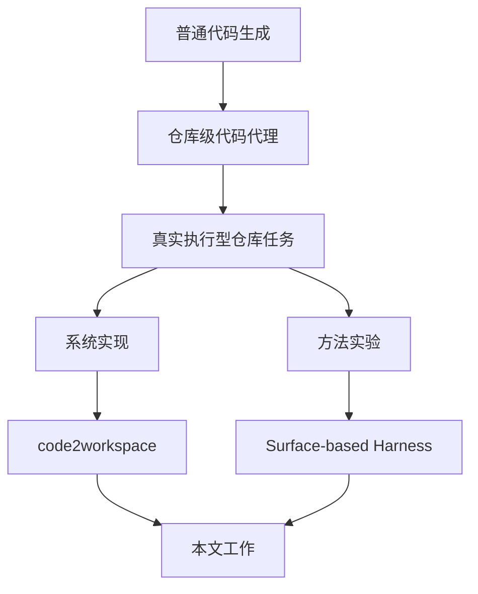
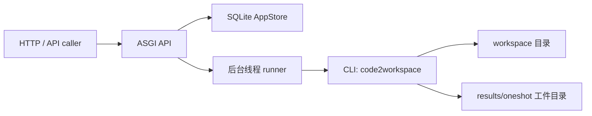
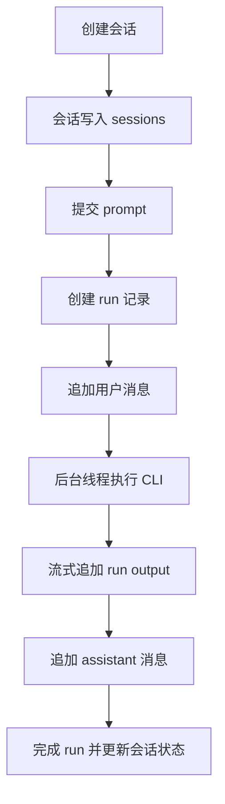
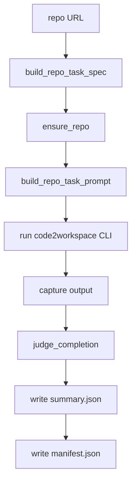
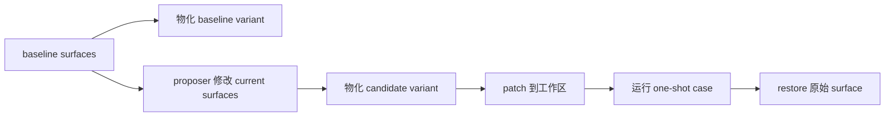
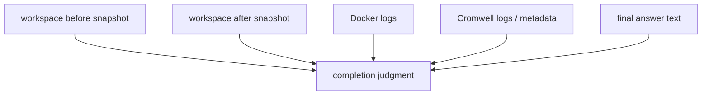
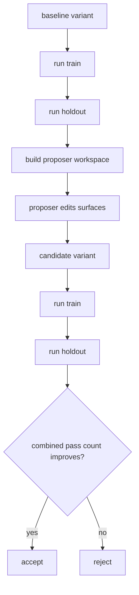

# 本科毕业设计（论文）草稿

## 封面信息

- 论文题目：面向真实软件仓库任务的智能体工作空间系统设计与实现
- 备选题目：面向长时程仓库任务的智能体 Harness 优化方法研究与实现
- 学院：`[待填写]`
- 专业：`[待填写]`
- 学生姓名：`[待填写]`
- 学号：`[待填写]`
- 指导教师：`[待填写]`
- 提交日期：`[待填写]`

> 说明：本稿按本科毕业论文正文结构组织，内容优先服务于正式写作与后续补实验，不作为最终排版稿。

---

## 学位论文原创性声明

本人郑重声明：所呈交的论文是本人在导师指导下独立进行研究所取得的成果。除文中已经明确标注引用的内容外，本论文不包含任何其他个人或集体已经发表或撰写过的研究成果。对本文研究做出重要贡献的个人和集体，均已在文中以明确方式标明。本人完全意识到本声明的法律后果由本人承担。

作者签名：`[待填写]`  
日期：`[待填写]`

## 学位论文版权使用授权书

本人完全了解学校关于保留、使用学位论文的有关规定，同意学校保留并向有关部门或机构送交论文的复印件和电子版，允许论文被查阅和借阅；同意学校可以公布论文的全部或部分内容，并采用影印、缩印或其他复制手段保存和汇编本论文。

作者签名：`[待填写]`  
指导教师签名：`[待填写]`  
日期：`[待填写]`

---

## 摘要

随着大语言模型和代码智能体的发展，基于自然语言驱动软件仓库理解、环境构建和工作流执行的自动化系统逐渐成为软件工程智能化的重要方向。然而，现有大量代码生成或代理 benchmark 主要集中于短上下文、低成本、单轮即可验证的任务，难以覆盖真实软件仓库中的长时程、强状态依赖执行问题。针对这一不足，本文围绕 repository-to-workspace 场景，设计并实现了一个面向真实软件仓库任务的智能体工作空间系统 `code2workspace`，并进一步提出基于显式 surfaces 的 harness 优化方法，以提升任务执行过程的可复现性、可审计性和结果判定可靠性。

在系统实现方面，本文构建了一个轻量 Python ASGI API backend，支持会话管理、one-shot 任务提交、运行轮询与 SQLite 持久化；设计并实现了标准化的 one-shot repository runner，能够完成仓库 URL 到任务 prompt、实际执行、日志落盘、manifest 记录和 summary 输出的完整链路；同时构建了面向 Docker 构建、真实数据验证、WDL 编写与 Cromwell 执行的统一任务工件布局。在方法方面，本文将原本分散于人工 prompt 调整中的经验过程形式化为 surface-based harness optimization，通过显式 surface、variant 物化、`train/holdout` 分离评估、keep/discard 决策以及 evidence-backed completion judgment，将 prompt 调参与结果评估转化为可比较、可回放、可复核的实验过程。

实验部分采用三层验证思路：一层是 `SWE-bench Lite` 小规模 pilot，用于验证 agent 在通用软件工程仓库修复场景中的能力；第二层是低成本的 project-skill 编排评测，用于验证软路由、phase gate 与报告完整性；第三层是多个真实生物信息学软件仓库，用于验证系统在 Docker、真实数据验证、WDL 与 Cromwell 任务链条上的落地能力。当前已整理出的结果包括：8 个历史 one-shot baseline run，其中 3 个形成历史 completed 样本；4 个 project-skill 编排 case，全部通过；5 条两小时缩减评估记录，其中 `spades` 与 `megahit` 形成真实完成样本；8 工具 benchmark 快照，其中 4 个工具成功、1 个部分成功、3 个明确阻塞；以及 5 条真实 `SWE-bench Lite dev` pilot，其中 `marshmallow-code__marshmallow-1359`、`marshmallow-code__marshmallow-1343` 与 `pydicom__pydicom-1694` 通过官方 harness 达到 `resolved=1/1`，最新 `pylint-dev__astroid-1268` rerun 则生成真实 patch 并进入完整 official harness 评测但最终被判为 `unresolved=1/1`，`sqlfluff__sqlfluff-2419` 则在两次 agent attempt 后仍因模型侧 `InternalServerError` 形成 empty-patch 反例。`spades` 个案进一步说明，系统的主要障碍并非任务本质不可完成，而是 shell 能力暴露、执行策略收敛速度、完成判定规则以及编排约束是否能稳定驱动智能体进入真实执行路径。这也表明，当前阶段的成功率改进主要来自 skills、middleware 与完成判定/规划约束的外部化，而不是重写主智能体结构。本文所提出的 evidence-backed completion judgment 能够有效减少仅凭关键词判定带来的伪阳性，而 harness 外环则为后续成功率优化提供了结构化实验基础。

本文完成了一个兼具系统实现与方法实验价值的毕业设计原型。研究表明，针对真实仓库任务，单纯依赖一次性运行或人工 prompt 调试难以形成稳定结论，而基于显式 surfaces 的 harness 优化更适合支撑长时程、高成本任务上的可靠实验。后续工作将进一步补全 DeepAgents proposer 外环、大规模 split 上的泛化实验以及更完整的图表化结果分析。

关键词：智能体系统；软件仓库任务；工作空间构建；Harness 优化；工作流执行

## Abstract

With the rapid progress of large language models and coding agents, repository-level automation driven by natural language has become an important direction for intelligent software engineering. However, many existing code-generation or agent benchmarks still focus on short-context, low-cost, single-turn tasks, and therefore fail to capture the long-horizon, stateful execution challenges that appear in real software repositories. To address this gap, this thesis designs and implements `code2workspace`, an agent workspace system for repository-to-workspace tasks, and further introduces a surface-based harness optimization framework to improve reproducibility, auditability, and reliability of execution outcomes.

On the system side, this work builds a lightweight Python ASGI API backend with session management, one-shot task submission, run polling, and SQLite-based persistence. A standardized one-shot repository runner is implemented to connect repository URLs, task prompts, real execution, log persistence, machine-readable manifests, and final summaries. A unified artifact layout is also defined for Docker image construction, real-data container validation, WDL authoring, and Cromwell-based workflow execution. On the method side, this thesis reformulates ad hoc prompt tuning as surface-based harness optimization. Through explicit surfaces, variant materialization, train/holdout split evaluation, keep/discard decisions, and evidence-backed completion judgment, prompt iteration is turned into a comparable, replayable, and auditable experimental process.

Experiments are conducted on multiple real bioinformatics repositories together with a lower-cost orchestration-eval layer. The current evidence has already been consolidated into four thesis-ready bundles: 8 historical one-shot baseline runs with 3 historical completed samples, a 4/4 passing project-skill orchestration batch, a reduced two-hour evaluation with 2 fresh completed samples (`spades`, `megahit`), and an 8-tool benchmark snapshot with 4 successes, 1 partial success, and 3 explicit blockers. The `spades` case study further shows that the main bottleneck is not inherent task impossibility, but whether the harness can reliably expose shell capability, push the agent into real execution early enough, and judge completion using sufficient evidence. This also indicates that the current success-rate gains come mainly from externalized skills, middleware, and planning/completion contracts rather than from rewriting the core agent runtime. The proposed evidence-backed completion judgment reduces false positives caused by weak keyword-based completion labels, and the harness outer loop provides a structured foundation for future success-rate optimization.

This thesis delivers a graduation-project prototype with both system-implementation value and methodological significance. The study shows that for real repository tasks, one-off runs or manual prompt tweaking alone are insufficient for stable conclusions, while optimization over explicit harness surfaces is more suitable for long-running, high-cost tasks. Future work will focus on larger-scale split evaluation, fuller DeepAgents proposer integration, and more complete comparative experiments.

Keywords: agent systems; software repository tasks; workspace construction; harness optimization; workflow execution

---

## 目录

1. 绪论  
2. 相关技术与理论基础  
3. `code2workspace` 系统设计与实现  
4. 基于 Surface 的 Harness 优化方法  
5. 实验结果与分析  
结论  
参考文献  
致谢  
附录  

## 插图清单

- 图 1-1 研究任务场景图
- 图 2-1 本文技术位置图
- 图 3-1 系统总体架构图
- 图 3-2 Web API 控制层数据流图
- 图 3-3 one-shot repository runner 执行流程图
- 图 4-1 variant 物化与 patch/restore 流程图
- 图 4-2 completion judgment 证据来源图
- 图 4-3 harness 外环优化流程图
- 图 5-1 仓库完成状态柱状图
- 图 5-2 失败类型分布图
- 图 5-3 SWE-bench Lite 子集 resolved 比例图
- 图 5-4 30 分钟与 60 分钟预算对比图
- 图 5-5 baseline 与 candidate 通过数对比图

## 表格清单

- 表 1-1 本文主要贡献与章节映射
- 表 2-1 相关方向对比表
- 表 3-1 Web API 接口说明
- 表 3-2 one-shot run 工件说明
- 表 3-3 运行状态枚举表
- 表 4-1 基线方法与 harness 框架对比
- 表 4-2 baseline 与 candidate 数据结构说明
- 表 4-3 completion judgment 证据项说明
- 表 5-1 仓库任务列表与难度特征
- 表 5-2 one-shot 结果总表
- 表 5-3 SWE-bench Lite 子集结果表
- 表 5-4 `spades` 演化时间线
- 表 5-5 baseline 与 candidate harness 结果对比表
- 表 5-6 completion 判定口径对比表
- 表 5-7 skills 软路由与编排层对比表
- 表 5-8 project-skill 编排 smoke 结果表
- 表 5-9 两小时缩减评估结果表
- 表 5-10 benchmark 八工具快照总览表
- 表 5-11 预算对比实验表

---

# 第一章 绪论

## 1.1 研究背景

随着大语言模型、代码生成模型和工具调用框架的快速发展，智能体系统正在从“回答问题”逐渐走向“执行任务”。在软件工程领域，这种演化体现在越来越多的系统开始尝试理解代码仓库、调用命令行工具、读取配置文件、编写补丁，并最终完成某类端到端的软件任务。然而，现有公开 benchmark 和大量工程演示仍主要聚焦于低成本、短时程、局部可验证的问题，例如函数补全、单文件修复或简单脚本编写。对于真实软件仓库中的复杂任务，尤其是包含环境构建、容器执行、工作流调用和真实数据验证的任务，现有研究与实践仍缺少结构化、可复现的研究路径。

本课题所面对的 repository-to-workspace 任务，恰好处于这一问题交叉点上。给定一个真实仓库 URL，智能体不仅要阅读 README 和脚本，还要识别真实测试入口、构建 Docker 镜像、在容器内完成真实数据验证、编写 WDL 接口，并通过 Cromwell 运行工作流，最终将日志、工件和完成证据全部落盘。这类任务远比普通代码生成复杂，因为它要求智能体持续处理跨阶段依赖、执行状态、外部环境约束和多源证据整合。

从研究角度看，这一问题具有代表性。一方面，它覆盖了软件仓库理解、环境构建、任务执行、结果归档等多个与智能体落地密切相关的能力；另一方面，它又天然暴露出传统 prompt 调参与成功标签判定中的脆弱性。一个看似轻微的 shell 能力缺失、完成标准不清或执行策略偏慢，都可能让系统陷入长时间阅读、伪完成或无法复核的状态。因此，研究如何在真实仓库任务上组织系统实现与实验优化，既具有工程意义，也具有方法论价值。

## 1.2 研究意义

本文的研究意义主要体现在以下三个方面。

第一，本文面向真实仓库任务，而非理想化 benchmark。通过把 Docker、真实数据、WDL 与 Cromwell 纳入统一任务链，研究对象从“生成一段代码”提升为“完成一项真实的软件工程执行任务”，更接近智能体在科研与工程场景中的实际应用需求。

第二，本文强调实验过程的可审计性。对于高成本、长时程任务而言，仅给出一次成功或失败并不足以形成可信研究结论。相比之下，标准化的 runner、结构化 manifest/summary、variant 持久化和 completion judgment，能够把系统行为转化为可复核证据链。

第三，本文尝试把 prompt 调参问题转化为 harness 优化问题。过去很多智能体实验依赖人工经验修改 prompt，但修改对象不清晰、过程难复用、结果难泛化。本文通过显式 surfaces、`train/holdout` split 和 keep/discard 决策，把“经验操作”提升为“受控实验”，从而为今后的成功率优化提供方法学基础。

## 1.3 国内外研究现状

围绕智能体与软件任务自动化，当前研究大体可以分为四个相关方向，即通用工具调用智能体、代码智能体与仓库理解、工作流执行自动化以及 harness 与 agent evaluation。国内外工作虽然均在快速发展，但各自关注重点和公开研究形态存在明显差异。

### 1.3.1 国外研究现状

国外研究整体起步较早，已经从“模型能否生成代码”逐步扩展到“智能体能否在真实环境中稳定完成复杂任务”。如果按近两年的研究演化路径来观察，当前国外相关工作大致形成了三条主线。

第一条主线是“真实软件工程问题基座”的建立。`SWE-bench` 将评测对象从函数级补全推进到真实 GitHub issue 修复，为后续软件工程智能体研究提供了统一基底。围绕这一基底，`SWE-agent` 强调 agent-computer interface（ACI）设计，使模型能够更有效地浏览仓库、编辑文件和执行测试；`AutoCodeRover` 则突出代码搜索与程序分析能力，说明仓库级定位与检索对于实际修复成功率具有关键作用。

第二条主线是“软件工程智能体结构”的快速分化。一类工作强调更完整的交互式 runtime 和开放平台，例如 `OpenHands` 通过代码编辑、命令行和网页浏览构建更接近人类开发者的通用软件开发 agent 平台；另一类工作则反而对复杂 agent 结构提出反思。`Agentless` 指出，经过良好分解的定位、修复与验证流水线，在不少软件工程 benchmark 上能够以更低成本达到不弱于复杂 agent loop 的效果。这个结论对本文很重要，因为它表明提高成功率并不必然依赖“更复杂的主智能体结构”，而可能来自更清晰的任务分解、状态约束和评测方式。

第三条主线是“评测 realism 与长时程能力”的重新审视。`Multi-SWE-bench` 将 issue-resolving 任务扩展到多语言生态，`Saving SWE-Bench` 进一步指出传统 issue 描述与真实用户查询之间存在分布差异，并通过 benchmark mutation 展示公开 benchmark 可能显著高估 agent 能力；`SWE-EVO` 则把关注点推进到 long-horizon software evolution，显示当前 agent 在持续多文件演化任务上的能力远低于单 issue 修复。进入 2026 年，`Ambig-SWE` 开始系统讨论软件工程任务中的 underspecification 与交互澄清问题，`Effective Strategies for Asynchronous Software Engineering Agents` 则说明异步多智能体协作若缺少隔离工作区与集中式协调，很容易在长时程任务中出现干扰和集成失败。

总体而言，国外研究已经在 benchmark、runtime 和 agent 结构三方面形成较强基础，但其主流关注点仍多集中于 issue 修复、代码补丁与 benchmark pass rate。相比之下，围绕 Docker、真实数据验证、WDL 与 Cromwell 的 repository-to-workspace 任务，尤其是如何把高成本执行任务与可审计 harness 优化统一起来的公开研究仍然相对有限。

### 1.3.2 国内研究现状

国内相关研究近年来发展迅速，但整体上更多体现为“系统落地和综述总结同步推进”。一方面，围绕大语言模型智能体、提示工程、工具调用、多模态执行以及大模型幻觉和安全问题，国内已经出现了较多综述性和应用型研究，重点关注智能体架构、应用部署与可靠性问题。另一方面，在软件工程方向，国内实践更多聚焦于代码助手、研发提效平台、模型接入网关和企业级集成工具，强调模型在开发流程中的可接入性、可管理性与可控性。

不过，相较于国外在 agent evaluation 和公开 benchmark 方面的系统化探索，国内关于“如何为真实软件仓库任务构造统一 runner、如何持久化运行工件、如何以显式 harness 为对象进行 outer-loop 优化”的公开研究仍然较少。尤其在长时程科学软件任务上，现有公开材料更多强调模型能力、系统接入或业务应用，而较少专门讨论 Docker 构建、真实数据验证、工作流执行与完成判定之间的结构化衔接。

### 1.3.3 现有研究的不足

结合国内外研究现状，可以归纳出本文研究场景下的三个主要不足。

第一，任务链条覆盖不足。已有很多工作证明了智能体可以调用工具或修改仓库，但很少将 Docker、真实数据、WDL 与 Cromwell 组织成统一、可验证的执行闭环。

第二，实验对象显式化不足。许多工程实践虽然在不断调 prompt、改策略，但很难准确回答“究竟改了 harness 的哪一部分”，从而削弱了实验的可复现性。

第三，完成判定证据不足。相当一部分工作仍依赖返回码、关键字或人工印象判断是否成功，而缺少围绕新写入工件、日志与 metadata 的多源证据机制。

因此，本文的切入点在于：在真实仓库任务上同时补齐系统执行链路、显式 harness 优化结构以及 evidence-backed completion judgment，使系统不仅“能运行”，而且“能被研究、能被复核”。

### 1.3.4 与本文工作的关系

与上述代表性工作相比，本文的定位更接近“执行链路与实验方法的结合”，而不是单纯追求某个公开 benchmark 上的最高 resolved 比例。

一方面，相比 `SWE-agent`、`OpenHands` 这类强调交互式 runtime 设计的工作，本文没有重新发明一套主 agent 运行时，而是尽量保持既有主体结构稳定，把关键增益放在 skills、middleware、soft routing、phase gate、completion judgment 和 harness outer loop 上。这样的设计更适合本科毕业设计的实现边界，也更有利于解释“性能提升究竟来自哪里”。

另一方面，相比 `Agentless`、`AutoCodeRover` 这类主要面向 issue 修复与仓库补丁任务的系统，本文研究对象进一步延展到 repository-to-workspace 场景，其成功标准不仅包含 patch 或测试通过，还包括 Docker 构建、容器验证、WDL 编写以及 Cromwell 工作流成功执行。因此，本文更强调 execution-grounded evidence，而不仅是代码层输出。

最后，相比 `Multi-SWE-bench`、`Saving SWE-Bench`、`SWE-EVO` 等最新评测工作，本文并不试图再提出一个通用 benchmark，而是采用“双层评测”策略：用 `SWE-bench Lite` 小规模 pilot 补充通用软件工程能力证据，再用高成本 scientific repository 任务线刻画真实环境执行能力边界。这样虽然样本规模不大，但任务真实性和工件可复核性更强，也更贴合本文的研究问题。

## 1.4 研究问题与挑战

围绕上述背景，本文重点研究以下问题。

- 如何设计一个面向真实仓库任务的智能体工作空间系统，使其能够完成从任务提交到日志/工件落盘的完整链路。
- 如何将 one-shot repository runner 标准化，使不同仓库运行可比较、可追踪。
- 如何把原本非结构化的 prompt 调优过程形式化为基于显式 surfaces 的 harness 优化过程。
- 如何通过 evidence-backed completion judgment 提高成功标签的可信度。

对应地，本文面临的主要挑战包括：

- 任务链条长，失败点分布在仓库理解、环境准备、构建、测试和工作流执行多个环节。
- 仓库运行成本高，无法依赖大规模穷举试错。
- 成功与失败高度受 harness 影响，需要清晰区分“系统能力缺失”“执行策略不足”和“任务接口错误”。
- 部分实验结果形成于系统演化过程中，需要在论文中明确区分历史 run 产物与当前代码中已实现的最终评估机制。

### 图 1-1 研究任务场景图


## 1.5 本文主要工作与贡献

本文的主要工作与贡献可以概括为以下五点。

1. 设计并实现了 `code2workspace` 系统原型，构建了面向真实软件仓库任务的轻量 Web API 控制层、ASGI 后端和 one-shot 执行链路。
2. 标准化了 repo-task runner，使其能够从仓库 URL 出发生成统一 prompt、持久化日志与 manifest，并显式记录 setup 失败与 batch 错误。
3. 提出了基于显式 surfaces 的 harness 优化框架，通过 variant 物化、`train/holdout` split 和 keep/discard 决策，将 prompt 调参过程形式化为可审计实验。
4. 构建了 evidence-backed completion judgment，用 Docker、WDL、Cromwell 和工件写入等多源证据增强完成标签的内部有效性。
5. 在不重写主智能体主体结构的前提下，引入了基于 `planning-guide` 的软路由、分阶段编排约束与 project-skill 编排评测层，使 benchmark、paper2workspace 和 mixed task 能够以较低成本形成稳定可观测的回归信号。

### 表 1-1 本文主要贡献与章节映射

| 贡献 | 内容 | 对应章节 |
| --- | --- | --- |
| 系统原型 | 轻量 Web API 控制层、ASGI 后端、SQLite 持久化 | 第三章 |
| 标准化 runner | one-shot task、batch、日志、manifest | 第三章、第五章 |
| harness 方法 | surface、variant、split、outer loop | 第四章 |
| 证据化评估 | completion judgment、多源完成证据 | 第四章、第五章 |
| 轻量编排层 | 软路由、phase gate、project-skill 编排评测 | 第四章、第五章 |

## 1.6 论文结构

本文共分为五章正文和一个结论部分。第一章为绪论，介绍研究背景、研究问题与主要贡献。第二章介绍相关技术与理论基础，包括智能体、代码仓库理解、Docker/WDL/Cromwell 和 harness 评估方法。第三章重点阐述 `code2workspace` 系统设计与实现。第四章给出基于 Surface 的 harness 优化方法。第五章对现有实验结果、`spades` 个案和待补实验设计进行统一分析。最后在结论部分总结全文工作，并给出后续展望。

---

# 第二章 相关技术与理论基础

## 2.1 智能体系统与工具调用

智能体系统通常由语言模型、工具调用接口、上下文管理机制和执行状态管理机制构成。相较于仅返回文本的对话模型，智能体系统强调“能够感知环境并采取行动”，即模型不仅生成文字，还会决定是否读取文件、是否执行命令、是否调用搜索或其他外部能力。

在本文场景中，工具调用的重要性体现在两个层面。其一，仓库理解需要通过读取 README、脚本、配置和目录结构获取任务入口；其二，真实执行需要通过 shell、Docker 和 Java/Cromwell 等工具驱动环境构建和工作流验证。也正因为如此，工具表面的缺失或约束会直接影响任务是否能从“思考”推进到“执行”。本文在实验中观察到的早期失败就证明了这一点：如果 non-interactive 运行不暴露 shell/execute 能力，智能体将难以真实完成 Docker/WDL 任务。

## 2.2 软件仓库理解与代码智能体

相较于单文件代码补全，软件仓库理解要求智能体在多文件、多目录和多类型工件间建立联系。一个真实仓库通常包含 README、源码、脚本、配置文件、测试样例和文档，智能体需要在这些材料之间定位最短真实执行路径，而不是停留在泛泛的源码阅读阶段。

本文处理的 repository-to-workspace 任务属于更高成本的仓库级问题。智能体既要识别真实测试数据和官方命令，又要基于这些材料生成镜像、脚本、WDL 和工作流输入。换言之，仓库理解并不是终点，而是执行链条中的第一阶段。本文在设计 prompt 与 harness 时，特别强调“尽快收敛到最短真实执行路径”，其原因就在于高成本仓库任务无法承受长时间的无效阅读。为了避免论文评测只局限于自建仓库任务集，本文还预留了 `SWE-bench Lite` 这一外部权威 benchmark，用来补充通用软件工程能力验证。

## 2.3 Docker、WDL 与 Cromwell 工作流基础

Docker 为本文任务提供了环境封装与可复现执行基础。对于生物信息学软件而言，依赖库、运行环境和输入路径往往比普通软件工程更复杂，通过容器化方式可以更稳定地复现任务执行路径。

WDL（Workflow Description Language）为工作流接口提供统一描述方式，允许将镜像、输入文件、输出工件和执行参数组织为结构化工作流。Cromwell 则是 WDL 的执行后端，可实际调度工作流运行并输出状态、日志与 metadata。

将 Docker、WDL 与 Cromwell 纳入同一任务链，使本文实验比普通“能否编译通过”更严格。系统不仅要证明镜像可构建，还要证明容器内真实测试可通过、WDL 可运行、Cromwell 可达成 `Succeeded`，并保留真实工件。这一链条决定了本文必须采用更强的完成判定方式。

## 2.4 Harness 与 agent evaluation 方法

在智能体系统中，模型能力与 harness 配置往往是耦合的。所谓 harness，不仅包括 prompt，还包括可用工具、完成判定规则、外环优化策略和实验记录方式。很多工程实践虽然在做“调优”，但缺少显式对象和统一评估，因此往往只能在局部样本上形成经验，而难以形成可复用结论。

本文采用的 harness 视角，核心是把优化对象显式化。具体而言，系统将 prompt 模板与 completion rubric 等内容抽象为 surfaces，再通过 variant 物化、`train/holdout` split、proposer workspace 和 keep/discard 机制，将原本依赖聊天记录的经验调参转变为有结构的实验迭代。这一思路与通用“run once and inspect”相比，更适合高成本仓库任务。

### 2.4.1 与最新代表性工作的比较

如果把最近的软件工程智能体工作放在同一分析框架下，可以看到它们在关注重点上存在明显差异。

`SWE-agent` 与 `OpenHands` 代表的是“更强交互式 runtime”路线，重点在于让 agent 能更像人类开发者那样与仓库、终端和网页交互；`AutoCodeRover` 与 `Agentless` 则更强调“定位-修复-验证”这一 issue-resolving 主链条，并试图以更清晰、更低成本的流水线获得更稳定的结果；`Multi-SWE-bench`、`Saving SWE-Bench` 和 `SWE-EVO` 关注的则是“评测是否足够真实”和“当前 agent 是否真的具备长时程软件工程能力”。

本文与这些工作的关系可以概括为两点。第一，本文承认这些工作在 runtime、benchmark 和 agent 结构方面提供了重要启发，但并不沿着“不断重写主 agent 架构”的路径推进，而是把主要改进集中在 harness、skills 和报告/判定 contract 上。第二，本文的核心任务不是纯 issue 修复，而是 repository-to-workspace，因此必须把成功标准延伸到环境构建、workflow 执行和结果工件，这使得本文在方法上更强调 execution grounding，在实验上更强调 artifact-backed verification。

### 表 2-1 相关方向对比表

| 代表性方向/工作 | 主要任务对象 | 运行时交互 | 评测重点 | 对本文的启示 | 与本文的主要差异 |
| --- | --- | --- | --- | --- | --- |
| `ChatDev` / `MetaGPT` | 角色化协作的软件生成 | 多 agent 角色通信 | 生成流程完整性 | 说明多角色协作与 SOP 约束具有组织价值 | 更偏向从需求生成软件，不直接面向高成本真实仓库执行 |
| `SWE-agent` | GitHub issue 修复 | 强终端/文件交互 | SWE-bench issue resolving | 证明 ACI 与真实仓库交互对补丁生成有效 | 成功标准主要是 issue 修复，不覆盖 Docker/WDL/workflow 闭环 |
| `AutoCodeRover` | 仓库级程序改进 | 检索与分析增强 | 程序修复成功率 | 强调代码搜索、定位和静态/动态分析的重要性 | 重点仍在补丁与测试，不在工作空间构建 |
| `Agentless` | issue 修复流水线 | 弱化复杂 agent loop | 成本与 resolved 率 | 说明简单而清晰的任务分解可能优于复杂架构 | 不强调交互式执行链与高成本环境工件 |
| `OpenHands` | 通用软件开发 agent 平台 | 代码、终端、网页综合交互 | 多 benchmark 平台化评测 | 证明开放 runtime 与 benchmark 接入的重要性 | 本文不重做平台本体，而更强调 harness/skills 层改进 |
| `Multi-SWE-bench` / `Saving SWE-Bench` / `SWE-EVO` | 多语言、现实化、长时程软件工程评测 | 以 benchmark 为中心 | 评测 realism 与长时程 gap | 提醒评测必须关注语言覆盖、用户查询分布和 long-horizon 难度 | 本文样本规模更小，但任务成本更高，强调工件与执行证据 |
| 本文系统 | repository-to-workspace | 强终端、容器与工作流执行 | 双层评测 + harness 优化 | 将 skills、contracts、taxonomy 与 evidence-backed judgment 合并为可审计实验链 | 不是追求单一 benchmark SOTA，而是追求真实仓库任务上的可复核性与可迭代优化 |

### 图 2-1 本文技术位置图



## 2.5 本章小结

本章从智能体系统、软件仓库理解、Docker/WDL/Cromwell 以及 harness 评估四个角度，为后文系统实现与方法设计提供了基础背景。可以看出，本文问题并非单一“生成代码”问题，而是一个同时涉及环境执行、仓库理解与实验组织的复合任务。正因为如此，后文需要同时处理系统实现与方法优化两条主线。

---

# 第三章 `code2workspace` 系统设计与实现

## 3.1 系统需求分析

根据当前项目目标，`code2workspace` 需要满足以下三类需求。

第一类是控制面需求。系统需要提供一个轻量、可复用的 Web API 控制层，用于创建会话、发起 one-shot 运行、查询历史记录和查看执行输出。该控制层主要承担实验操作台角色，而非复杂产品化界面。

第二类是执行需求。系统需要支持从仓库 URL 或任务 prompt 出发，触发 one-shot 智能体执行，并将执行过程中的原始输出稳定落盘，形成可复查结果。

第三类是实验需求。系统需要以统一目录布局记录 prompt、日志、summary、manifest 以及 Docker/WDL/Cromwell 相关工件，并为之后的 harness 优化提供稳定输入。

## 3.2 系统总体架构

`code2workspace` 当前可概括为“最小化 API backend + 持久化状态存储 + one-shot runner + 实验结果目录”的组合架构。

当前仓库中不再保留 checked-in 浏览器前端；`apps/webapp` 只承担轻量 API backend 角色。该 backend 通过 HTTP 暴露健康检查、session 列表与 one-shot run 查询接口，并使用 SQLite 存储会话、消息与运行记录。在用户触发任务时，后台线程调用现有 CLI 路径 `uv run --project libs/cli code2workspace ...`。实验执行完成后，运行输出被写入数据库和文件系统中的结果目录，供后续研究与复核。

在这一总体架构之外，系统还新增了一层“技能感知规划层”。其核心不是把主
agent 替换成一个硬编码 router，而是通过 `planning-guide` 在任务开始前生成
结构化 soft contract，再由 CLI 侧 middleware 将该 contract 作为额外上下文
注入给主 agent。对于 benchmark 和 paper2workspace 这类高成本任务，contract
可以显式给出 `recommended_skill`、lane hints、fresh-run 与隔离建议，以及
更细的 execution contract，例如“不要复用历史 WDL 结果”“尽量共用同一
数据集”“先完成 phase 1 再进入 phase 2”“先输出用户可读报告再扩展 scope”等。

这一层的设计价值在于，它把高成本任务的关键约束从零散 prompt 经验变成了
可维护、可测试的技能约束，同时又保留了主 agent 的最终决策权。换言之，
系统采用的是“软路由 + 技能引导”而非“硬分发 + 架构替换”。这使得 benchmark
与 paper2workspace 等任务可以共享同一主体智能体，只在 skills 层表达任务约束，
从而降低系统侵入性并提高后续 harness 实验的可追溯性。

### 图 3-1 系统总体架构图



## 3.3 Web API 控制层设计与实现

当前 Web API 控制层围绕三个核心概念组织：`session`、`message` 与 `run`。会话用于组织用户任务上下文，消息用于保留用户与系统返回内容，运行记录则对应一次后台 one-shot 执行。

在后端实现上，`apps/webapp/api.py` 定义了最小可用的 API 面：

- `GET /api/health`
- `GET /api/sessions`
- `POST /api/sessions`
- `GET /api/sessions/{session_id}`
- `DELETE /api/sessions/{session_id}`
- `POST /api/sessions/{session_id}/runs`
- `GET /api/runs/{run_id}`

这些接口只覆盖 API 控制面的最小闭环，不扩展到复杂的用户认证、模型配置或多租户资源管理。这样的设计符合当前研究阶段目标：保留一个诚实、轻量的实验 API，而不是继续维护一套仓库内浏览器前端。

SQLite 持久化由 `apps/webapp/store.py` 中的 `AppStore` 实现。该存储层维护了三张表：`sessions`、`messages`、`runs`，分别承担会话摘要、消息流和运行状态记录功能。会话列表支持最后消息预览、最新运行状态和运行次数汇总，便于 API 层返回轻量历史视图。

### 表 3-1 Web API 接口说明

| 接口 | 方法 | 功能 | 返回核心字段 |
| --- | --- | --- | --- |
| `/api/health` | GET | 健康检查 | `ok` |
| `/api/sessions` | GET | 列出会话 | `sessions` |
| `/api/sessions` | POST | 创建会话 | `session` |
| `/api/sessions/{session_id}` | GET | 获取单会话详情 | `session`、`messages`、`runs` |
| `/api/sessions/{session_id}` | DELETE | 删除会话 | `deleted` |
| `/api/sessions/{session_id}/runs` | POST | 发起 one-shot run | `run_id`、`status` |
| `/api/runs/{run_id}` | GET | 查询单次 run | `run` |

### 图 3-2 Web API 控制层数据流图



## 3.4 one-shot repository runner 设计与实现

one-shot runner 是系统的核心执行入口。其设计目标不是“运行一次模型就结束”，而是围绕真实仓库任务形成完整的实验工件。

`experiments/oneshot/run_repo_task.py` 定义了标准的单仓库执行路径。其逻辑包括：

1. 根据仓库 URL 构建 `RepoTaskSpec`
2. clone 或复用目标仓库
3. 生成标准化任务 prompt
4. 调用本地 CLI 路径执行智能体
5. 捕获终端输出并写入日志
6. 对运行结果写出 `summary.json` 和 `manifest.json`
7. 在完成判定逻辑上生成 `completion_judgment`

`run_repo_batch.py` 则进一步在此基础上提供 batch 执行能力，支持目标列表、运行上限、逐仓库失败记录以及 `batch_error` 显式序列化。这一改动的意义在于：即便某个仓库 preparation 或执行出错，也不会让整批实验静默中断，从而保证部分失败仍然可分析。

### 图 3-3 one-shot repository runner 执行流程图



### 表 3-2 one-shot run 工件说明

| 工件 | 位置 | 作用 |
| --- | --- | --- |
| `prompt.txt` | run 目录 | 保存标准任务 prompt |
| `agent.log` | run 目录 | 保存原始终端输出 |
| `summary.json` | run 目录 | 保存运行状态、返回码与 completion 结果 |
| `manifest.json` | run 目录 | 保存运行元信息与路径信息 |
| `results/docker_test/` | workspace 或 run 目录 | 保存 Docker 构建/容器测试产物 |
| `results/wdl_file/` | workspace 或 run 目录 | 保存 WDL 与输入文件 |
| `results/wdl_result/` | workspace 或 run 目录 | 保存 Cromwell 结果与输出工件 |

## 3.5 运行日志与实验工件持久化

对于高成本任务而言，“记录过程”与“得到结果”同样重要。本文在系统实现中将日志、summary、manifest 和工件目录视为一等公民，而不是附属输出。这样做至少带来两点好处。

第一，实验可重放。由于每次运行都保存 prompt、命令、返回码与结果目录路径，后续可以对单次运行进行复核和归因。

第二，失败可分析。系统不仅记录 `completed`，还区分 `finished`、`timed_out`、`interrupted`、`setup_failed` 与 `batch_error` 等状态。对于研究场景而言，这种差异比单纯的“成功/失败”更加重要。

### 表 3-3 运行状态枚举表

| 状态 | 含义 | 典型来源 |
| --- | --- | --- |
| `completed` | 满足 completion judgment | one-shot summary |
| `finished` | 运行结束但未满足完成证据 | one-shot summary |
| `timed_out` | 达到预算上限后终止 | one-shot summary |
| `interrupted` | 外部中断或提前停止 | one-shot summary |
| `setup_failed` | 仓库准备阶段失败 | `run_repo_task.py` |
| `batch_error` | batch 中单仓库异常 | `run_repo_batch.py` |
| `queued` | Web 后台任务已排队 | Web AppStore |
| `running` | Web 后台任务执行中 | Web AppStore |
| `succeeded` | Web 后台 CLI 返回码为 0 | Web runner |
| `failed` | Web 后台 CLI 返回码非 0 或异常 | Web runner |

## 3.6 本章小结

本章围绕 `code2workspace` 的系统实现展开，说明了轻量 Web API 控制层、SQLite 状态存储、one-shot repository runner 与实验工件持久化之间的关系。可以看出，当前系统的设计重点并不是丰富前端交互，而是为真实仓库任务和后续 harness 研究提供稳定、可复查的执行基础。

---

# 第四章 基于 Surface 的 Harness 优化方法

## 4.1 问题建模

传统 one-shot 路径的研究对象通常是“某一次运行是否成功”。这种建模方式虽然简单，但无法清晰解释：是模型能力不足，还是 prompt 设计不合理，还是完成标准过弱，抑或仓库准备本身失败。

为了解决这一问题，本文将优化对象从“单次运行”提升为“harness 配置”。具体来说，系统不再把每轮调整看作对整套系统的模糊修补，而是把 prompt 模板、completion rubric 等可修改对象抽象为显式 surfaces。于是，每轮实验评估的对象就从“这次会话表现如何”，变成“某个 variant 在一组仓库 case 上表现如何”。

## 4.2 基线方法及其局限

本文将当前可对比的方法分为三类。

第一类是直接 one-shot。其优点是实现成本低、启动快，但缺点是实验对象不明确，prompt 和判定标准都容易漂移。

第二类是人工 prompt 迭代。其优点是灵活，能快速根据失败调节策略；缺点是改动对象模糊、过程难以重现、容易对少量样本过拟合。

第三类是本文提出的 harness 框架。其优点在于显式化 surface、物化 variant、引入 split 和 keep/discard 机制，并将完成标签建立在多源证据上。其代价是需要额外的实验组织结构和元数据管理，但这恰恰是高成本仓库任务所需要的。

### 表 4-1 基线方法与 harness 框架对比

| 维度 | 直接 one-shot | 人工 prompt 迭代 | 本文 harness 框架 |
| --- | --- | --- | --- |
| 优化对象 | 单次运行 | prompt 或少量策略文本 | 显式 harness surfaces |
| 改动单位 | 隐式 | 半显式 | variant 级显式物化 |
| 成功判定 | 人工检查或关键词 | 人工检查为主 | 证据化 completion judgment |
| 泛化控制 | 无 | 无 | `train/holdout` 分离 |
| 决策规则 | 无 | 主观判断 | keep/discard 规则 |
| 可追溯性 | 弱 | 中等 | 强 |

## 4.3 Surface 抽象与 variant 物化

在当前原型中，live surfaces 至少包括：

- `one_shot_prompt`
- `completion_rubric`

每个 variant 都包含：

- 一个稳定标签
- 相对 baseline 变化的 surface 集合
- 全部 surface 的当前值

在评估时，系统会把 candidate surface 值 patch 到目标工作区，运行结束后再恢复。这样可以保证：

- baseline 与 candidate 的执行路径保持一致
- 改动对象局限在显式 surfaces 上
- 每个实验状态都可以序列化和回放

### 图 4-1 variant 物化与 patch/restore 流程图



### 表 4-2 baseline 与 candidate 数据结构说明

| 对象 | 关键字段 | 含义 |
| --- | --- | --- |
| `Surface` | `name`、`kind`、`target`、`filename`、`base_value` | 单个可编辑 harness surface |
| `Variant` | `label`、`changed_surfaces`、`values` | 一组物化后的 surface 值 |
| `Proposal` | `changed_surfaces`、`workspace_dir`、`summary` | 外层 proposer 生成的修改提案 |
| `RunReport` | baseline/final split 结果、iterations、delta | 外环优化运行报告 |

## 4.4 evidence-backed completion judgment

本文认为，完成判定是 one-shot 路径与 harness 研究之间的关键桥梁。如果完成标签本身不可靠，那么外环优化得到的任何提升都缺乏意义。

当前 `experiments/oneshot/completion.py` 通过对运行前后工作区状态进行快照比较，并结合日志与 metadata，构建了结构化的 `completion_judgment`。其核心思想是：只有在 Dockerfile、镜像、容器测试、WDL、Cromwell 和输出工件等多个证据通道共同满足条件时，才将一次运行判为完成。

### 表 4-3 completion judgment 证据项说明

| 证据项 | 检查内容 | 目的 |
| --- | --- | --- |
| `dockerfile_written` | Dockerfile 是否新建或修改 | 排除口头声明 |
| `docker_image_matches_repo` | 镜像是否真实构建且与仓库对应 | 排除无关镜像 |
| `docker_test_executed` | `results/docker_test` 是否生成新工件 | 排除空目录或旧残留 |
| `wdl_written_for_expected_image` | WDL 是否新写入且 runtime 指向目标镜像 | 保证工作流接口真实生成 |
| `cromwell_ran` | 是否执行 Cromwell 或生成新日志 | 排除未运行工作流 |
| `wdl_succeeded` | 日志或 metadata 是否显示 `Succeeded` | 保证工作流完成 |
| `wdl_outputs_written` | `results/wdl_result` 与 `results/wdl_file` 是否有新工件 | 保证结果落盘 |
| `final_answer_declares_completed` | 最终回答是否声明完成 | 与其他证据形成补充一致性 |

### 图 4-2 completion judgment 证据来源图



## 4.5 proposer workspace 与 keep/discard 机制

为支持外环优化，系统会在每轮迭代中构建 proposer workspace。该工作区包含当前可编辑 surfaces、可见 train 失败样本、历史决策以及任务说明，允许 proposer 只在一个受限环境中提出修改。

当前外层 proposer 支持两种模式：

- 本地 `[proposer].command`
- 原生 `[better_agent]` DeepAgents 外环

无论采用哪种模式，最终 candidate 都必须在相同的 `train/holdout` split 上重新评估，并遵守统一的 keep/discard 规则：只有当 combined `train + holdout` 通过数严格提升时，candidate 才会被接受。这一规则虽然简单，但非常适合论文原型阶段，因为它避免了复杂权重设计和主观阈值。

### 图 4-3 harness 外环优化流程图



## 4.6 本章小结

本章从问题建模、surface 抽象、variant 物化、completion judgment 和外环 proposer 机制五个层面，给出了 `code2workspace` 的 harness 方法设计。相较于直接 one-shot 和人工 prompt 迭代，本文方法更强调优化对象显式化、完成判定证据化以及实验过程的可复用性。后文将结合真实仓库运行结果进一步说明这一方法的必要性与边界。

---

# 第五章 实验结果与分析

## 5.1 实验平台及环境

本章实验主要在本地服务器环境中完成，统一采用 one-shot repository runner 作为内层执行路径。当前单仓库默认预算为 30 分钟，系统围绕 Docker 镜像构建、真实数据验证、WDL 编写与 Cromwell 执行组织任务链条。

从实验目的上看，本章并不只关心“最终是否完成”，而是围绕以下四个研究问题展开：

- RQ1：标准化 one-shot 基线在真实仓库任务上能达到何种完成水平。
- RQ2：shell 能力、prompt surface 和 completion judgment 是否显著影响执行结果。
- RQ3：重型仓库的失败来自任务本身不可做，还是来自执行可靠性与 harness 设计不足。
- RQ4：surface-based harness 优化是否比人工 prompt 调整更具可复现性和可审计性。

## 5.2 数据集与仓库对象介绍

本文实验对象由两部分组成。第一部分是外部权威 benchmark，即 `SWE-bench Lite`，用于验证 agent 在通用软件工程仓库修复任务中的能力；第二部分是本文自建的真实软件仓库任务集，用于验证系统在高成本 scientific workflow 场景中的落地能力。后者中的每个仓库都被视为一个 repository-level case，要求系统完成仓库理解、Docker 构建、容器验证、WDL 编写和工作流执行中的全部或部分环节。

### 表 5-1 仓库任务列表与难度特征

| 仓库 | 类型 | 任务特点 | 当前角色 |
| --- | --- | --- | --- |
| `SWE-bench Lite` | 通用软件工程 benchmark | 真实 GitHub issue 修复任务，评测成本相对较低 | 通用能力验证 |
| `spades` | 重型科学仓库 | 构建链长，测试与工作流完整 | 核心个案 |
| `canu` | 重型科学仓库 | 构建耗时长 | 难例 |
| `megahit` | 科学仓库 | 构建依赖敏感 | 难例 |
| `Flye` | 科学仓库 | 可定位最短真实入口 | 部分失败例 |
| `trinityrnaseq` | 重型科学仓库 | 长时程构建与执行 | 难例 |
| `v-pipe` | 工作流型仓库 | Docker + workflow 链路清晰，但环境收敛成本高 | 历史正向基线 / 对照 |
| `covid-19-signal` | 工作流型仓库 | 官方脚本与数据路径清晰，但 benchmark 通道仍受外网依赖影响 | 历史正向基线 / 阻塞对照 |
| `fieldbioinformatics` | 工作流型仓库 | 任务链闭环明确，但当前 benchmark 与缩减评测已复现运行时阻塞 | 历史正向基线 / 阻塞对照 |

这些仓库具有两个共同特征：一是运行成本高，二是任务链条长。因此，它们比普通代码 benchmark 更能暴露智能体系统在真实执行场景下的能力边界。

## 5.3 实施过程

本章实验的实施过程分为四步。

第一步，在 `SWE-bench Lite` 上构造一个 20 到 50 题的代表性子集，作为通用软件工程能力评测集。该部分用于验证 agent 是否具备处理真实仓库 issue、生成补丁和通过测试的基本能力。

第二步，运行标准化 one-shot baseline。系统以仓库 URL 为输入，统一生成标准任务 prompt，并输出 `prompt.txt`、`agent.log`、`manifest.json` 与 `summary.json` 等工件。

第三步，对代表性仓库进行结果归类和个案分析。对于历史正向基线仓库，重点提取其真实执行闭环；对于未完成或受阻仓库，重点分析其卡在何处以及失败属于哪一层。

第四步，将已完成实验与待补实验纳入统一框架。已完成部分用于支撑当前结论，待补部分则以正式实验设计形式预埋在论文中，保证后续只需补数而不必重新设计实验结构。

除高成本 repo-url 任务线外，本文还补充了一条低成本 project-skill 编排评测线。该路径主要通过
`experiments/skill_tests` 中的自然语言 case 与少量 helper-script case，
验证 `planning-guide` 的软路由、benchmark / paper2workspace 编排技能
选择、mixed task lane 摘要，以及分阶段 workspace report
等行为是否能被稳定观测和回归测试。其意义不在于替代真实仓库任务，而在于为
高成本任务提供一个更快的约束层回归层。

## 5.4 评估指标和实验结果

### 5.4.1 研究问题与评价指标

本章采用三层指标体系。

结果指标包括：`completed` 数量、比例、WDL `Succeeded` 数量以及工件落盘数量。  
过程指标包括：是否进入 `docker build`、`docker run`、Cromwell，首次进入真实构建时间、总时长以及超时数量。  
方法指标包括：是否具备 variant 记录、split-level 结果、keep/discard 决策以及 evidence-backed completion judgment。

这些指标分别保存在 `summary.json`、`manifest.json`、`report.json`、日志文件和结果目录中，便于后续交叉验证。

### 5.4.2 one-shot baseline 结果概览

当前标准化 one-shot baseline 已经形成一组具有代表性的仓库结果。整体来看，系统已经跨过“只读不执行”的初级阶段，并在多个仓库上进入真实构建和工作流执行。

### 表 5-2 one-shot 结果总表

| 仓库 | 代表性运行 | 持续时间 | 状态 | 完成情况 | 结果解读 |
| --- | --- | --- | --- | --- | --- |
| `spades` | `20260416T123616Z` | 26m42s | `finished` | 未完成 | 首次进入真实 `docker build` |
| `canu` | `20260416T151417Z` | 30m00s | `timed_out` | 未完成 | 已进入真实构建，受预算限制 |
| `megahit` | `20260416T154420Z` | 30m00s | `timed_out` | 未完成 | 已进入真实构建，暴露依赖不稳定 |
| `Flye` | `20260417T003012Z` | 2m44s | `finished` | 未完成 | 已定位真实入口但未闭环 |
| `trinityrnaseq` | `20260417T003257Z` | 30m44s | `timed_out` | 未完成 | 仍属于长时程难例 |
| `v-pipe` | `20260417T010342Z` | 25m28s | `completed` | 完成 | 历史 one-shot 正向基线；后续 workflow-heavy 通道仍可能受环境收敛影响 |
| `covid-19-signal` | `20260417T012910Z` | 11m40s | `completed` | 完成 | 历史 one-shot 正向基线；当前 benchmark 通道仍受外网依赖阻塞 |
| `fieldbioinformatics` | `20260417T014050Z` | 16m16s | `completed` | 完成 | 历史 one-shot 正向基线；更新评测中已复现 `artic` 运行时阻塞 |

需要强调的是，表 5-2 只表示标准化 one-shot 历史 baseline，不等同于本文截至 2026-04-22 的当前最强完成样本；最新强正样本已更新为表 5-9 中的 `spades` 与 `megahit`。

从表 5-2 可以看出，历史标准化 one-shot baseline 大致分为三类：

- 历史正向基线型：`v-pipe`、`covid-19-signal`、`fieldbioinformatics`
- 进入真实构建但未完成型：`spades`、`canu`、`megahit`
- 部分收敛但未闭环型：`Flye`、`trinityrnaseq`

该表对应的自动汇总结果位于 `results/oneshot-baseline-summary-20260422/`。在此基础上，`results/thesis-plot-data-20260422/` 已进一步提供图 5-1 和图 5-2 所需的直接统计 CSV，`results/thesis-asset-notes-20260422/SUMMARY_ZH.md` 则给出可直接引用的图题和解释句。

### 图 5-1 仓库完成状态柱状图

图 5-1 可直接根据 `results/thesis-plot-data-20260422/figure_5_1_counts.csv` 绘制。建议横轴为完成状态类别，纵轴为样本数，并使用 `completion_level` 三值编码：`completed=2`、`entered real execution but incomplete=1`、`stalled before full closure=0`。按当前汇总，历史 one-shot baseline 中 level=2 样本为 3 个，level=1 样本为 5 个。

### 图 5-2 失败类型分布图

图 5-2 可直接根据 `results/thesis-plot-data-20260422/figure_5_2_counts.csv` 绘制。按当前汇总，失败类型分布为：`budget timeout` 2 例、`dependency instability` 1 例、`pre-build convergence too slow` 1 例、`workflow interface error` 1 例。该图用于说明当前 one-shot 失败主要发生在真实执行后的收敛、依赖和接口层，而不是停留在纯阅读阶段。

### 5.4.3 SWE-bench Lite 补充验证（pilot）

考虑到本文自建仓库任务集主要来自生物信息学软件场景，其结果更能体现领域落地能力，但对“通用软件工程能力”覆盖仍然有限。因此，本文将 `SWE-bench Lite` 作为补充评测层。该 benchmark 基于真实 GitHub issue 与真实仓库修复任务构建，具有较高认可度，同时比更大规模的公开软件工程 benchmark 更适合在毕业设计时间预算内完成。

当前已经完成 5 条真实 `dev`-split pilot。五个案例分别为 `marshmallow-code__marshmallow-1359`、`pylint-dev__astroid-1268`、`pydicom__pydicom-1694`、`marshmallow-code__marshmallow-1343` 和 `sqlfluff__sqlfluff-2419`。其中，`marshmallow-code__marshmallow-1359` 在仓库基线提交上生成了真实 patch，并补出回归测试；第一次 official harness 评测因 Docker 构建阶段的容器内 `git clone` 触发瞬时 HTTP2 网络错误而中断，但对同一份 `predictions.jsonl` 直接重试后成功达到 `resolved=1/1`。`pydicom` 则直接生成真实 patch 和回归测试，并在首次 official harness 评测中达到 `resolved=1/1`。新补入的 `marshmallow-code__marshmallow-1343` 同样生成真实 patch 与回归测试，并达到 official `resolved=1/1`。`astroid` 也生成了真实 patch，并在仓库内通过目标 pytest；在引入 official-eval 自动重试后，该案例已经不再受评测层网络构建错误阻塞，而是能够完成完整 official harness 评测，但最终仍被判为 `unresolved=1/1`。与之相对，`sqlfluff__sqlfluff-2419` 在引入 agent-side retry 后仍连续两次遭遇模型侧 `InternalServerError`，最终形成 empty-patch 样本。整体来看，这一结果已经足以把 `SWE-bench Lite` 从“纯待补实验”推进到“已有多样本真实 pilot 证据”的层次。

需要强调的是，这一结果仍然只是小规模 pilot，而不是大规模统计结论。当前 pilot 使用 `dev` split，且其中 `marshmallow`、`astroid`、`sqlfluff` 三条提示显式包含 benchmark 提供的 `FAIL_TO_PASS` 测试名与 `hints_text`。因此，论文中应将其定位为“通用软件工程能力的可行性验证”而不是“最终泛化性能结论”。后续仍应继续扩展到更多实例，才能更稳健地比较 resolved 比例、失败类型以及模型服务波动、official harness 稳定性与真实 patch 质量之间的关系。

### 表 5-3 SWE-bench Lite 子集结果表

当前表 5-3 已可直接根据 `results/thesis-table-data-20260422/table_5_3.csv` 填写。现阶段共有 5 条 `dev` pilot 记录，其中 `marshmallow-code__marshmallow-1359`、`pydicom__pydicom-1694` 与 `marshmallow-code__marshmallow-1343` 为 official resolved，`pylint-dev__astroid-1268` 为 official unresolved，而 `sqlfluff__sqlfluff-2419` 则是经过 agent-side retry 后仍未产生 patch 的 empty-patch 样本。因此，这张表不仅能展示已有 official resolved 样本，也保留了 official unresolved 反例与模型服务不稳定导致的空补丁反例。

### 图 5-3 SWE-bench Lite 子集 resolved 比例图

图 5-3 已可直接根据 `results/thesis-plot-data-20260422/figure_5_3_counts.csv` 绘制。当前已有五条 pilot 记录，横轴可直接使用 `run_id` 或对应 `instance_id`，纵轴为每条 run 的 `resolved / attempted`。若在正文中需要一个总览句，可写为“当前累计 `resolved / attempted = 3 / 5`”。待后续继续扩展更多实例后，再把该图自然扩展为更多 run 或不同配置的对比图。

### 5.4.4 `spades` 个案分析

`spades` 是当前最重要的核心案例，因为它既展示了自动 baseline 的障碍，也提供了手工延续后成功的正例证据。

### 表 5-4 `spades` 演化时间线

| 运行标识 | 时间 | 结果 | 主要发现 |
| --- | --- | --- | --- |
| `20260416T105820Z` | 2026-04-16 10:58:20 UTC | `interrupted` | 停留在仓库理解阶段 |
| `20260416T110635Z` | 2026-04-16 11:06:35 UTC | `interrupted` | 暴露 shell/execute 缺失 |
| `20260416T111040Z` | 2026-04-16 11:10:40 UTC | `interrupted` | 已具备执行能力，但前置收敛过慢 |
| `20260416T123133Z` | 2026-04-16 12:31:33 UTC | `finished` | 写出部分目录，但未真正构建 |
| `20260416T123616Z` | 2026-04-16 12:36:16 UTC | `finished` | 首次进入真实 `docker build` |
| 手工延续 | 2026-04-16 22:55:29 本地时间 | `Succeeded` | Cromwell workflow 成功 |

`spades` 个案说明，失败模式具有明显层次性。第一层是 harness 工具表面问题，例如 shell 能力未暴露；第二层是执行策略问题，即即使具备能力，智能体也可能在进入真实执行前消耗过多预算；第三层才是具体任务接口和环境问题，如镜像源波动或测试参数冲突。由此可知，重型仓库的主要障碍并非“本质不可做”，而是“是否能稳定进入真实执行路径”。

### 5.4.5 harness 方法实验与分析

当前 harness 原型已支持：

- explicit surfaces
- baseline variant
- proposer workspace
- candidate variant
- `train/holdout` split
- keep/discard decision
- final report
- skill-contract surfaces for planning, benchmark reporting, and
  paper2workspace phase gating

这一结果表明，论文的方法主体已经成立。不过，从实验强度上看，当前最充分的证据仍是“方法结构已成型”和“completion judgment 已升级”，而不是“大规模 candidate 优化已显著提升成功率”。因此，本节采用“已完成分析 + 待补实验设计”混合写法。

现有 harness 架构已经至少带来三项可确认收益。

第一，优化对象被显式化。系统不再笼统说“改了 prompt”，而是明确记录修改的是哪个 surface。

第二，实验结果被序列化。candidate 是否接受，不再依赖聊天记录，而是通过 split-level 结果与 keep/discard 决策文件保留。

第三，完成标签被强化。`completion_judgment` 让系统能够区分真实执行、旧目录残留和口头性成功声明。

第四，skills 层编排开始承担稳定执行约束。最新版本中，`planning-guide`
已经可以为 benchmark、paper2workspace 与 mixed task 输出 lane 化规划
摘要，`benchmark-workflow-orchestrator` 负责 case/analysis/summary，
`paper2workspace-orchestrator` 负责分阶段 workspace/status/report。
这说明本项目的成功率提升路径并不一定来自更重的主智能体结构，而可以来自
更轻、更易回滚的 skills 与 middleware 改进。

第五，repo-url heavy task 与 project-skill orchestration evaluation 开始形成
分层实验结构。前者继续承担 Docker、真实数据、WDL 与 Cromwell 的高成本真实
执行验证；后者则以低成本自然语言 case 检查规划摘要、skill 选择、
lane 组织和报告完整性。这样的分层组织使本文可以同时讨论“真实执行是否
完成”和“编排约束是否稳定”两类问题，而不必用一次昂贵 repo run 去覆盖
所有回归目标。

第六，surface 的含义也被进一步扩展。当前 harness 已不再只暴露
`one_shot_prompt` 与 `completion_rubric` 两个文本，而是进一步把
`planning_guide_skill`、`benchmark_report_policy` 与
`paper2workspace_phase_gate` 纳入显式 surface 集合。这样，outer-loop
candidate 可以直接改动编排约束、报告约束和 phase-ordering 文本，而不必
通过更重的主智能体结构变更来表达这些策略。

这一点已经有一条真实但低成本的优化证据。项目中存在一个 checked-in 的
deterministic smoke optimize 路径，其结果位于
`results/harness-smoke/stratum-surface-smoke/20260422T003336Z`。在该次运行中，
`iter-001` 被 keep/discard 规则接受，修改了
`benchmark_report_policy`、`paper2workspace_phase_gate` 与
`planning_guide_skill` 三个 surface，并把 combined `train + holdout`
从 `0/2` 提升到 `2/2`。这条证据虽然不替代真实重仓库 benchmark，但它证明了
本文提出的“外环直接优化 skill 约束”已经不是纯设计设想，而是可执行、
可留档、可复核的工程路径。

进一步地，本文还补充了一条更接近真实 inner path 的 local-repo smoke 证据。
其结果位于
`results/harness-local-repo-smoke-fixture/runs/local-repo-stratum-smoke/20260422T020117Z`。
该路径会先物化两个 checked-in 的 tiny repo fixture，再通过标准 `git clone` 与
`run_repo_task()` 流程完成 prompt 生成、manifest 写入与 completion judgment，
只在最终命令执行处使用 deterministic artifact writer 代替真实模型执行。最终
`iter-001` 同样被接受，并把 combined `train + holdout` 从 `0/2` 提升到
`2/2`。这使得本文关于“outer loop 可直接优化 skill 约束 surface”的主张，
不再只建立在 fully synthetic smoke 上，而是已经有一个轻量但更接近真实
repo-url inner path 的中间层证据。

截至 2026-04-22，后者已经形成一组初始 smoke 结果。`experiments/skill_tests`
中的四个 project-skill 编排 case 分别验证了 benchmark 软路由、
paper2workspace 严格 phase gate、mixed-task lane 摘要，以及
分阶段 workspace report helper。四个 case 均形成了真实运行日志与结果
目录，并已汇总在
`results/skill-tests/project-skill-orchestration/20260422`。这说明
本文已经不仅能在高成本任务上讨论“是否完成”，也能在低成本回归层上讨论
“编排约束是否稳定且可观测”。

从方法论角度看，这一变化很重要。它意味着本文不必把“多 lane / subagent
协同”叙述为复杂多智能体架构的胜利，而可以将其表述为：针对高成本混合任务，
系统通过外部化规划约束降低单上下文混杂造成的失败率，并把最终
汇总要求显式落在 synthesis/report lane 上。这种写法更符合当前仓库已有证据，
也更容易在论文中论证其低侵入性与工程可维护性。

### 表 5-5 baseline 与 candidate harness 结果对比表

> 待补实验后填写。表头固定为：`variant`、`changed surfaces`、`train passed/total`、`holdout passed/total`、`combined delta`、`decision`、`notes`。

### 表 5-6 completion 判定口径对比表

> 待补实验后填写。表头固定为：`run id`、`keyword-only completed?`、`evidence-backed completed?`、`difference reason`。

### 表 5-7 skills 软路由与编排层对比表

由于仓库内目前没有在同一条件下对“无规划提示”与“旧关键词路由”进行受控重跑，
本文不编造缺失证据的历史对照组。表 5-7 改为基于现有真实日志，归纳当前
`planning-guide` 软路由层已经稳定暴露出的可观测信号。

| 场景设置 | 规划摘要可见 | 目标技能或 lane 摘要 | 是否进入真实仓库执行 | 报告/阶段状态 | 说明 |
| --- | --- | --- | --- | --- | --- |
| benchmark 软路由 | 是 | `benchmark-workflow-orchestrator`；`benchmark,analysis,synthesis` | 否；本表属于低成本编排回归层 | 需要最终综合报告 | 规划摘要中同时显式给出 fresh-run、shared-dataset、禁止复用旧结果等约束 |
| paper2workspace 软路由 | 是 | `paper2workspace-orchestrator`；`workspace,analysis,synthesis` | 否；本表属于低成本编排回归层 | 严格 phase gate；先报告再扩展 | 规划摘要中显式要求 phase1 真实验证、phase2 本地 workflow 执行 |
| mixed task lane 组织 | 是 | 无单一技能；`workspace,benchmark,synthesis` | 否；本表属于低成本编排回归层 | synthesis lane 负责统一汇总 | 说明混合任务可以被拆为工作空间、benchmark 与综合分析三条 lane |
| 分阶段 helper report | 不适用 | 不适用 | 否；本表属于 helper 级验证 | `phase1=completed;phase2=completed;analysis=completed` | 说明在阶段工件齐备后，helper 能稳定产出用户可读状态摘要 |

这张表的作用不是证明某个历史旧路由一定更差，而是证明当前软路由层已经具有
稳定的规划摘要、技能选择、lane 组织与阶段状态可观测性，可作为高成本仓库任务
之前的低成本回归层。

### 表 5-8 project-skill 编排 smoke 结果表

| case | 核心验证点 | 状态 | 结果目录 |
| --- | --- | --- | --- |
| benchmark routing | `benchmark-workflow-orchestrator` 软路由、fresh-run、shared-dataset、no-reuse | `passed` | `results/skill-tests/project-skill-orchestration/20260422` |
| paper2workspace routing | `paper2workspace-orchestrator` 软路由与严格 phase gate | `passed` | `results/skill-tests/project-skill-orchestration/20260422` |
| mixed routing | `workspace + benchmark + synthesis` lane summary | `passed` | `results/skill-tests/project-skill-orchestration/20260422` |
| 分阶段 helper report | `workspace_tool.py` 的 `status/report` 路径 | `passed` | `results/skill-tests/project-skill-orchestration/20260422` |

这张表的意义不在于替代高成本 repo-url 结果，而在于补充了一层“编排约束
稳定性”评测。与高成本 benchmark 相比，这些 case 成本低、回归快，更适合作为
planner、middleware 和 helper 脚本的日常回归层。

从定量结果看，这一层当前共有 4 个 case，全部通过。其中 2 个 case 对应明确 skill 选中（benchmark 与 paper2workspace），1 个 case 对应 mixed-task 三 lane 组织，1 个 case 对应分阶段 helper report。也就是说，当前编排层已经不只是“能路由”，而是已经能够稳定输出 task type、selected skill、lane summary 与 phase report 这些论文所需的可观测信号。

### 图 5-4 30 分钟与 60 分钟预算对比图

> 待补预算实验后绘制。横轴为仓库，纵轴为完成状态或进入真实执行阶段的比例。

### 表 5-11 预算对比实验表

> 待补预算实验后填写。表头固定为：`repo`、`budget_minutes`、`status`、`entered_real_execution`、`completed`、`notes`。

### 图 5-5 baseline 与 candidate 通过数对比图

> 待补 candidate 实验后绘制。横轴为 variant，纵轴为 combined `train + holdout` 通过数。

### 5.4.6 待补实验设计

#### P1 SWE-bench Lite 通用能力验证实验

- 目的：引入权威但实验成本相对可控的公开 benchmark，验证 agent 在通用软件工程仓库修复场景下的能力。
- 自变量：题目子集、agent 配置或 prompt 版本。
- 控制条件：固定 `SWE-bench Lite` 子集、固定运行预算和统一执行入口。
- 观察指标：`resolved / attempted`、是否生成补丁、平均单题耗时、失败原因分布。
- 预期结论：该 benchmark 可为论文提供“通用软件工程能力”这一层的外部证据。

### 5.4.7 两小时缩减评估集结果（当前是否继续使用 harness 的决策依据）

为了回答一个更现实的问题，即“当前 harness 是否已经值得继续用于本科论文主任务”，
本文额外组织了一次两小时窗口内的缩减评估。该评估不追求一次性跑完整个 8 仓库集合，
而是选取四个具有代表性的仓库：

- `spades`
- `megahit`
- `v-pipe`
- `fieldbioinformatics`

其目的不是形成最终统计表，而是尽快区分以下三种情况：

1. harness 只能产生计划或伪完成；
2. harness 可以把 agent 推入真实执行，但主要卡在环境与阻塞点；
3. harness 已经足以在至少一个重仓库上达成真实完成。

当前结果表明，第三种情况已经成立。`spades` 在 clean harness baseline 下已经完成
真实 `docker build`、真实容器测试和真实 Cromwell `Succeeded`，对应结果位于
`results/harness-two-hour-eval/code2workspace-two-hour-eval/20260422T033624Z/.../spades/20260422T033624Z/summary.json`。
同时，`fieldbioinformatics` 和 `v-pipe` 虽然在两小时窗口内未完成，但都已进入真实执行：
前者复现了 `artic` PATH/运行时阻塞，后者进入了真实 Docker 构建和
Snakemake/conda 环境创建。进一步地，`megahit` 的 direct retry 也已经走到
真实 `docker build`、显式输入模式容器测试以及 Cromwell `Succeeded`，并在
30 分钟窗口内形成了正式 `COMPLETED` 结果。因此，
这组结果已经不只是“单点完成 + 两个阻塞样本”，而是至少包含两个强正向执行样本
（`spades`、`megahit`）和两个真实阻塞或长时程样本（`fieldbioinformatics`、
`v-pipe`）。而 `megahit` clean baseline 的那次失败来自模型服务 `APIError`，
也说明至少这一条失败不能简单归因于 harness 设计本身。

因此，本文在工程决策上给出的结论是：当前 harness 值得继续用于主任务，但应继续
以缩减版真实仓库集合推进，而不是立刻恢复 8 仓库全量长跑。换言之，当前最合理的
策略不是“暂停 harness”，而是“继续用 harness，但用更窄、更快、更能区分 blocker
类型的仓库子集”。这也与本文的总体方法论一致：先把高成本任务压缩到可分析的真实
执行子集，再逐步扩展规模，而不是一开始就追求大而全的 benchmark。

### 表 5-9 两小时缩减评估结果表

| 仓库 | 通道 | status | completed | 主要未通过项 | 结果解读 |
| --- | --- | --- | --- | --- | --- |
| `spades` | clean harness baseline | `completed` | `true` | `(none)` | 真实完成 `docker build`、容器测试和 Cromwell `Succeeded`，是当前最强正例 |
| `megahit` | direct retry | `completed` | `true` | `(none)` | 已真实完成 `docker build`、显式输入模式容器测试和 WDL/Cromwell `Succeeded`，是第二个强正向样本 |
| `v-pipe` | direct spotcheck | `timed_out` | `false` | `returncode_zero`, `not_timed_out`, `docker_image_matches_repo`, `docker_test_executed`, `wdl_written_for_expected_image`, `cromwell_ran`, `wdl_succeeded`, `wdl_outputs_written` | 已真实进入 Docker 构建和 Snakemake/conda env 创建，属于 workflow-heavy 环境收敛超时 |
| `fieldbioinformatics` | direct spotcheck | `timed_out` | `false` | `returncode_zero`, `not_timed_out`, `docker_test_executed`, `wdl_written_for_expected_image`, `cromwell_ran`, `wdl_succeeded`, `wdl_outputs_written` | 已真实构建镜像并复现 `artic` PATH/运行时阻塞，属于明确阻塞样本 |

该表的详细整理版保存在
`experiments/harness/TWO_HOUR_EVAL_20260422_TABLE_ZH.md`，便于后续继续补数或转成正式表格排版。

如果只看结构而不看个案细节，这 5 条记录可以分为三类：2 条新增完成样本、2 条真实阻塞或长时程样本，以及 1 条模型服务 `APIError` 导致的 clean baseline 失败样本。这样的分布恰好说明，当前 harness 已经足以把“仓库问题”“环境问题”和“服务侧波动”初步分层。

### 表 5-10 benchmark 八工具快照总览表

| 工具 | 共享数据 | 状态 | 关键指标/产物 | 备注 |
| --- | --- | --- | --- | --- |
| `SPAdes` | `short-read-ecoli-srr001666` | `成功（历史完整 run）；当前 WDL 也有产物` | `contig_count=344, assembly_size=4,559,369, n50=72,373` | 当前 20260421 run 的 repo-native 失败，但历史完整 benchmark 可用 |
| `Canu` | `long-read-ecoli-pacbio` | `成功` | `contig_count=1, assembly_size=4,665,301, n50=4,665,301` | 长读长组最稳 |
| `MEGAHIT` | `short-read-ecoli-srr001666` | `成功` | `contig_count=472, assembly_size=4,530,520, n50=18,360` | 与 SPAdes 可直接对比 |
| `Flye` | `long-read-ecoli-pacbio` | `部分成功/最终失败` | `contig_count=4, assembly_size=4,994,494, n50=3,597,263` | polishing 阶段缺失 `40-polishing/consensus_1.fasta` |
| `TrinityRNASeq` | `trinity-rnaseq-srr390728` | `成功` | `transcript_count=82, assembly_size=129,423` | RNA-seq transcriptome，不与基因组装配直接横比 |
| `v-pipe` | `sars-cov-2-illumina-sra` | `失败` | `无最终共识序列` | 输入目录结构与流程预期不一致 |
| `covid-19-signal` | `sars-cov-2-illumina-sra` | `失败/阻塞` | `无最终共识序列` | Docker build 依赖在线拉取 `pangoLEARN` |
| `fieldbioinformatics` | `ebov-amplicon-flongle` | `失败/环境阻塞` | `benchmark 无有效产物` | 容器执行时 `artic: command not found` |

该表对应的自动汇总结果位于
`results/benchmark-summary-20260421/SUMMARY_ZH.md`。它的价值在于：把“哪些工具在共享数据上真正可比、哪些失败来自流程封装或环境阻塞”固定成一个可直接引用的结果快照，而不必每次都回到原始 benchmark 工作区逐行查读。

从数量分布看，该快照当前覆盖 8 个工具，其中 4 个成功、1 个部分成功、3 个明确失败/阻塞。这样的版图说明，benchmark 结果并非单一“成功”或“失败”二分，而是同时包含可复用产物、部分可复用产物和带有明确阻塞的失败样本，因此更适合用来分析 workflow 封装、环境依赖与共享数据策略，而不是只看最终通过数。

#### P2 shell 能力消融实验

- 目的：验证 shell 能力是否是重型仓库进入真实执行路径的必要条件。
- 自变量：是否开启 shell/execute 能力。
- 控制条件：相同仓库、相同 prompt、相同预算。
- 观察指标：是否进入 `docker build`、`docker run`、Cromwell。
- 预期结论：关闭 shell 时，系统大概率停留在阅读/规划阶段。

#### P3 prompt surface 对比实验

- 目的：验证“尽快进入最短真实执行路径”的 prompt 是否优于开放式仓库阅读 prompt。
- 自变量：两版 `one_shot_prompt`。
- 观察指标：首次进入真实构建时间、完成数、超时数。
- 预期结论：强调快速收敛的 prompt 更适合高成本仓库任务。

#### P4 completion 判定规则对比实验

- 目的：验证 evidence-backed judgment 是否能减少伪阳性。
- 自变量：关键词完成规则 vs 证据化完成规则。
- 观察指标：完成标签差异、差异原因。
- 预期结论：弱规则会高估实际完成数。

#### P5 运行预算对比实验

- 目的：验证部分重仓库失败是否主要由预算不足引起。
- 自变量：30 分钟 vs 60 分钟。
- 观察指标：完成数、进入真实执行的比例、超时数量。
- 预期结论：部分仓库会在更长预算下进一步接近或达到完成。

#### P6 candidate variant 泛化实验

- 目的：验证 candidate 在 `holdout` 上是否仍有效。
- 自变量：variant 修改内容。
- 观察指标：`train`、`holdout`、combined delta。
- 预期结论：仅在 `train` 上改善而不能泛化的 variant 不应被接受。

#### P7 proposer 外环替换实验

- 目的：评估从 `[proposer].command` 到 `[better_agent]` 的真实 outer-loop proposer 后，candidate 质量是否提升。
- 自变量：proposer 模式。
- 观察指标：candidate 产生质量、改动解释性、最终通过数变化。
- 预期结论：原生 DeepAgents proposer 更有潜力提升候选质量，但仍需更多实证。

### 5.4.8 有效性威胁与局限性

本文实验结果仍面临以下局限。

第一，样本规模有限。当前仓库数足以说明方法可行性和典型失败模式，但不足以支持更大规模统计结论。

第二，运行成本较高。由于目标仓库多为重型科学软件，实验无法像普通 benchmark 一样进行大量重复采样。

第三，部分结果跨越系统演化阶段。部分早期 run 形成于 completion judgment 完全稳定之前，因此在论文中必须明确区分“历史 run 原始标签”与“当前代码中的判定逻辑”。

第四，部分待补实验尚未完成。本文必须明确这些实验的设计价值，但不能将其写成已被证实的结论。

### 5.4.9 benchmark realism vs execution realism

综合本章现有结果可以看到，本文所说的“真实性”并不是单一概念，而至少包含三种彼此相关但不能互相替代的层次。

第一层是 benchmark realism。它主要回答“任务描述是否接近真实软件工程问题、补丁是否能在官方评测链中成立”。当前这层证据主要来自 `SWE-bench Lite` pilot：5 条 `dev` run 中，`patch_generated=4/5`，`official resolved=3/5`，另有 1 条 official unresolved 与 1 条 empty-patch 样本。其中 `astroid` 已经不再停留在外部网络/构建错误，而是进入完整 official harness 后被判为 `unresolved`；`sqlfluff` 则揭示了模型服务波动会直接把一次 benchmark run 变成空补丁失败。这说明系统已经具备通用 issue-fixing 的可行性，但该证据仍受小样本、`dev` split、部分提示显式暴露 `FAIL_TO_PASS`/`hints_text` 等因素限制，因此更适合被表述为“外部 benchmark 上的可行性证明”，而不是“长时程真实执行能力的充分代表”。

第二层是可观测编排 realism。它既不同于公开 benchmark，也不同于高成本 scientific repo 执行，而是回答“高成本任务所依赖的规划约束、skill 选择、lane 组织与 phase report 是否已经形成稳定、可回归的外部化信号”。当前这层证据来自 project-skill 编排评测：4 个 case 全部通过，并稳定暴露 `recommended_skill`、lane summary、phase gate 与 helper report 等信息。它的价值在于，为高成本仓库任务提供了一个低成本、可反复回归的编排层验证面，使系统能够在不大改主 agent 结构的前提下持续优化 skills、contracts 和 synthesis 行为。

第三层是 execution realism。它回答的是“系统能否在高状态依赖、长链路、强环境约束的真实仓库中，真正完成构建、验证与工作流执行”。这层证据主要来自 bioinformatics repository 任务线。两小时缩减评估中，`spades` 与 `megahit` 已经形成真实 completed 样本；`v-pipe` 与 `fieldbioinformatics` 虽未完成，但都进入了真实构建、环境初始化或运行时阻塞阶段；再结合 `spades` 演化链可知，当前主要瓶颈并不是“任务本质不可做”，而是 shell 暴露、执行收敛速度、环境稳定性与 completion judgment 是否足够可靠。也就是说，真正拉开 benchmark realism 与 execution realism 差距的，不是补丁生成本身，而是能否在真实环境链路中稳定走完整条执行路径。

因此，第五章的现有证据表明，benchmark realism 与 execution realism 在本文中应被视为互补而非互证的两类真实性：前者由 `SWE-bench Lite` pilot 提供通用 issue 修复证据，后者由 `spades`、`megahit` 及其阻塞对照仓库提供真实执行链路证据，而 project-skill 编排评测则承担两者之间的低成本可观测回归层。这个三层结构也正是本文方法选择的依据，即不把所有改进都押注在单一 benchmark 分数上，而是同时追求 benchmark 可比性、编排约束可回归性和真实执行链路可复核性。

值得补充的是，在当前已纳入统计的 5 条 `SWE-bench Lite` pilot 之外，额外的探索性 run 还进一步暴露出两类尚未完全被主表吸收的失败模式。其一是 `patch-ready but eval-blocked`，即 agent 已产生真实 patch，例如 `pvlib__pvlib-python-1606`，但 official harness 在 instance-image build 阶段连续遭遇容器内 `git clone` 连接超时，导致结果停留在 `error` 而无法进入 `resolved/unresolved` 判定。其二是 `agent-side empty-patch`，即如 `pylint-dev__astroid-1978` 这类 case 在两次 agent attempt 中都被模型侧 `APIError` 中断，尚未产生任何 patch，最终在 official harness 中表现为 `empty_patch`。这两类结果说明，当前 benchmark 线中的失败并非都应直接解释为“补丁质量不足”，其中一部分仍来自模型服务和评测基础设施的波动。

## 5.5 本章小结

本章从实验平台、仓库对象、实施过程、评价指标以及结果分析等多个层面，对 `code2workspace` 当前实验状态进行了统一分析。按当前已整理出的结果，历史 one-shot baseline 为 8 条代表性 run，其中 3 条为历史 completed；project-skill 编排评测为 4 条 case，全部通过；两小时缩减评估为 5 条记录，其中 `spades` 与 `megahit` 形成新增完成样本；benchmark 快照则覆盖 8 个工具，其中 4 个成功、1 个部分成功、3 个明确阻塞；`SWE-bench Lite` 则已补出 5 条真实 `dev` pilot，其中 3 条 official resolved、1 条 official unresolved、1 条 empty-patch。整体结果表明，系统已经在 `spades`、`megahit`、`marshmallow-code__marshmallow-1359`、`marshmallow-code__marshmallow-1343` 和 `pydicom__pydicom-1694` 上形成真实完成证据，并在 `fieldbioinformatics`、`v-pipe` 等 workflow-heavy 仓库上进入真实执行路径或复现明确阻塞。更重要的是，实验清楚显示：仓库任务的主要瓶颈并非本质不可做，而是 harness 是否能够稳定暴露执行能力、推动最短真实执行路径并提供可信完成判定。后续待补实验将在这一结论基础上继续增强论文说服力。

---

# 结论

## 1. 论文工作总结

本文围绕真实软件仓库上的 repository-to-workspace 任务，完成了系统实现与方法实验两方面工作。

在系统实现方面，本文设计并实现了 `code2workspace` 原型系统，构建了轻量 Web API 控制层、ASGI 后端、SQLite 状态持久化与 one-shot repository runner，形成了从会话管理到实验工件落盘的完整链路。在实验执行方面，系统已经能够标准化地记录 prompt、日志、summary、manifest 以及 Docker/WDL/Cromwell 相关工件，从而为后续复核与方法比较提供基础。

在方法层面，本文提出了基于显式 surfaces 的 harness 优化框架，并将 prompt 调优问题提升为可结构化实验问题。通过 surface 抽象、variant 物化、`train/holdout` split、keep/discard 决策以及 evidence-backed completion judgment，本文将原本依赖经验的调参过程转化为可审计、可比较、可回放的实验过程。

在实验分析方面，当前仓库内已有三条已可引用的结果线。第一条是历史标准化 one-shot baseline 与早期 workflow 正例，共 8 条代表性 run，其中 3 条为历史 completed，它们说明系统已经具备在部分仓库上打通真实链路的能力。第二条是低成本 project-skill 编排评测，共 4 条 case 且全部通过，验证了规划约束、skill 选择、lane 组织与分阶段报告的稳定可观测性。第三条是高成本 repo 结果线，包括 benchmark 八工具快照与两小时缩减评估；这条结果线进一步揭示了：`spades` 与 `megahit` 已可形成真实完成样本，而 `fieldbioinformatics`、`v-pipe` 等仓库的主要问题集中在运行时阻塞、环境收敛和流程封装，而非任务本身不可做。`spades` 个案进一步表明，智能体在重型科学仓库上的主要障碍并非任务本身不可做，而是 shell 能力暴露、执行策略以及完成判定规则等 harness 因素是否足够稳定。

## 2. 对研究问题的回答

结合当前系统实现与实验结果，本文已经可以对最初提出的三个核心问题给出阶段性回答。

第一，真实 repository-to-workspace 任务并非“本质不可完成”。在当前仓库证据中，`spades` 与 `megahit` 已经分别形成真实 Docker、真实容器验证和真实 WDL/Cromwell `Succeeded` 的 completed 样本；这说明问题核心不是任务是否可做，而是系统能否稳定把智能体推入最短真实执行路径。

第二，当前成功率提升并不依赖重写主智能体结构。现有证据表明，skills、middleware、规划约束、phase gate、报告策略以及 evidence-backed completion judgment 已经能够实质改变任务表现。换言之，本课题目前最有效的改进路径，是把高成本任务知识外部化为可测试、可回滚的 harness surface，而不是继续堆叠新的 runtime 或复杂 graph。

第三，分层评测是当前阶段最合适的方法学选择。高成本 repo 结果线负责回答“任务是否真实做完”，低成本 project-skill 编排评测负责回答“规划约束和编排技能约束是否稳定可观测”。这两条结果线与历史 one-shot baseline 结合后，已经足以支持一个明确工程判断：当前 harness 值得继续用于主任务，但应继续以缩减版代表仓库集和低成本回归层共同推进。

## 3. 工作展望

后续工作可从以下几个方向推进。

第一，继续补做待补实验，包括 shell 消融、completion 判定规则对比、预算对比以及 candidate variant 泛化实验，从而增强当前论文的定量证据强度。

第二，进一步扩大仓库任务集合，覆盖更多类型的科学软件和工作流仓库，以验证当前 harness 方法在更大样本上的泛化性。

第三，继续增强 DeepAgents proposer 外环，在真实优化循环中积累更多 candidate 改进结果，使方法章节从“结构已成立”进一步提升到“效果已充分验证”。

第四，继续演进当前轻量 Web API 控制层及其外部调用界面，使其从实验操作台逐步过渡到更适合多轮 agent workflow 控制与工件浏览的研究控制面。

---

## 参考文献（初稿，待按学校格式统一）

[1] Yao S, Zhao J, Yu D, et al. ReAct: Synergizing Reasoning and Acting in Language Models[EB/OL]. arXiv:2210.03629, 2023.  
[2] Schick T, Dwivedi-Yu J, Dessì R, et al. Toolformer: Language Models Can Teach Themselves to Use Tools[EB/OL]. arXiv:2302.04761, 2023.  
[3] Karpas E, Levine Y, Moshkovitz M, et al. MRKL Systems: A Modular, Neuro-Symbolic Architecture that Combines Large Language Models, External Knowledge Sources and Discrete Reasoning[EB/OL]. arXiv:2205.00445, 2022.  
[4] OpenAI. GPT-4 Technical Report[EB/OL]. arXiv:2303.08774, 2023.  
[5] Jimenez C E, Yang J, Wettig A, et al. SWE-bench: Can Language Models Resolve Real-World GitHub Issues?[EB/OL]. arXiv:2310.06770, 2023.  
[6] Qian C, Liu W, Liu H, et al. ChatDev: Communicative Agents for Software Development[EB/OL]. arXiv:2307.07924, 2023.  
[7] Hong S, Zhuge M, Chen J, et al. MetaGPT: Meta Programming for A Multi-Agent Collaborative Framework[EB/OL]. arXiv:2308.00352, 2023.  
[8] Yang J, Jimenez C E, Wettig A, et al. SWE-agent: Agent-Computer Interfaces Enable Automated Software Engineering[EB/OL]. arXiv:2405.15793, 2024.  
[9] Zhang Y, Ruan H, Fan Z, et al. AutoCodeRover: Autonomous Program Improvement[EB/OL]. arXiv:2404.05427, 2024.  
[10] Xia C S, Deng Y, Dunn S, et al. Agentless: Demystifying LLM-based Software Engineering Agents[EB/OL]. arXiv:2407.01489, 2024.  
[11] Wang X, Li B, Song Y, et al. OpenHands: An Open Platform for AI Software Developers as Generalist Agents[EB/OL]. arXiv:2407.16741, 2024.  
[12] Zan D, Huang Z, Liu W, et al. Multi-SWE-bench: A Multilingual Benchmark for Issue Resolving[EB/OL]. arXiv:2504.02605, 2025.  
[13] Garg S, Steenhoek B, Huang Y. Saving SWE-Bench: A Benchmark Mutation Approach for Realistic Agent Evaluation[EB/OL]. arXiv:2510.08996, 2025.  
[14] Thai M V T, Le T, Nguyen Manh D, et al. SWE-EVO: Benchmarking Coding Agents in Long-Horizon Software Evolution Scenarios[EB/OL]. arXiv:2512.18470, 2025.  
[15] Vijayvargiya S, Zhou X, Yerukola A, et al. Ambig-SWE: Interactive Agents to Overcome Underspecificity in Software Engineering[EB/OL]. ICLR 2026 Poster, OpenReview, 2026.  
[16] Geng J, Neubig G. Effective Strategies for Asynchronous Software Engineering Agents[EB/OL]. arXiv:2603.21489, 2026.  
[17] Docker Inc. Docker Documentation: Docker Overview[EB/OL].  
[18] OpenWDL Community. Workflow Description Language Specification[EB/OL].  
[19] Broad Institute. Cromwell Documentation[EB/OL].  
[20] 何静, 沈阳, 谢润锋. 大模型幻觉现象的分类识别与优化研究[J]. 计算机科学与探索, 2025, 19(05): 1295-1301.  
[21] `deepagents/examples/better-harness`（本地参考实现）.  
[22] `experiments/oneshot/run_repo_task.py`（本文系统实现依据）.  
[23] `experiments/oneshot/run_repo_batch.py`（本文 batch 实现依据）.  
[24] `experiments/oneshot/completion.py`（本文完成判定实现依据）.  
[25] `apps/webapp/api.py`、`apps/webapp/store.py`、`apps/webapp/runner.py`（本文轻量 Web API 控制层实现依据）.  
[26] `experiments/harness/code2workspace_harness/core.py`、`runner.py`、`patching.py`、`agent.py`（本文 harness 实现依据）.  
[27] `results/oneshot/spades/BASELINE_NOTES.md`（本文核心案例依据）.  
[28] `docs/research/thesis-log.md`、`docs/overview/roadmap.md`（本文研究追踪依据）.  

---

## 致谢

感谢指导教师在课题方向、系统实现与论文写作过程中给予的持续指导。感谢项目演化过程中各类实验记录与阶段材料的积累，它们使本文能够从工程实现进一步沉淀为可复查的毕业论文成果。感谢相关开源项目与本地参考样例为本文的系统设计、实验组织和论文结构提供了启发。

---

# 附录

## 附录 A 关键 prompt surface 摘要

- `one_shot_prompt`
  - 作用：定义从仓库 URL 到 Docker/WDL/Cromwell 任务的标准执行指令。
  - 当前状态：已作为 live surface 被 one-shot runner 消费。

## 附录 B completion rubric 摘要

- `completion_rubric`
  - 作用：定义完成标签所需的多源证据。
  - 当前状态：已由 `completion.py` 解析并写入 `completion_judgment`。

## 附录 C 代表性工件目录样例

推荐在最终定稿时附一个典型 run 目录树，例如：

```text
results/oneshot/<repo>/<run_id>/
├── prompt.txt
├── agent.log
├── manifest.json
├── summary.json
└── results/
    ├── docker_test/
    ├── wdl_file/
    └── wdl_result/
```

## 附录 D 待补实验原始记录模板

| 字段 | 内容 |
| --- | --- |
| 实验编号 | `P1` / `P2` / `P3` ... |
| 实验日期 | `[待填写]` |
| 仓库 | `[待填写]` |
| 变量 | `[待填写]` |
| 控制条件 | `[待填写]` |
| 运行预算 | `[待填写]` |
| 结果摘要 | `[待填写]` |
| 结论 | `[待填写]` |
